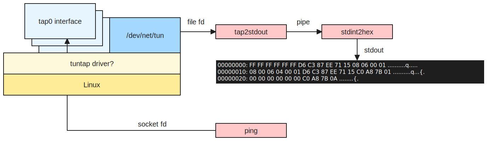

Make a tap (layer 3) virtual network device and print packets sent to it.



```
Quick start:
$ sudo ip tuntap add dev tap0 mode tap
$ make
Pipe packets from tuntap to compiled hex dumper:
$ ./tap2stdout | ./stdin2hex
Pipe packets from tuntap to python hex dumper:
$ ./tap2stdout | ./stdin2hex.py
Run python program that creates child and pipes:
$ ./listen.py

In another terminal, send some packets with:
$ sudo ip addr add 192.168.123.1/24 dev tap0
$ sudo ip link set tap0 up
$ ping 192.168.123.1
```

Tap notes:

```
Create with:
$ sudo ip tuntap add dev tap0 mode tap
$ sudo ip tuntap add mode tap tap0
$ ip link show tap0

Tap interfaces are sometimes set up by ifconfig/ip.
They go up when a reader has opened /dev/net/tun and issued the TUNSETIFF ioctl.
Is this true?
`./tap2stdout | ./stdin2hex` puts the interface up
`./tap2stdout | ./vrouter.py` seems to need manual `ip link set tap0 up`

Pipe notes:

Named pipes (fifos) will block both ways.
A writer will block until the file is opened and read.
A reader will block until the file is opened and written.
When read() returns (unblocks) with result 0, we know the writer has closed.
Try this experiment:
  $ mkfifo /tmp/mypipe
  $ cat /tmp/mypipe | ./stdin2hex    // cat blocks on /tmp/mypipe, stdin2hex blocks on stdin
Then:
  $ echo 'AAAA' > /tmp/mypipe
  00000000: 41 41 41 41 0A                                   AAAA.
And both reader and writer are closed.
```
