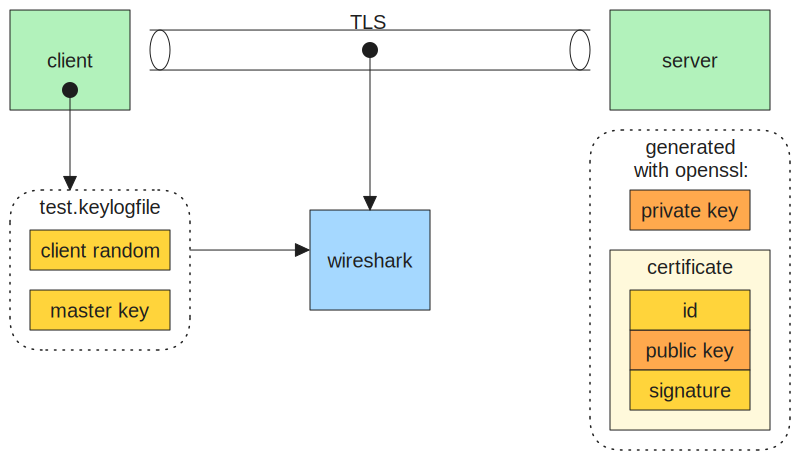

Run some TLS experiments, view encrypted traffic with Wireshark [1].



* `./v1.0/*` client/server for tls 1.0, difficult to do with modern OpenSSL or tools that link against it
* `./client/*` client, leaks key material for wireshark
* `./server/*` server

## MITM with socat

Set up a server listening on port 4000.

Next generic a key and certificate for the MITM server:

```
openssl req -x509 -nodes -newkey rsa:4096 -keyout mitm_key.pem -out mitm_cert.pem -sha256 -days 3650 -nodes -subj "/C=XX/ST=StateName/L=CityName/O=CompanyName/OU=CompanySectionName/CN=CommonNameOrHostname"
```

Run the MITM server, forwarding 3000 to 4000.

```
socat -dd -v openssl-listen:3000,reuseaddr,fork,verify=0,key=mitm_key.pem,cert=mitm_cert.pem openssl:127.0.0.1:4000,verify=0
```

Finally run the client, connecting to port 3000.

## References

1. https://en.wikipedia.org/wiki/Wireshark
2. https://pypi.org/project/tlslite-ng/
