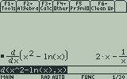

Years ago I thought my TI-89 calculator was magic, able to integrate and differentiate formulas I entered:



But it might not be so difficult as I thought. Consider the expression above $x^2 - ln(x)$. In python this would be `x**2 - math.log(x)`. We can use the AST module to parse this string in python to:

```python
Module(
    body=[
        Expr(
            value=BinOp(
                left=BinOp(
                    left=Name(id='x', ctx=Load()),
                    op=Pow(),
                    right=Constant(value=2)),
                op=Sub(),
                right=Call(
                    func=Attribute(
                        value=Name(id='math', ctx=Load()),
                        attr='log',
                        ctx=Load()),
                    args=[
                        Name(id='x', ctx=Load())],
                    keywords=[])))],
    type_ignores=[])
```

And refine it (see [./demo.py](./demo.py)) to:

```python
['-',
  ['^',
    ['var', 'x'],
    ['const', 2]
  ],
  ['log',
    ['var', 'x']
  ]
]
```

Which, graphed, is:


And one of my favorite patterns emerges: a tree to be processed by a recursive algorithm. We'll have derivation rules for each node type and the final derivative is produced at the top. So at `**` we'll apply the power rule. At `log` we'll change it to a `1/x`.

See [./demo.py](./demo.py) for the proof of concept, which outputs:


Or `2x - 1/x` in string form.

