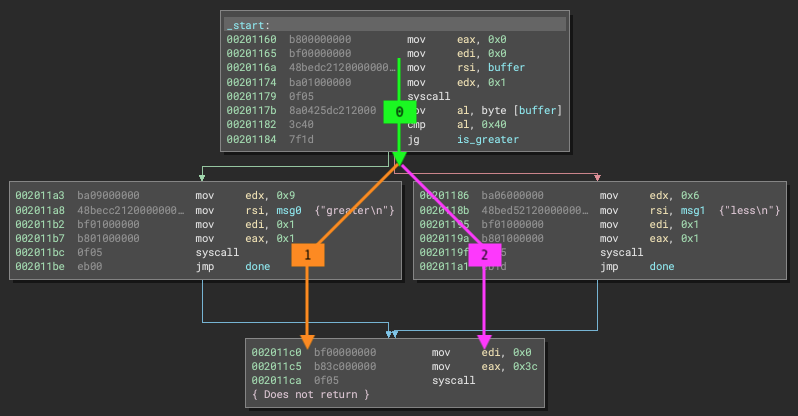
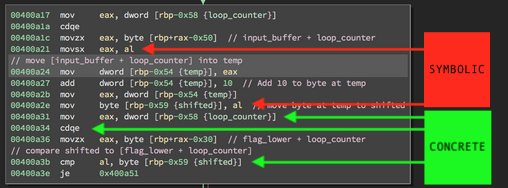
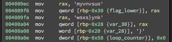
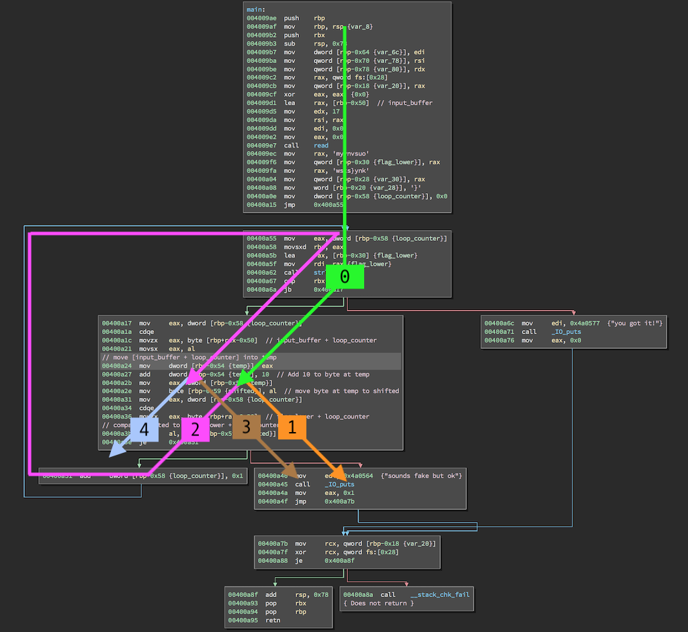

This is a quick tutorial and notes on getting started with Manticore. It comments on and clears some personally encountered confusion with a tutorial by Eric Hennenfent. LINKS:

* [ehennenfent's gist writeup](https://gist.github.com/ehennenfent/a5ad9746615d1490c618a88b98769c10) which is [replicated in the manticore/examples](https://github.com/trailofbits/manticore/tree/master/examples/linux/binaries) folder
* [github.com/trailofbits/manticore/examples](https://github.com/trailofbits/manticore/tree/master/examples) examples in the manticore repo
* [github.com/trailofbits/manticore-examples/](https://github.com/trailofbits/manticore-examples) a completely separate repository of examples

### What is manticore actually doing and how do I use it?

It's generating emulated states to reach all paths in a program. That obviously expands into an amount of states that's infeasible to manage, so it's your job to set up hooks that constrain and cull this rapidly growing set of states.

If the states were sheep, you are the sheep herding dog, corralling the states towards desirable paths, for example the success path of a CTF challenge.

The entry point gets state 0, and upon any branching path, the current state is destroyed and two others are spawned. See [./example-2path](./example-2path) for a minimal example where the first byte of stdin decides which of two paths are taken. The verbose prints in [./example-2path/analyze.py](./example-2path/analyze.py) show three states are generated by manticore during exploration: state0 lasts until the first block, when it is annhilated and states 1 and 2 are spawned. Both 1 and 2 reach the final block:



Note that `al`, taking the first byte from STDIN is not a fixed ("concrete") value, it's symbolic by default. In state0, `al` is an unconstrained byte. In state1, it's constrained to all bytes whose signed interpretation is greater than 0x40. In state1, it's less than 0x40.

### How does he collect the answer at comparison time?

It's easy to make mistake the `al` collected towards the answer as the `al` from STDIN. It's not, it's the deducible bytes from a light transform on a hardcoded answer:



It's concrete because Manticore saw the loop counter set to 0 and incremented. It also saw the initialization of `flag_lower`:



 Manticore can deduce the values, and so can we:

```python
>>> ''.join(chr(ord(x)-10) for x in 'myvnvsuo'+'wsxs}ynk'+'}')
'coldlikeminisodas'
```

That's why he named this solution "concrete solve".

### How does ehennenfent get away with modifying the ZF in a state?

There are many ways to control state exploration to get what you want. The best way to understand what he's doing is to consider what happens if he does **NOT** modify ZF:



The states reaching the comparison of the first input characters to the hardcoded password will split into states searching the failure path and the path that will compare the second character.

By setting ZF=1, there is no more split at this block. Manticore sees the state will always head left (towards comparison the next character). He's essentially runtime patching so exploration will continue along a path he's able to spy on. Each comparison fails (the input chars don't match), but he's only interested in collecting the values of the comparison (what the input chars _should_ be).

Now it's certainly possible to let exploration branch and get the answer some other way. That's what his symbolic solution does.

### What is with the context? Why can't the values be read from memory directly?

The context is evidently a convenience area where you can accumulate useful information for yourself. I don't understand why it's connected to the manticore object and not the state, though. It seems that at the higher level, the correctness of your accumulated data is sensitive to the order in which states are explored.

Anyways, you can eschew using the context and read directly from memory:

```python
def concrete_mem(state, addr, length):
    data = b''
    sym_mem = state.mem.read(addr, length)
    for i in range(length):
        value = state.concretize(sym_mem[i], 'ONE')
        assert type(value)==tuple and len(value)==1
        value = value[0]
        if type(value) == int:
            value = value.to_bytes(1, 'big')
        elif type(value) == bytes:
            pass
        else:
            breakpoint()
        data += value
    return data
```

See [./solve-read-mem.py](./solve-read-mem.py) for full code.
