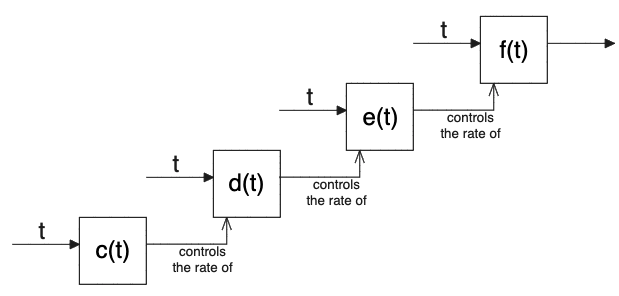
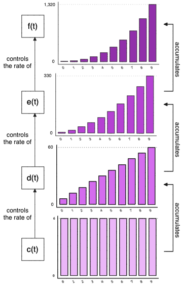
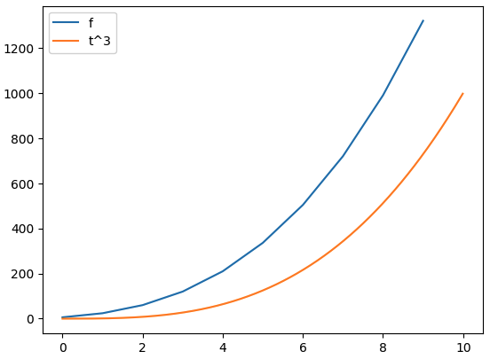
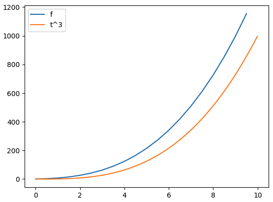
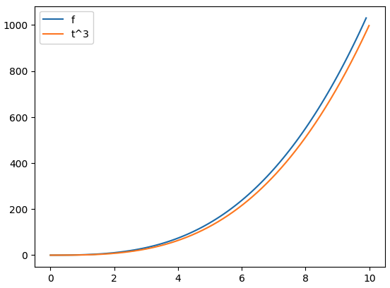

Check out this code:

```python
c, d, e, f = 6, 0, 0, 0
for _ in range(10):
    d += c
    e += d
    f += e
```

What happens to each of the variables `c`, `d`, `e`, and `f` as the loop executes?
* `c` changes by 0, so it stays constant at 6
* `d` changes by `c`, so 6 each cycle
* `e` changes by `d`, so first it changes by 6, then 12, then 18, ...
* `f` changes by `d`, so first it changes by 6, then 18, then 36, ...

If we consider each of these variables as the output of some function, and each cycle of the loop as a time increment, we might visualize this as a ladder or food chain:



As we move up the food chain, the contribution of `c(t)` compounds or accumulates. In fact, using [itertools](https://docs.python.org/3/library/itertools.html)'s `accumulate()` function is another way to write this:

```python
c = [6]*10
d = accumulate(c, add)
e = accumulate(d, add)
f = accumulate(e, add)
```

The values the variables take on are:

* `c`: [6, 6, 6, 6, 6, 6, 6, 6, 6, 6]
* `d`: [6, 12, 18, 24, 30, 36, 42, 48, 54, 60]
* `e`: [6, 18, 36, 60, 90, 126, 168, 216, 270, 330]
* `f`: [6, 24, 60, 120, 210, 336, 504, 720, 990, 1320]

Here it is graphed:



Notice the value of `d` at some time is the sum of the output values of `c`, **which is the same as its "area under the curve"**. Similarly, the amount in `e` is how much has accumulated from `d`, it's "area under the curve". And same for `f` and `e`.

Indeed, moving up the food chain is integration. The lower functions act as the rate changer for the above functions. Moving down is finding which function was the rate changer, derivation.

How does it compare to integrating symbolically with the power rule?

1. integrating `c(t) = 6` yields `d(t) = 6x`
2. integrating `d(t)` yields `e(t) = 3x^2`
3. integrating `e(t)` yields `f(t) = x^3`

How close does it look to the actual x^3?

 

That's a similar shape, but it's it doesn't line up quite right. But if we increase the amount of samples, the approximation moves to more resemble real function. Doubling from 10 to 20 gets us to:



And going to 100 samples gets us to:



This really is x^3!

It has always eluded me exactly how the integral is the inverse of the derivative. It was presented to me as [Reimann sums](https://en.wikipedia.org/wiki/Riemann_sum), essentially approximating the area under a curve by positioning shapes (usually rectangles) with simple area calculations. I thought it was just a geometer's trick.

While derivatives answer "What function would yield the rate of change of this function?", I thought of integrals answering "What function would give the area under the curve of this function?".

Now, with the above demonstration, I can see that the alternative question for integrals, "What function results from this function governing its rate of change?" is equivalent to the the original question.

Indeed, the [Wikipedia page on the fundamental theorem of calculus](https://en.wikipedia.org/wiki/Fundamental_theorem_of_calculus) mentions the two views as alternatives of one another, separated by "or":

> ...with the concept of integrating a function (calculating the area under its graph, or **the cumulative effect of small contributions**).

The cumulative effect of small contributions is that the contributing function governs the rate of change of the recipient.

## ChatGPT's Explanation

(prompted with the code and the question "What calculus-like task this code is doing?")

The code you've provided is effectively calculating the sums of sums of a constant value (`c`), resembling a discrete version of repeated integration in calculus. Here's a breakdown:

- `d += c`: This is a summation of the constant `c`. In each iteration, `c` is added to `d`. Over 10 iterations, this accumulates the sum of `c` 10 times. This is analogous to the integral of a constant function.

- `e += d`: Here, `e` is accumulating the sum of `d`. Since `d` itself is a sum of `c`, this step is essentially summing the sum, akin to a second integral.

- `f += e`: This is one level deeper, summing the values of `e`. As `e` is the sum of sums, this makes `f` the sum of sums of sums, analogous to a third integral.

So, if we think of `c` as a constant rate of change (like a constant function in calculus), then `d`, `e`, and `f` represent the first, second, and third cumulative sums of `c`, respectively. This is similar to performing repeated integrations on a constant function in calculus, where each integral increases the degree of the polynomial by 1.However, the discrete nature of this summation (due to the `for` loop) makes it distinct from the smooth, continuous nature of calculus-based integrals. To someone familiar with both programming and calculus, the connection might be apparent, but it may not be immediately obvious to everyone.
