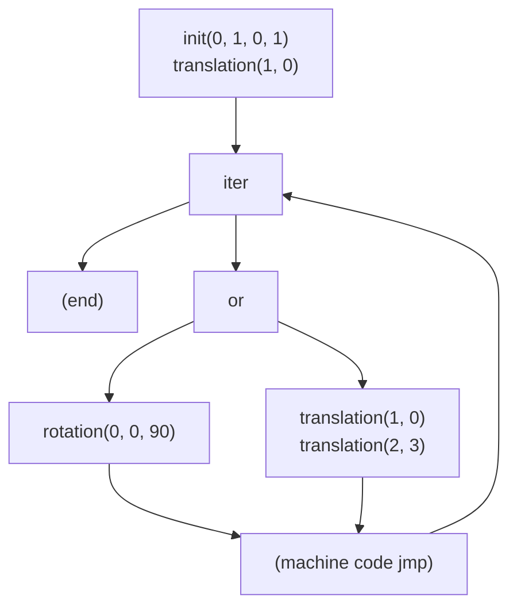

## Use Python and AST Module to Prototype Languages

Modeling a language in python then using its `ast` module to parse and interpet the model is very powerful. You completely shortcut the usual tasks of writing a grammar, tokenizer, and parser, and get an instant abstract syntax tree (AST).

To demonstrate, here is the toy language of Chapter 2 of the book **Introduction to Static Analysis** (ITSA), here Example 2.1:

```
init([0,1] x [0,1]);
translation(1,0);
iter {
  {
    translation(1,0)
  } or {
    rotation(0, 0, 90)
  }
}
```

Is modeled in [example_2_1.py](./example_2_1.py):

```python
init(0, 1, 0, 1)
translation(1, 0)
while unknown:
    if unknown:
        translation(1, 0)
        translation(2, 3)
    else:
        rotation(0, 0, 90)
```

And can be interpreted with [interpret.py](./interpret.py):

```
$ ./interpret.py ./example_2_1.py
-------- EXECUTED AST --------
init([0, 1, 0, 1])
translation([1, 0])
iteration taken? True
or taken? False
rotation([0, 0, 90])
iteration taken? True
or taken? True
translation([1, 0])
translation([2, 3])
iteration taken? True
or taken? False
rotation([0, 0, 90])
iteration taken? True
or taken? True
translation([1, 0])
translation([2, 3])
iteration taken? True
or taken? False
rotation([0, 0, 90])
iteration taken? False
```

The AST can be printed with [parse.py](./parse.py):

```python
[   'block',
    ['init', 0, 1, 0, 1],
    ['translation', 1, 0],
    [   'iter',
        [   'block',
            [   'or',
                ['block', ['translation', 1, 0], ['translation', 2, 3]],
                ['block', ['rotation', 0, 0, 90]]]]]]
```

To get the control flow graph, I have tested:

* convert AST to [C](./example_2_1.c) using [py2c.py](./py2c.py) and compiled with [gcc](https://gcc.gnu.org/)
* convert AST to [assembly](./example_2_1.asm) using [py2asm.py](./py2asm.py) and assembled with [nasm](https://www.nasm.us/)

Then opened with a binary analysis tool like Binary Ninja. See [Makefile](./Makefile).

