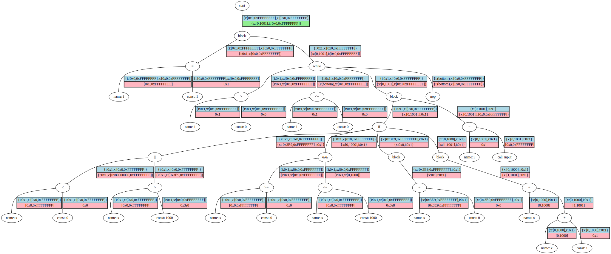

This is a basic [abstract interpreter](https://en.wikipedia.org/wiki/Abstract_interpretation) (AI) using the signedness-agnostic strided intervals (SASI) implementation from [angr/claripy](https://github.com/angr/claripy) with some modified methods. The inputs are python files, parsed with the [ast](https://docs.python.org/3/library/ast.html) module, following the [RapidPrototypingWithPythonAst](../RapidPrototypingWithPythonAst) idea.

**Contents:**

[./interpreter.py](./helpers.py) - actual abstract interpreter, TreeNode, SASI utilities

[./helpers.py](./helpers.py) - support functions

[./test.py](./test.py) - runs, tests the AI on the test cases

[./test-cases.py](./test-cases.py) - contains the test cases

[./test-case-single.py](./test-case-single.py) - contains a single test case for ease of analysis

[./convert-to-c.py](./pcode-codegen.py) - convert python tests to C

[./graph-aitree.py](./pcode-codegen.py) - draw the result tree after abstract interpretation

**Quick Start:**

```
$ ./test.py ./test-case-single.py
$ ./graph-aitree.py ./test-case-single.py
```

or to run all tests:

```
$ ./test.py
```

**Example:**

The following loop body is entered at least once, but total iterations is indeterminable since we don't know about `input()`.

```python
i = 1
while i > 0:
    if x < 0 or x > 1000:
        x = 0
    else:
        x = x + 1
    i = input()
```

The AI correctly concludes `x` will be between 0 and 1001 inclusive upon loop exit. In the below tree, the blue part of each edge table is the precondition "pushed down", and the pink part is the postcondition "returned up". The final returned postcondition is marked green:


