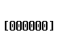
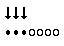
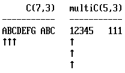

2017-08-12

Animations Using Python+PIL+CP437

The idea was: "if you can printf() frames, you have an animation" but with the added retro symbols provided by [code page 437](https://en.wikipedia.org/wiki/Code_page_437).

happy.py example:

combinations.py example:

multichoose.py example:

Thanks to orangetide.com/fonts/DOS for the cp437 image
