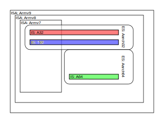
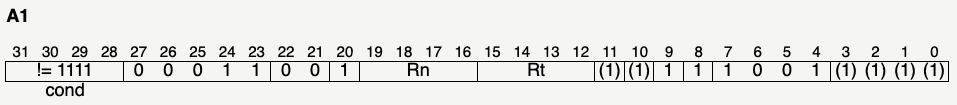

This is just a collection of questions I've come up with while working with ARM architecture.

### What is the difference between Armv{7,8,9}, Aarch{32,64}, and A32, T32, A64?

ARM kind of overload the term "ISA".

* Armv8 is the ISA (emphasis on the "A") / **architecture**, the abstract model of a computer.
* AArch64 and AArch32 are **execution states**, 32-bit and 64-bit respectively.
* A64 is an **instruction set** available in the 64-bit execution state, and A32, T32 are instruction sets available in the 32-bit execution state.

I think since A32 and T32 were the only instruction sets available when Armv7 was out, they became synonymous.



### What is ARM64?

Arm64 is not a term used by ARM. 

In March 2014, Apple's LLVM compiler backend was called ARM64. ARM vendors (and GNU/GCC guys?) had developed a competing 64-bit ARM backend called AArch64. That got merged and renamed to Aarch64, the official 64-bit ARM execution state, and should be present in LLVM 3.5 onward.

https://www.phoronix.com/scan.php?page=news_item&px=MTY5ODk
https://www.phoronix.com/scan.php?page=news_item&px=MTY4NjQ

Then Linux called their port "arm64", so the source code has arch/arm64 in https://github.com/torvalds/linux/tree/master/arch/arm64

### What is NEON?

Neon is the name for ARM's SIMD implementation.

### How does the "exchange" work in instructions?

I don't know they used the word exchange. Better might have been switch.

When the operand is register or memory containing an absolute (not-relative) pointer, the arrival mode is determined by the lsb of the pointer (0 means ARM mode, 1 means thumb mode) . Examples: `bx Rm`, `blx Rm`, `mov pc, Rm`, `ldm Rm, {..., pc}`.

When the operand is a relative offset, the arrival mode is always the opposite of the departing mode. Examples: `bx label`, `blx label`.

For instructions that link, the pointer `lr` will reflect the departing mode in its LSB.

Confirming tests: [./2022-03-10-arm-thumb-exchange-tests.md](./2022-03-10-arm-thumb-exchange-tests.md)

### Are thumb instructions and functions at odd addresses?

No, an address value with lsb set acts as a temporary marker of thumb transition. The thumb instructions themselves are at even addresses.

For example, a `blx` to operand 0x4000001 executes the code at 0x4000000 in thumb mode.

This is very explicit if you try to assemble thumb code at `_start` with the GNU assembler. The correct thumb encodings will be assembled, but the binary entrypoint will be set to the true (even) address of `_start` instead of the address marked by convention. You need the `.thumb_func` assembler directive.

### What are the parenthesized bits in the specifications' instruction encoding diagrams?

Example:



They specify bit values that are expected, but not required, of the encoding.

(2020-10-10) I've always ignored parenthesized bits, but I learned a reason why that's a bad idea. At later times their positions can be used for other instructions. So if you ignore them, assuming the disassembler set the bits, you could be creating technical debt for when those bits are allocated for a new encoding. Here are a couple cases I came across today:

In ARMv7, ldrex's bits 12..8 are `(1)(1)(1)(1)`. But in the 32-bit encodings of ARMv8, the instruction ldaex uses those parenthesized bits:

`cond.4|0001100|1|Rn|Rt|(1)(1)(1)(1)|1001|(1)(1)(1)(1)` (ARMv7 `ldrex`)
`cond.4|0001100|1|Rn|Rt|(1)(1) 1  0 |1001|(1)(1)(1)(1)` (ARM32 `ldaex`)

So if you're making a decoder/disassembler, check for the expected bits!

There are similar examples for `strex/stlex`:

```
               cond        op   Rn   Rd                     Rt
ARMv7   strex: xxxx|0001|1000|xxxx|xxxx|(1)(1)(1)(1)|1001|xxxx
  A32   stlex: xxxx|0001|1000|xxxx|xxxx|(1)(1) 1  0 |1001|xxxx
ARMv7  strexb: xxxx|0001|1100|xxxx|xxxx|(1)(1)(1)(1)|1001|xxxx
  A32  stlexb: xxxx|0001|1100|xxxx|xxxx|(1)(1) 1  0 |1001|xxxx
ARMv7  strexh: xxxx|0001|1110|xxxx|xxxx|(1)(1)(1)(1)|1001|xxxx
  A32  stlexh: xxxx|0001|1110|xxxx|xxxx (1)(1) 1  0 |1001|xxxx
ARMv7  strexd: xxxx|0001|1010|xxxx|xxxx|(1)(1)(1)(1)|1001|xxxx
  A32  stlexd: xxxx|0001|1010|xxxx|xxxx|(1)(1) 1  0 |1001|xxxx
```

And `strex/stl`:

```
ARMv7   strex: cond.4|0001|1000|xxxx|        xxxx|(1)(1)(1)(1)|1001|xxxx
  A32     stl: cond.4|0001|1000|xxxx|(1)(1)(1)(1)|(1)(1) 0  0 |1001|xxxx
```
