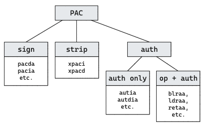

There are new instructions and some existing instructions

1. sign pointers (`PAC.*`)
2. authenticate pointers (`AUT.*`)
3. strip pointers (`XPAC.*`)

Of the authenticate instructions, some are "old instruction plus authentication", like `BLRA.*`, `.LDRA.*`, and `RETA.*`.

Best resources:

* [Rutland's Linux Security Summit slides](./assets/2017-09-14 Linux Security Summit - Rutland.pdf)

* https://googleprojectzero.blogspot.com/2019/02/examining-pointer-authentication-on.html