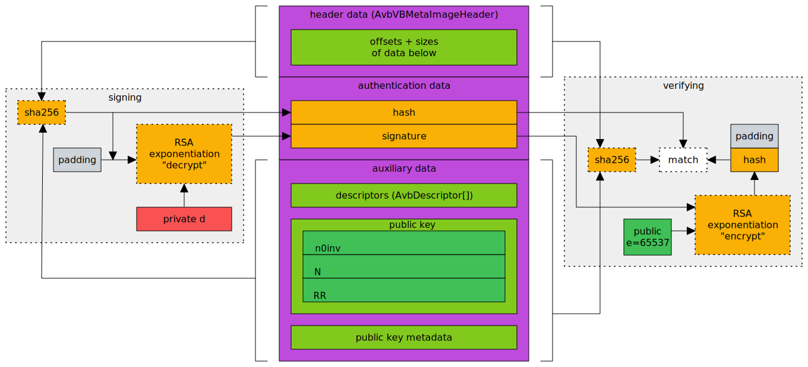

Examine a VBMETA partition implementing [Android Verified Boot](https://source.android.com/docs/security/features/verifiedboot/avb). Here's a sketch of what's going on:

### Files list

[./vbmeta.img](./vbmeta_a.bin) - example vbmeta partition

[./annotated.txt](./annotated.txt) - annotated hex dump of the example vbmeta partition

[./verify.py](./verify.py) - exercise the cryptography

[./helpers.py](./helpers.py) - helper module for above

### Source of this vbmeta partition:

It's from a Pixel 5 image:

https://developers.google.com/android/images search for SHA256 "c3ea1715"
https://dl.google.com/dl/android/aosp/redfin-rd1a.200810.020-factory-c3ea1715.zip

Unzipping extracts the file `image-redfin-rd1a.200810.020.zip` which, when unzipped, extracts `vbmeta.bin`.

### Links

https://android.googlesource.com/platform/external/avb/+/master/README.md

https://crypto.stackexchange.com/questions/93367/whats-the-use-of-storing-r2-with-a-public-key