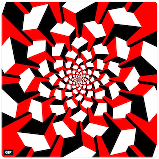
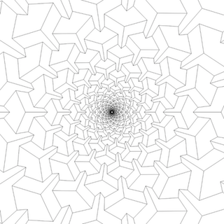

On [dwitter](dwitter.net) there's a hash tag #beesandbombs for the work of this gif maker who does a lot of geometric transformation type art. I really liked [this one](https://twitter.com/beesandbombs/status/880421946659352576):

By browsing twitter and twitter for demoscene art, I also learned of a cool program [DrawBot](http://www.drawbot.com/) which is a canvas commanded by python, and you can select numeric values and adjust them with your mouse in real-time. I wondered if a still shot (or close to it) of the above could be made without doing anything in 3d:

The strategy is to draw the same 6-sided white polygon in various rotations and scalings, then connect them together appropriately with lines. The result is on [turtletoy.net](https://turtletoy.net/turtle/a9cf9e31b3):

I wonder how many other polygons could interlock like this to make a pseudo-3d effect.