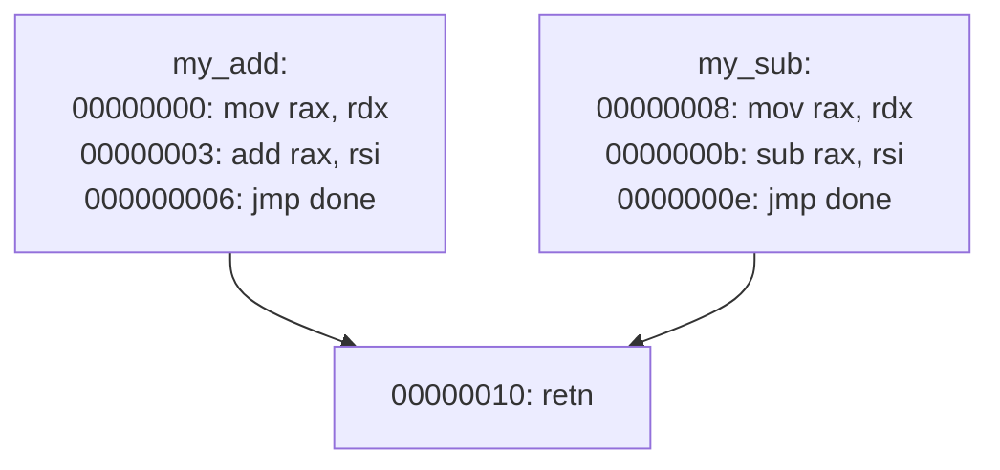

# How can I set a function boundary?

Mostly you can't, you must rely on analysis. Analysis performs actions like making functions at call destinations and potentially ending functions at returns.

Through the UI, you can set new function starts (right click, "Make Function at This Address").

If the current function start is manually made (and not automatically made by being the destination of a call), you might move it by undefining the function and making the function at the new address.

See [How does Binja think of function boundaries?](#how-does-binja-think-of-function-boundaries).

# How do I get the end of a function?

**Quick answer**: you can't, because Binja doesn't think of functions like that

Binja does not have a strict view of a functions start and end boundaries. See [How does Binja think of function boundaries?](#how-does-binja-think-of-function-boundaries)

If you want the address after the final byte which comprises the function, use `max(bb.end for bb in func.basic_blocks)`.

see binaryninja-api discussion: <https://github.com/Vector35/binaryninja-api/discussions/2189>

# How does Binja think of functions?

**Quick answer**: as a directed [graph](https://en.wikipedia.org/wiki/Graph_(discrete_mathematics)) of [basic blocks](https://en.wikipedia.org/wiki/Basic_block) where one block is specified as the entry.

Note:

* there is no requirement the blocks be contiguous
* there is no requirement a block be solely owned (it may exist in multiple functions), see: [How can one address appear in two functions?](#how-can-one-address-appear-in-two-functions)

# How does Binja think of function boundaries?

**Quick answer**: as the union of all [start, end) of every basic block from the function.

See: [How does Binja think of functions?](#how-does-binja-think-of-functions)

In the python API, you might notice `binaryninja.function.Function` has `.start` but not `.end` or `.len` or `.length`. It does have `.total_bytes` which cannot be set and is the sum of the sizes of all its basic blocks.

Unlike some RE tools, Binja does not bound a function by a start and end address. Here are some reasons:

1. functions can have multiple return points
2. function return could be located at not its greatest address
3. A straightforward [start, end] might capture non-function code

The first two could be handled by a policy of "function end should be the greatest address containing bytes of the function". So when there are multiple return points, function end is the address after the final (greatest address) return. When a return is not at the function's greatest address, return the address of the instruction that is at the greatest address.

The third objection is carries some weight IMO. Here I purposely place function `int my_sub(int a, b)` within the lowest and highest addresses of `int my_add(int a, int b)`:

```asm
my_add:
	mov		rax, rdx
	jmp		my_add_continued

my_sub:
	mov		rax, rdx
	sub		rax, rsi
	ret

my_add_continued:
	add		rax, rsi
	ret
```

Binja disassembles:

```
00000000  int64_t my_add(int64_t, int64_t arg2, int64_t arg3)
00000000  4889d0             mov     rax, rdx
00000003  eb07               jmp     my_add_continued

00000005  int64_t my_sub(int64_t, int64_t arg2, int64_t arg3)
00000005  4889d0             mov     rax, rdx
00000008  4829f0             sub     rax, rsi
0000000b  c3                 retn     {__return_addr}

{ Continuation of function my_add }
0000000c  4801f0             add     rax, rsi
0000000f  c3                 retn     {__return_addr}
```

If we say `my_add()` starts at 0 and ends at 0x10 that would mistakenly include bytes of `my_sub()`.

# How can one address appear in two functions?

**Quick answer**: because the two functions' graphs of blocks can share

See: [How does Binja think of functions?](#how-does-binja-think-of-functions)

Here's a simple example:

```asm
my_add:
	mov		rax, rdx
	add		rax, rsi
	jmp		done

my_sub:
	mov		rax, rdx
	sub		rax, rsi
	jmp		done

done:
	ret
```

Each function has two blocks/vertices in its graph. The second block is shared:



In the python console:
```
>>> [f.name for f in bv.get_functions_containing(0x10)]
['my_sub', 'my_add']
```

# How can I programmatically access the feature map?

There's no API to access the result of the feature map (the image data) but you can access everything the feature map widget uses to draw the image in order to draw it yourself.

See [./code/feature-map.py](./code/feature-map.py) for an example using PIL to produce a .png.

# Does the index of a block indicate the order of execution of the blocks?

No, counterexamples are easy to find with the following script:

```python
bv = binaryninja.open_view(sys.argv[1])
for func in bv.functions:
    print(f'analyzing function {func}')
    bbs = list(func.basic_blocks)
    for (i, bb) in enumerate(bbs):
        left = set(bb.strict_dominators)
        right = set(bbs[i+1:])
        both = left.intersection(right)
        if both:
            print(f'blocks {both} execute before, but appear after {bb}')
            sys.exit(-1)
```

That is, there are blocks that appear later in an enumeration that dominate blocks that appear earlier.

# What Are Intrinsics?

There are a few ways this term is used, but they all involve the concept of the compiler possessing and using knowledge of the implementation of some function instead of referring to it.

**CASE 1:** A C programmer remains at a high level and the low level details happen behind the scenes.

For example, compiling a call to `memset()` or `memcpy()` can:

* **extrinsic:** generate a call to a symbol that gets linked against an implementation in some library
* **intrinsic:** inline a highly optimized implementation

Note the programmer intended merely to clear or copy memory.

**CASE 2:** A C programmer wants a special low level implementation.

Functions are sometimes exposed intentionally to generate specialized instructions. For example, the [ARM instrinsics](https://developer.arm.com/architectures/instruction-sets/intrinsics) have functions like `vaddq_s16()` to generate the advanced SIMD form of the instruction `ADD`.

Note the programmer knew they were working with advanced SIMD and the int16x8_t datatype.

**CASE 3:** An architecture writer cannot fully model an instruction, but still wants to convey to Binary Ninja what operands are read and written.

For example, consider the A64 instruction `autda` which authenticates a data address using a key. There's no way to model that in Binja's IL. But it does read and write some registers, so the writer:

* creates some identifier for the instrinsic, like `ARM_INTRIN_AUTDA`
* informs Binja of its presence by returning it in `GetAllIntrinsics()`
* informs Binja of how it should be presented by having `GetIntrinsicName()` return something like `"__autda"` which will be `__autda(arg)` in decompiler view
* informs Binja that it writes two 8-byte registers (`<Xd>`, `<Xn|SP>`) via `GetIntrinsicOutputs()`
* informs Binja that it reads an 8-byte register (`<Xd>`) via `GetIntrinsicInputs()`

**CASE 4:** An Architecture writer could fully model an instruction, but thinks the analyst might benefit more from seeing a human readable name.

For example the A64 instruction `clz` counts the leading zeros of an input register, and writes the result to an output register. There's no single IL instruction to do this, but it could be synthesized with a loop or some fancy bit masking. Instead, the A64 architecture currently lifts this as an intrinsic, naming one input and one output 8-byte register, and decompiling to `_CountLeadingZeros(arg)`.

**CASE 5:** An architecture writer knows certain instructions were generated by case #2 intrinsics, and wants the decompiler to display what the programmer likely wrote.


