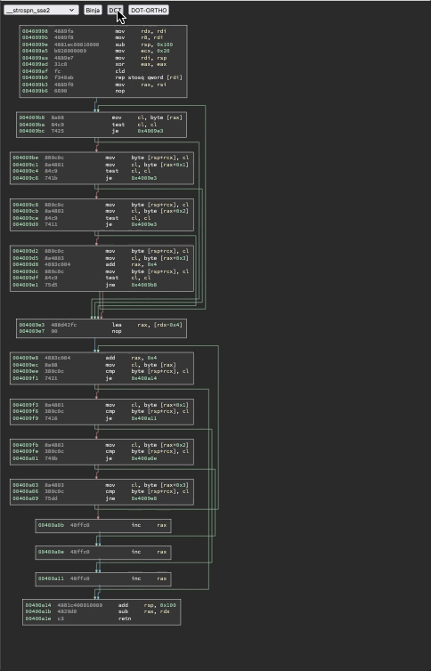

This is a tool using html/js/d3 to compare control flow graph layouts default in Binary Ninja versus graphviz:

## instructions:

* download D3 (d3.min.js) to `./js`
* generate function .svg's and .json's in `./datas` with `./bin2layout.py /path/to/binary`
* generate graphviz layout information with `./relayout.py`
* compile all that information to `./js/data.js` with `./make_data.py`
* firefox `./index.html` :)