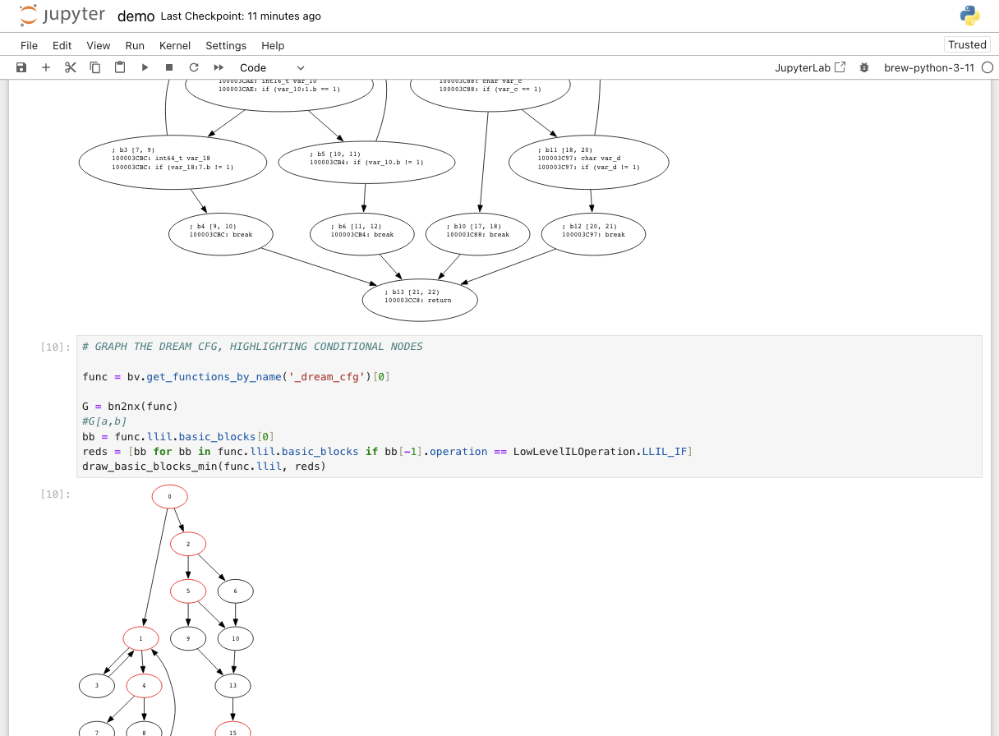

Interact with BinaryNinja in a Jupyter notebook.

I recommend setting your favorite python as the python within BinaryNinja and as the kernel for Jupyter.

You actually add the kernel from within the python you wish to use, like so:

```bash
$ pip install ipykernel
$ python -m ipykernel install --user --name=brew-python-3-11
```

Then it is part of the kernel drop-down menu.

There are also some requirements:

```bash
$ pip install networkx bs4 lxml
```

The module [./binja_jupyter.py](./binja_jupyter.py) provides some conveniences, especially between conversion to and from NetworkX and svg handling.

Here's what it looks like when it's working:


