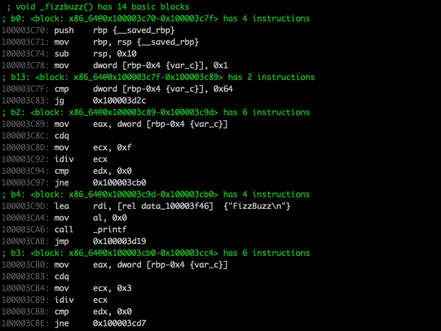
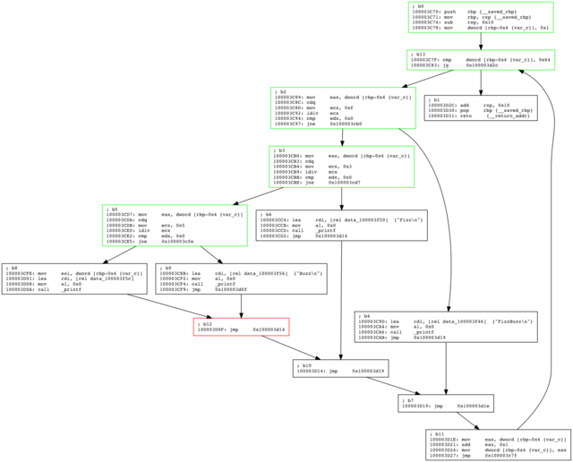
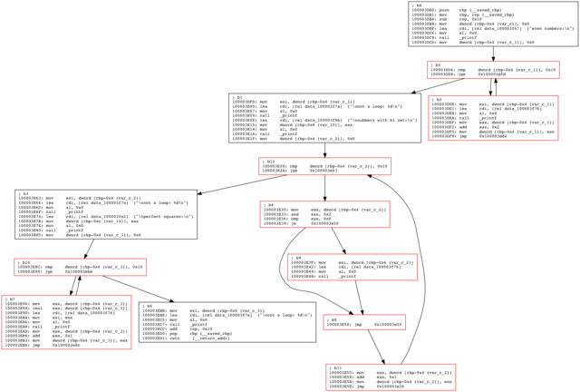
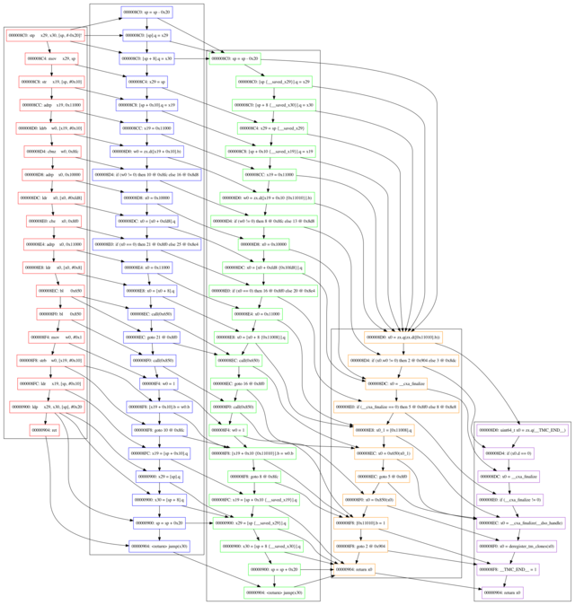
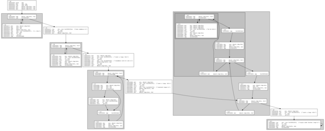

Exercise some basic Binary Ninja analysis headlessly.

linear disassembly:

red block is dominated by green blocks:

red blocks are detected as loops:

attempt to map from disassembly to HLIL:

loops and nested loops mapped to graphviz clusters:

