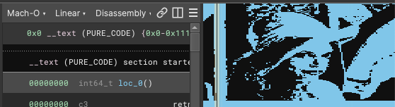

Convert an image to a binary that renders in the BinaryNinja feature map:

See [img2binja.py](./img2binja.py) and [Makefile](./Makefile) for details. Dependencies include [imagemagick](https://imagemagick.org/) and [nasm](https://www.nasm.us/).

Originally made for Binary Ninja Devs @BinjaDevs twitter · Aug 16, 2019 https://buff.ly/2YEJInl

