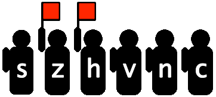

## Binja Architecture Flags Part 1: The Basics

I think of flags as global boolean variables, set and cleared by observers who monitor the result of instructions from a distance:



Instructions like JXX glance at the flagmen for permission to jump.

Analysis would be _really_ complicated by tracking a "remote thread" like this, in addition to the normal instruction stream. So another approach is to insert the flag logic _into_ the instruction stream:

```
...
SUB a, b, c
flag_s = ...
flag_z = ...
flag_v = ...
...
```

Now the problem is that tons of instructions affect tons of flags, so a lot of noise is generated.

Binja tries to reduce the noise by displaying only the flags between producer and consumer that are relevant. For example, ADD affects many flags, but if none are read until ADC (add with carry) then only the carry flag is shown.

Writing effective flag code in architectures requires this understanding, and there's a bit of an art in "helping" Binja connect flag producers and consumers.

But this is about basics! So what are the basic ways in which an architecture author informs Binja of flags? The following is python architecture code for Z80.

### 1) declare the flags

```
flags = ['s', 'z', 'h', 'pv', 'n', 'c']
```

That's simple, it's just a list of strings.

### 2) assign flag Roles

    flag_roles = {
        's': FlagRole.NegativeSignFlagRole,
        'z': FlagRole.ZeroFlagRole,
        'h': FlagRole.HalfCarryFlagRole,
        'pv': FlagRole.SpecialFlagRole,
        'n': FlagRole.NegativeSignFlagRole,
        'c': FlagRole.CarryFlagRole
    }
Map each flag to a role from `api/python/enum.py` if possible. This informs Binja to generate IL for the basic, textbook behavior of a flag. For example, the `ZeroFlagRole` will generate IL that sets the flag when an arithmetic result is zero.

If a flag's behavior does not fit the textbook behavior, use `SpecialFlagRole` and in a future article we'll implement a callback for its custom IL. For example, `PV` here in Z80 acts as both a parity flag and an overflow flag. It's meaning at any given time depends on the last instruction that set it.

In the NES example `api/python/examples/nes.py` , the 6502 flag `c` deviates from textbook behavior, disqualifying it from `CarryFlagRole`, and earning it `SpecialFlagRole`.

### 3) flag write types

```python
flag_write_types = ['none', '*', 'only_carry']
```

```python
flags_written_by_flag_write_type = {
    'none': [],
    '*': ['s', 'z', 'h', 'pv', 'n', 'c'],
    'only_carry': ['c'],
}
```

Think of `flag_write_types` as custom named groups for your convenience. When you later lift instructions that affect all flags, you don't want to list them individually over and over, you want to say just `..., flag="*")`.

In fact, the `flag` keyword parameter for the IL constructing functions does not accept individual flag names, it accepts only these group names!