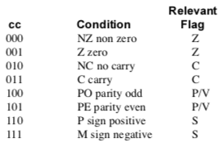

# Binja Architecture Flags Part 4: Flag Conditions

Many architectures implement equality tests by subtracting and looking to the Z flag. Remember that x86's `cmp` and z80's `cp` are subtracting behind the scenes.

In isolation, whether Z contains 0 or 1 is information in the "bit world", a haystack of 0's and 1's in the cold, mechanical circuitry of the ALU. When paired with a subtraction, a test on Z clues us that there's likelihood that we can ascend to a warmer "integer world" where Z is information bound to the outcome of an equality test on integers. X86 even has the synonym `je` for `jz`.

When lifting, you're trying to provide Binja with as much meaning as possible so Binja can reason over possible value sets, compute jump tables, etc. Consider `bool is_equal_10(int x) { return x==10; }`. The resulting Z80 code is:


Z80's `jr nz` is x86's `jnz`, jump if not zero. 

It's not a _guarantee_, mind, because adversarial cases like `push <val>; popf` preceeding `je` (a so-called "opaque predicate") aren't testing any integers at all. In my experience, the SDCC compiler refuses to test the sign flag, instead insisting on generating a `BIT` instruction which sets the `z` flag, ugh!

### Acceptable Lift

If `z`It is accurate to lift it as so:

```python
    # {'z', 'nz'} == {'zero', 'not zero'}
    if cond == CC.Z:
        return il.flag('z')
    if cond == CC.NOT_Z:
        return il.not_expr(0, il.flag('z'))
```

And the resulting lifted IL is technically correct:


But the IL `if` is still in the bit world!

### Preferrable Lift

```python
# {'z', 'nz'} == {'zero', 'not zero'}
if cond == CC.Z:
    return il.flag_condition(LowLevelILFlagCondition.LLFC_E)
if cond == CC.NOT_Z:
    return il.flag_condition(LowLevelILFlagCondition.LLFC_NE) 
```
The resulting lifted IL is:


Look at that! Now the IL `if` is not simply testing true or false, it's going to be looking for equality! We've successfully graduated from "Binja! test this bit!" to "Binja! someone's comparing integers!". Here's the next layer, low level IL:


### Conclusion

The Z flag example is the easiest. Amost everyone can picture subtracting two values, the Z flag indicating whether the result is 0, and branching based on that. But I have to look up cases like x86's `jg` which check ZF = 0 and SF = OF.

Check the venerable [NES example](https://github.com/Vector35/binaryninja-api/blob/dev/python/examples/nes.py), searching for `LLFC_` to see when their used for various branches, and `flags_required_for_flag_condition` definition, to see where Binja is informed which flags are involved in each condition.

The [powerpc example](https://github.com/Vector35/ppc-capstone/blob/master/arch_ppc.cpp) uses them also, but gets into semantic flag groups and classes, which will be the subject of a future article. Here's a sneak peak: When compiling Z80 with SDCC, I've not been able to get it to test the sign flag.  `BIT 7,A` `JR z, <is_positive>` to determine positivity, with the `BI check looking for the 2's complement sign flag, setting Z accordingly. Clearly this Z has nothing to do with equality check. Wouldn't be nice if an instruction could not only say "I'm setting the Z flag" but "I'm setting the Z flag and it's the sign bit".

 There are about 22 flag conditions currently `LowLevelILFlagCondition` in api/python/enums.py.

Having the tables below for whatever architecture you're implementing would probably be a big help:

### Appendix A: Z80 JCC Table



### Appendix B: X86 JCC Table

thanks: http://www.unixwiz.net/techtips/x86-jumps.html

