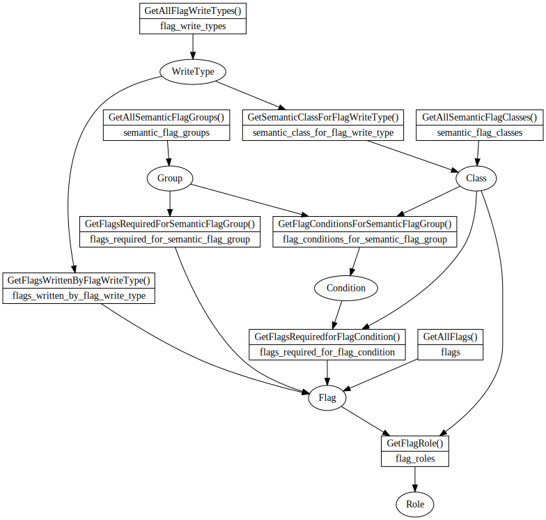

Sometimes I can jumpstart understanding something by just surveying and inventorying its components. This is such an attempt for the "semantic flags" in BinaryNinja's x86 architecture. Unfortunately it wasn't successful; I still don't get it.

## Sets

| Name | What | Where |
|---|---|---|
| Flags |flags themselves|GetAllFlags(), GetFlagName()|
| WriteType |user-defined convenience groups for lifting, like|GetAllFlagWriteTypes(), GetFlagWriteTypeName()|
| Roles ||GetFlagRole()|
| Groups ||GetAllSemanticFlagGroups(), GetSemanticFlagGroupName()|
| Semantic Classes ||GetAllSemanticFlagClasses(), GetSemanticFlagClassName()|
| Conditions ||built-in: BNLowLevelILFlagCondition {LLFC_E, LLFC_NE, LLFC_SLT, ...}|
| Roles ||built-in: BNFlagRole {SpecialFlagRole, ZeroFlagRole, PositiveSignFlagRole, ...}|

## Flags

| ID        | Name |
| --------- | ---- |
| IL_FLAG_C | "c"  |
| IL_FLAG_P | "p"  |
| IL_FLAG_A | "a"  |
| IL_FLAG_Z | "z"  |
| IL_FLAG_S | "s"  |
| IL_FLAG_D | "d"  |
| IL_FLAG_O | "o"  |

* The flag ID's are returned by `GetAllFlags()`
* The mapping ID -> string is given by `GetFlagName()`

## Write Type

These are user-defined groups of flags. The first reason is convenience. Instead of listing out all the flags everytime an arithmetic instruction is lifted, we can just have a group "generic_arithmetic". Often, a name "*" is assigned to mean all flags. Each group has a semantic class associated with it. If GetSemanticClassForFlagWriteType() is not implemented, or returns 0, it's assigned integer semantics.

 Example:

| ID                   | Name | Set                                                          | Class                 |
| -------------------- | ---- | ------------------------------------------------------------ | --------------------- |
| IL_FLAGWRITE_ALL     | "*"  | IL_FLAG_C, IL_FLAG_P, IL_FLAG_A, IL_FLAG_Z, IL_FLAG_S, IL_FLAG_O | IL_FLAG_CLASS_INT     |
| IL_FLAGWRITE_NOCARRY | "!c" | IL_FLAG_P, IL_FLAG_A, IL_FLAG_Z, IL_FLAG_S, IL_FLAG_O        | IL_FLAG_CLASS_INT     |
| IL_FLAGWRITE_CO      | "co" | IL_FLAG_C, IL_FLAG_O                                         | IL_FLAG_CLASS_INT     |
| IL_FLAGWRITE_X87COM  |      |                                                              | IL_FLAG_CLASS_X87COM  |
| IL_FLAGWRITE_X87COMI |      |                                                              | IL_FLAG_CLASS_X87COMI |
| IL_FLAGWRITE_X87C1Z  |      |                                                              | IL_FLAG_CLASS_X87COM  |
| IL_FLAGWRITE_X87RND  |      |                                                              | IL_FLAG_CLASS_X87COM  |

* The flagwrite type ID's are returned by `GetAllFlagWriteTypes()`
* The mapping ID -> string is given by `GetFlagWriteTypeName()`
* The mapping ID -> set of flags is given by `GetFlagsWrittenByFlagWriteType()`
* The mapping ID -> semantic class is given by `GetSemanticClassForFlagWriteType()`

## Flag Role

A flag's role can vary depending on its semantic class. For example, the Z80 "PV" flag can act as a parity, or an overflow.

| Flag        | Semantic Class           | Role                 |
| ----------- | ------------------------ | -------------------- |
| IL_FLAG_C0  | IL_FLAG_CLASS_X87COM     | CarryFlagRole        |
| IL_FLAG_C2  | IL_FLAG_CLASS_X87COM     | UnorderedFlagRole    |
| IL_FLAG_C3  | IL_FLAG_CLASS_X87COM     | ZeroFlagRole         |
| (otherwise) | IL_FLAG_CLASS_X87COM     | SpecialFlagRole      |
| IL_FLAG_C   | not IL_FLAG_CLASS_X87COM | CarryFlagRole        |
| IL_FLAG_P   | IL_FLAG_CLASS_X87COM     | UnorderedFlagRole    |
| IL_FLAG_P   | not IL_FLAG_CLASS_X87COM | EvenParityFlagRole   |
| IL_FLAG_A   | not IL_FLAG_CLASS_X87COM | HalfCarryFlagRole    |
| IL_FLAG_Z   | not IL_FLAG_CLASS_X87COM | ZeroFlagRole         |
| IL_FLAG_S   | not IL_FLAG_CLASS_X87COM | NegativeSignFlagRole |
| IL_FLAG_O   | not IL_FLAG_CLASS_X87COM | OverflowFlagRole     |
| (otherwise) | not IL_FLAG_CLASS_X87COM | SpecialFlagRole      |

* the mapping (flag ID, class) -> role is given by `GetFlagRole()`

You should only be turning custom IL for flags with special flag role.

## Flag Condition

Depending on semantic class, different flags be declared important in different flag conditions.

| Condition | Semantic Class           | Flags                           |
| --------- | ------------------------ | ------------------------------- |
| LLFC_FE   | IL_FLAG_CLASS_X87COM     | IL_FLAG_C3                      |
| LLFC_FNE  | IL_FLAG_CLASS_X87COM     | IL_FLAG_C3                      |
| LLFC_FLT  | IL_FLAG_CLASS_X87COM     | IL_FLAG_C0                      |
| LLFC_FGE  | IL_FLAG_CLASS_X87COM     | IL_FLAG_C0                      |
| LLFC_FLE  | IL_FLAG_CLASS_X87COM     | IL_FLAG_C0, IL_FLAG_C3          |
| LLFC_FGT  | IL_FLAG_CLASS_X87COM     | IL_FLAG_C0, IL_FLAG_C3          |
| LLFC_FO   | IL_FLAG_CLASS_X87COM     | IL_FLAG_C2                      |
| LLFC_FUO  | IL_FLAG_CLASS_X87COM     | {}                              |
| LLFC_E    | not IL_FLAG_CLASS_X87COM | IL_FLAG_Z                       |
| LLFC_NE   | not IL_FLAG_CLASS_X87COM | IL_FLAG_Z                       |
| LLFC_FE   | not IL_FLAG_CLASS_X87COM | IL_FLAG_Z                       |
| LLFC_FNE  | not IL_FLAG_CLASS_X87COM | IL_FLAG_Z                       |
| LLFC_SLT  | not IL_FLAG_CLASS_X87COM | IL_FLAG_S, IL_FLAG_O            |
| LLFC_SGE  | not IL_FLAG_CLASS_X87COM | IL_FLAG_S, IL_FLAG_O            |
| LLFC_ULT  | not IL_FLAG_CLASS_X87COM | IL_FLAG_C                       |
| LLFC_UGE  | not IL_FLAG_CLASS_X87COM | IL_FLAG_C                       |
| LLFC_FLT  | not IL_FLAG_CLASS_X87COM | IL_FLAG_C                       |
| LLFC_FGE  | not IL_FLAG_CLASS_X87COM | IL_FLAG_C                       |
| LLFC_SLE  | not IL_FLAG_CLASS_X87COM | IL_FLAG_Z, IL_FLAG_S, IL_FLAG_O |
| LLFC_SGT  | not IL_FLAG_CLASS_X87COM | IL_FLAG_Z, IL_FLAG_S, IL_FLAG_O |
| LLFC_ULE  | not IL_FLAG_CLASS_X87COM | IL_FLAG_C, IL_FLAG_Z            |
| LLFC_UGT  | not IL_FLAG_CLASS_X87COM | IL_FLAG_C, IL_FLAG_Z            |
| LLFC_FLE  | not IL_FLAG_CLASS_X87COM | IL_FLAG_C, IL_FLAG_Z            |
| LLFC_FGT  | not IL_FLAG_CLASS_X87COM | IL_FLAG_C, IL_FLAG_Z            |
| LLFC_NEG  | not IL_FLAG_CLASS_X87COM | IL_FLAG_S                       |
| LLFC_POS  | not IL_FLAG_CLASS_X87COM | IL_FLAG_S                       |
| LLFC_O    | not IL_FLAG_CLASS_X87COM | IL_FLAG_O                       |
| LLFC_NO   | not IL_FLAG_CLASS_X87COM | IL_FLAG_O                       |
| LLFC_FO   | not IL_FLAG_CLASS_X87COM | IL_FLAG_P                       |
| LLFC_FUO  | not IL_FLAG_CLASS_X87COM | IL_FLAG_P                       |

* the flag conditions are built-in to Binja, they're the `BNLowLevelILFlagCondition` enumeration
* the mapping (cond, class) -> flags is given by `GetFlagsRequiredforFlagCondition()`

## Semantic Group

Each group contains flags and a class -> flag condition mapping:

| Group            | Flags Required       | Class -> Flag Condition                                      |
| ---------------- | -------------------- | ------------------------------------------------------------ |
| IL_FLAG_GROUP_E  | IL_FLAG_Z            | IL_FLAG_CLASS_INT: LLFC_NE IL_FLAG_CLASS_X87COMI: LLFC_FE |
| IL_FLAG_GROUP_NE | IL_FLAG_Z            | IL_FLAG_CLASS_INT: LLFC_NE IL_FLAG_CLASS_X87COMI: LLFC_FNE |
| IL_FLAG_GROUP_LT | IL_FLAG_C            | IL_FLAG_CLASS_INT: LLFC_ULT IL_FLAG_CLASS_X87COMI: LLFC_FLT |
| IL_FLAG_GROUP_GE | IL_FLAG_C            | IL_FLAG_CLASS_INT: LLFC_ULE IL_FLAG_CLASS_X87COMI: LLFC_FLE |
| IL_FLAG_GROUP_LE | IL_FLAG_C, IL_FLAG_Z | IL_FLAG_CLASS_INT: LLFC_UGE IL_FLAG_CLASS_X87COMI: LLFC_FGE |
| IL_FLAG_GROUP_GT | IL_FLAG_C, IL_FLAG_Z | IL_FLAG_CLASS_INT: LLFC_UGT IL_FLAG_CLASS_X87COMI: LLFC_FGT |
| IL_FLAG_GROUP_PE | IL_FLAG_P            | IL_FLAG_CLASS_X87COMI: LLFC_FUO                              |
| IL_FLAG_GROUP_PO | IL_FLAG_P            | IL_FLAG_CLASS_X87COMI: LLFC_FO                               |

* The groups are defined with `GetAllSemanticFlagGroups()`
* The mapping group ID -> string is given by `GetSemanticFlagGroupName()`
* The mapping group ID -> flags defined by `GetFlagsRequiredForSemanticFlagGroup()`
* The mapping group ID -> (Class -> Flag Condition) is defined by `GetFlagConditionsForSemanticFlagGroup()` - this is currying, and you're free to think of the mapping instead being from (group id, class) -> flag condition

## Mappings

| From                       | To                        | Via                                                          |
| -------------------------- | ------------------------- | ------------------------------------------------------------ |
| Flags, Semantic Class      | Role                      | GetFlagRole()                                                |
| Condition, Semantic Class  | Flags                     | GetFlagsRequiredForFlagCondition()                           |
| Semantic Group             | Flags                     | GetFlagsRequiredForSemanticFlagGroup()                       |
| Semantic Group             | Semantic Class, Condition | GetFlagConditionsForSemanticFlagGroup()                      |
| Semantic Group             | IL                        | GetSemanticFlagGroupLowLevelIL() with help from GetFlagConditionLowLevelIL |
| FlagWriteType              | { Flags }                 | GetFlagsWrittenByFlagWriteType()                             |
| Operation, WriteType, Flag | IL                        | GetFlagWriteLowLevelIL()                                     |
|                            |                           |                                                              |
## An API Diagram

Each rectangle vertex is an API function where the top and bottom rows are the C and python function, respectively. The oval vertices are the objects returned by or accepted by the functions:

