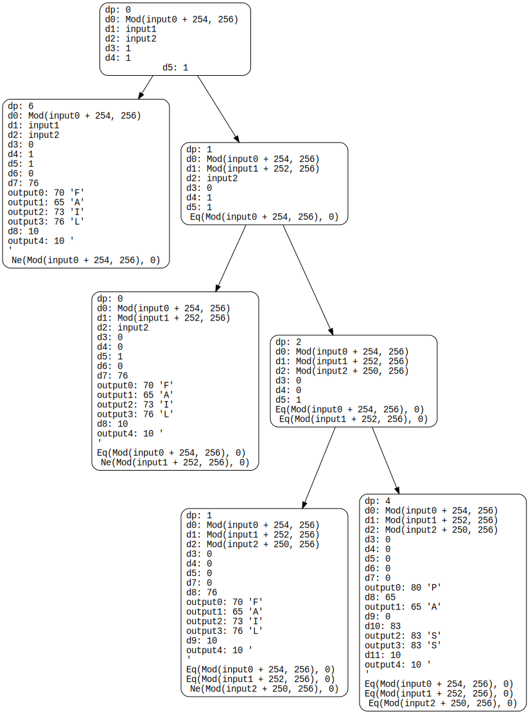
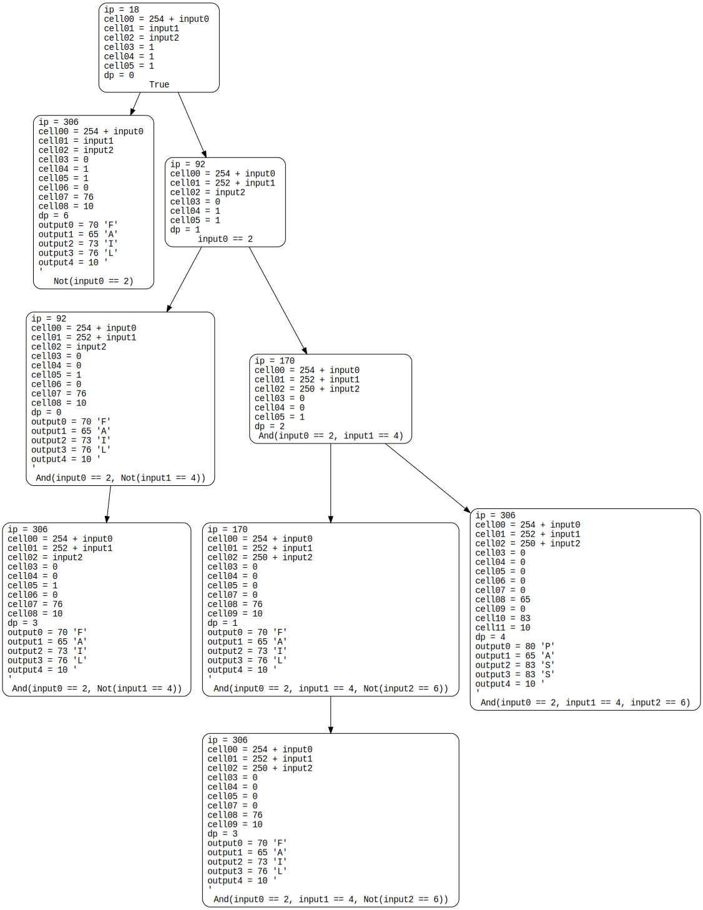

A first symbolic execution engine, starting with brainfuck.

`./symb-exec0.py` - track expressions with sympy, no branching

`./symb-exec1.py` - states can have children, execution paths become tree

`./symb-exec2.py` - actually split states when BF splits

Here is an example run on `../inputs-equals-2-4-6.bf`, a crackme that prints "PASS" when you enter 2, 4, 6 as inputs and "FAIL" otherwise:

`./symb-exec3.py` - use z3 instead of sympy

Another example run, this time with z3 version which has a `BitVecVal(8)` (unsigned char) datatype:

Note the fail cases spawn a state on their `]` that continues to the end of program (ip == 306).