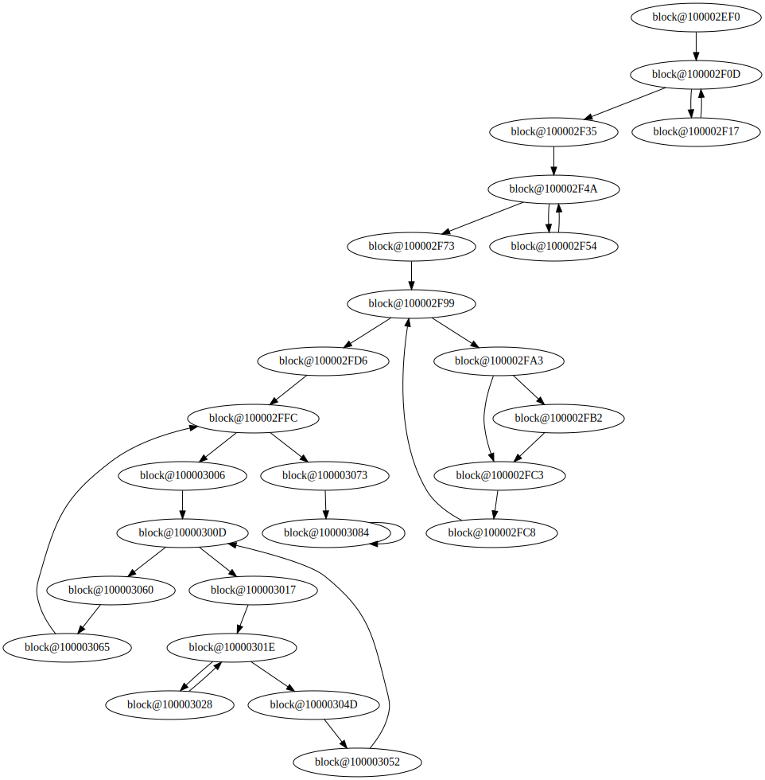
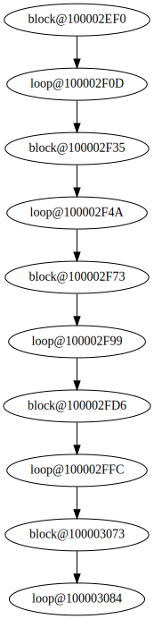

Turn a CFG into a DAG by consolidating each loop into a single loop-representing block.

Quick start (see [./test.py](./test.py) for a full example):

```python
binary = cfg_to_dag.Binary('/path/to/test.exe')
G = binary.get_cfg_dag('sub_40029a')
```

## Before:



## After:



## How?

It calculates all natural loops using the textbook algorithm. Then it searches from all blocks reachable from the first block of each loop, with the exception of blocks that have already been seen. The result of the search may include blocks from other loops. This should make it so loops that are within others, or loops that share blocks with others get combined.