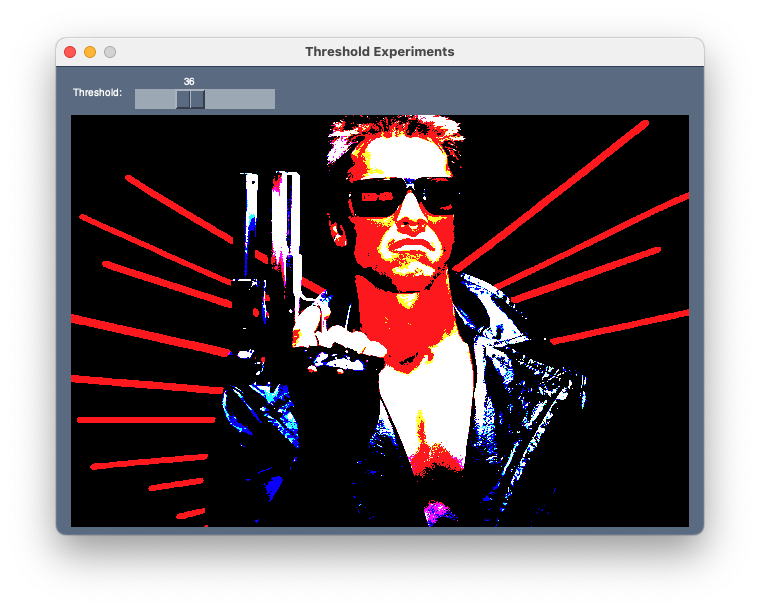
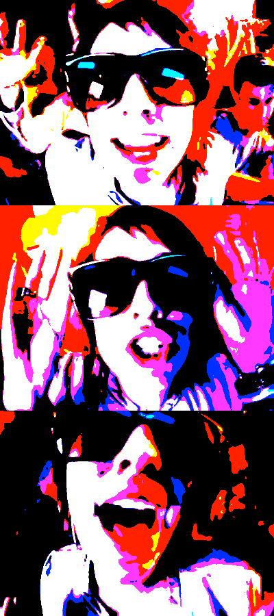

Using [PySimpleGui](https://pysimplegui.readthedocs.io/en/latest/) and [Pillow](https://pypi.org/project/Pillow/) it's quick to hack together an experimental "laboratory" for color threshold experimentation. See [./threshold-lab.py](./threshold_lab.py).

Arnold:

Here's dev from "Like a G6":

Posted 2020-06-08

The effect I wanted has a name: "posterization" and here's the right way to do it:

https://rosenzweig.io/blog/monotone-portraits-with-glsl.html
