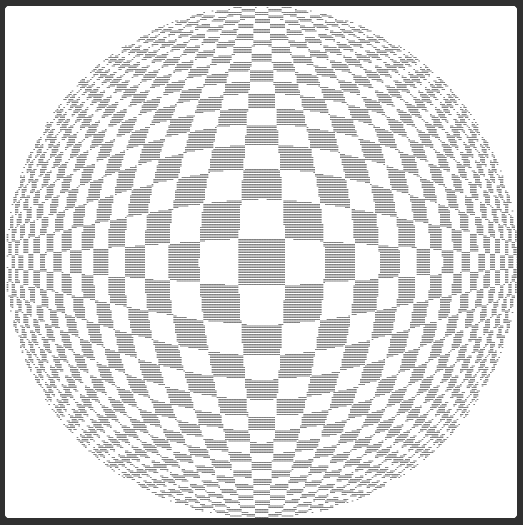
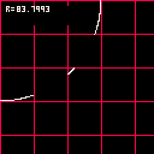
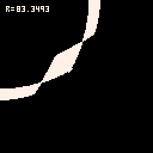

[Maraz's raster ball on turtletoy](https://turtletoy.net/turtle/ebef974b5d) is really cool, because it contains little code and no trigonometry:

My immediate urge is to draw a circle, and calculate angles and rays of light to map from a checkboard texture, but maraz moves left-to-right, top-to-bottom through every pixel on the screen.

To only draw within the circle, you just calculate a radius r from the center of the current x,y and test that it's within the circle's radius.

To detect if on black or light square, just compare the parity of the x and y coordinate with respect to the checker width.

But how do you correctly distort the squares? It's mind bending! Every x,y is asking if it's on a dark checker _within different checkerboards_. If you're close to the center, you're within a board with the largest checkers. And as you move towards the edge, you're in a checkerboard with the smallest checkers. The net effect is a distorted checker that mimics the lense. Here's an animation illustrating the distortion of checkers in the SE quadrant:

Resulting in:

For each x,y, a short line is drawn if it is the member of a dark square on its respective checkerboard. I think this is the mindset I need to learn to eventually learn to write shaders.