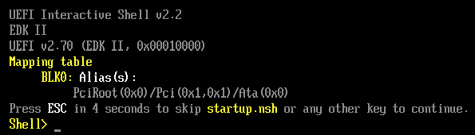

Run a UEFI app under a debugger. See [hello_uefi](https://github.com/lwerdna/reference_code/tree/master/hello_uefi).

## Get QEMU, OVFM, GDB

On MacOS, I use [homebrew](https://brew.sh/) package manager: `$ brew install qemu`.

Now get open virtual machine firmware (OVFM) prebuilt for x86_64. My search turned up https://retrage.github.io/edk2-nightly/ and I got `DEBUGX64_OVFM.fd`. The `.fd` extension is for a platform flash file I think.

`qemu-system-x86_64 --bios ~/Downloads/DEBUGX64_OVMF.fd -net none`:



That `--bios <file>` switch hides details `-drive if=pflash,format=raw,file=<file>`.

On macOS with brew package manager, install gdb with `brew install x86_64-elf-gdb`.

## Run QEMU set up for GDB connection

```
$ qemu-system-x86_64 -S -gdb tcp::9000 -drive if=pflash,format=raw,file=$HOME/Downloads/DEBUGX64_OVMF.fd -drive format=raw,file=fat:rw:. -net none -nographic
```

where:

* `-drive format=raw,file=fat:rw:.` says map the current directory to a FAT-formatted r/w drive
* `-S` says stop the CPU and wait for gdb connection
* `-gdb tcp::9000` says wait for gdb on port 9000

## Run GDB

```
$ x86_64-elf-gdb
(gdb) target remote localhost:9000
Remote debugging using localhost:9000
0x000000000000fff0 in ?? ()
(gdb) c
```

On qemu side we execute the built executable with:

```
Shell> fs0:
FS0:\> ls
Directory of: FS0:\
02/20/2024  10:46               2,048  bootx64.efi
02/13/2024  11:37 <DIR>         8,192  efi
02/20/2024  10:46 <DIR>         8,192  guest_root
02/20/2024  10:46                 452  main.c
02/20/2024  10:46                 228  main.d
02/20/2024  10:46                 780  main.o
02/13/2024  11:27                 695  Makefile
02/20/2024  10:52               1,974  README.md
          6 File(s)       6,177 bytes
          2 Dir(s)
FS0:\> bootx64.efi
```

## How to find the target

### int3 or 0xCC

Doesn't work! I compile this in with `__builtin_debugtrap()` intrinsic in clang. But result from qemu is:

```
!!!! X64 Exception Type - 03(#BP - Breakpoint)  CPU Apic ID - 00000000 !!!!
RIP  - 0000000005DA803F, CS  - 0000000000000038, RFLAGS - 0000000000000206
// omitted for brevity
FXSAVE_STATE - 0000000007E85FB0
!!!! Find image based on IP(0x5DA803F) (No PDB)  (ImageBase=0000000005DA7000, EntryPoint=0000000005DA8000) !!!!
```

### icebp

Doesn't work!

```!!!! X64 Exception Type - 06(#UD - Invalid Opcode)  CPU Apic ID - 00000000 !!!!
!!!! X64 Exception Type - 06(#UD - Invalid Opcode)  CPU Apic ID - 00000000 !!!!
RIP  - 0000000005DA703E, CS  - 0000000000000038, RFLAGS - 0000000000000206
// omitted for brevity
FXSAVE_STATE - 0000000007E85FB0
!!!! Find image based on IP(0x5DA703E) (No PDB)  (ImageBase=0000000005DA6000, EntryPoint=0000000005DA7000) !!!!
```

### while(1) or EB FE

`while(1)` causes the remainder of the function to optimized away with clang. So you have to insert this manually (EB FE) or with post-compilation patch script.

Nevermind! `__asm__("here: jmp here");` works!

break in and get out of the loop by setting RIP past it: `set $rip=0x5da8043`

```
=> 0x5da8040:	jmp    0x5da8040
   0x5da8042:	mov    rax,QWORD PTR [rsp+0x58]
   0x5da8047:	mov    rax,QWORD PTR [rax+0x40]
   0x5da804b:	mov    rax,QWORD PTR [rax+0x30]
   0x5da804f:	mov    rcx,QWORD PTR [rsp+0x58]
   0x5da8054:	mov    rcx,QWORD PTR [rcx+0x40]
   0x5da8058:	call   rax
```

## Debug!

Once you've found the target, you can do normal debugger type stuff, like inspecting registers, memory, etc. There is a script `uefi_gdb.py` to help.

Since we are at start of `efi_main()`, and Microsoft x64 calling convention is used, rcx should have the handle and rdx the pointer to the system table:

```
(gdb) source uefi_gdb.py
(gdb) info reg rdx
rdx            0x75ec018           123650072
(gdb) dump_system_table 0x75ec018
reading from 0x75EC018
header:
  signature: IBI SYST
  revision: 0x20046
  header_size: 0x78
  crc32: 0x3d5defe3
  reserved: 0x0
FirmwareVendor: 0x751df98
FirmwareRevision: 0x10000
padding: 0x0
ConsoleInHandle: 0x68abf98
ConIn: 0x6825050
ConsoleOutputHandle: 0x6491518
ConOut: 0x63cd0a0
StandardErrorHandle: 0x689f918
StdError: 0x6824df0
RuntimeServices: 0x75ecb98
BootServices: 0x7ead520
NumOfTableEntries: 12
ConfigurationTable: 0x75ecc98
```

## Tips

Kill qemu from another console with `pkill qemu-system-x86_64`.

Kill qemu from gdb with `(gdb) kill`.

If backspace doesn't work in qemu, try ctrl+h.

## Addendum

Mike Krinkin's very helpful blog posts:

* 2020-10-11 [Getting started with EFI](https://krinkinmu.github.io/2020/10/11/efi-getting-started.html)

* 2020-10-18 [UEFI handles, GUIDs and protocols](https://krinkinmu.github.io/2020/10/18/handles-guids-and-protocols.html)

* 2020-10-31 [UEFI File access APIs](https://krinkinmu.github.io/2020/10/31/efi-file-access.html)
* 2020-11-15 [Loading an ELF image from EFI](https://krinkinmu.github.io/2020/11/15/loading-elf-image.html)

https://en.wikibooks.org/wiki/QEMU/Debugging_with_QEMU

https://github.com/lwerdna/reference_code/tree/master/hello_uefi
