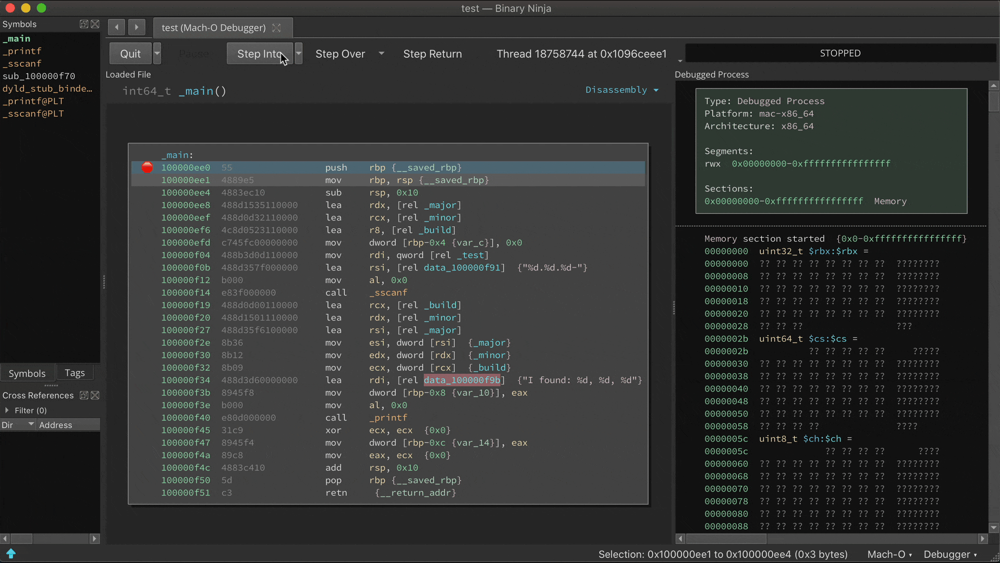
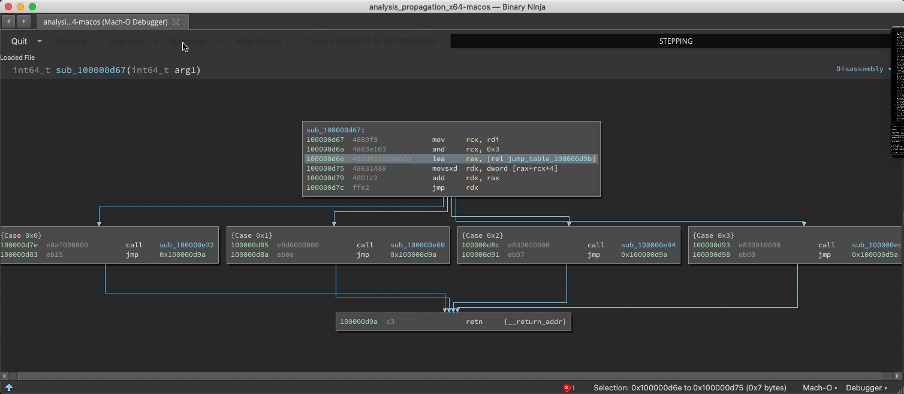
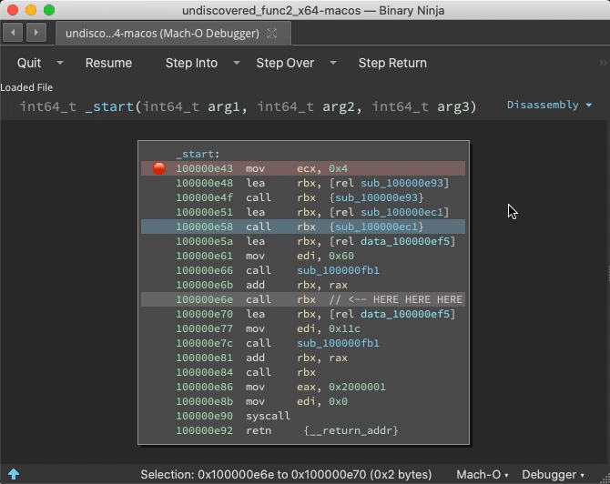
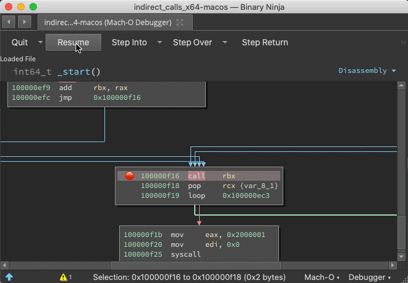
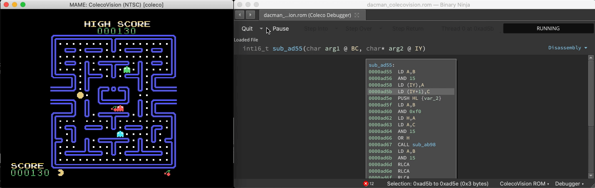
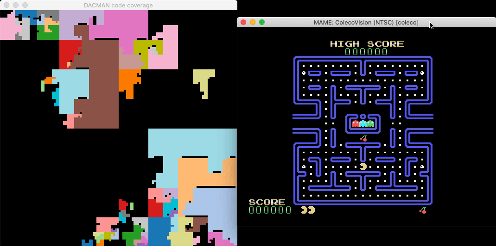
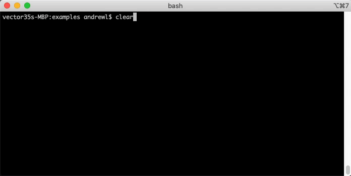
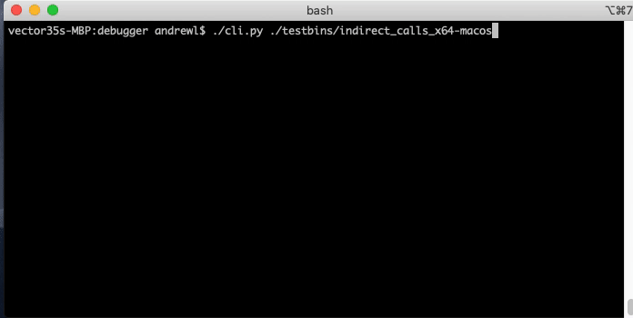
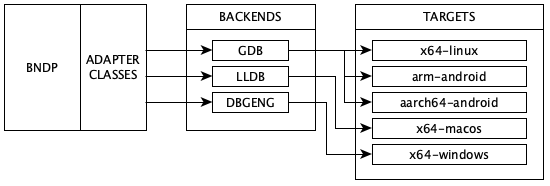
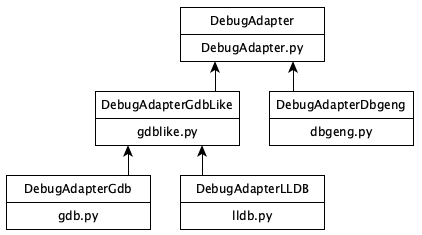

OFFICIAL RELEASE IS AT: https://binary.ninja/2020/05/06/debugger-showcase.html

It's been over a month since we [announced](https://twitter.com/vector35/status/1240287853969629186) the Binary Ninja Debugger Plugin (BNDP) in beta, and as it begins to near the time it can shed its "BETA" tag, we wanted to show off the current state of the features and capabilities. Note that the debugger is being implemented as an [open source plugin](https://github.com/Vector35/debugger) and feedback and code are always welcome.

First, the highlights: BNDP does most of the usual things you'd expect from a debugger:

- instrument processes
- pause/resume
- step into/step over/step until return
- detach
- inspect memory
- see/change register state
- disassemble new regions of memory as it executes through them

And it can do a few things you might not expect from all debuggers:
- automatically update functions and branch points in a binary based on execution through it
- apply arbitrary types and structure decoding to live memory
- annotate calls with run-time specific arguments

Though there's a few features still in development that aren't done yet:

- attaching to a running process[1](https://github.com/Vector35/debugger/issues/23)
- support for forking processes[2](https://github.com/Vector35/debugger/issues/84)]
- [see more requested enhancements](https://github.com/Vector35/debugger/issues?q=is%3Aissue+is%3Aopen+label%3Aenhancement)

Finally, the debugger runs on the [most common architectures and platforms](#supported-platforms) but more importantly, it's implemented on an extensible architecture that makes it easy to add support for new platforms and debugging APIs.

## Demos

Let's do the fun stuff first and show off some demos. You can skip to the [end](#design) for specifications and architecture discussions.

### Switch/Case Discovery

The static analysis is adept and finding switch statements and their corresponding jump tables, but with [considerable effort](https://github.com/Vector35/debugger/blob/master/testbins/missing_switch_case_x64.asm) it can be fooled into missing a case. If a new case is observed at runtime, analysis is updated: 

### Undiscovered Country

If a function [is purposely hidden](https://github.com/Vector35/debugger/blob/master/testbins/indirect_calls_x64.asm) or even just the result of a virtual function call or other indirect control flow, static analysis might miss it. But during runtime, analysis can be told the address of call destinations great improving function identification.

Prior to the `call ebx`, address `0x100000f25` is just data. But once this instruction is reached, Binja wisens up:

### Indirect Jump Annotation

With the `debugger.extra_annotations` setting, function starts get annotated with context information and targets of indirect calls are logged as comments:

### Connect to MAME

With the [right plugin](https://github.com/vector35/Z80), Binja can analyze Z80 binary code in Colecovision ROMS. And since [MAME](https://www.mamedev.org/) exposes a gdb stub, we can connect to it:

A [headless script](https://github.com/Vector35/debugger/blob/master/examples/dacman_live_hilbert.py) that breakpoints all Binja-identified functions and updates a live graphical map of the binary reveals which functions are responsible for gameplay elements and shows their relative sizes and proximity:

### Count Opcodes

The UI is not the only consumer of BNDP's API. You can write "headless" scripts too. Here's [a simple example](https://github.com/Vector35/debugger/blob/master/examples/md5_opc_freq.py) that runs `md5` and single-steps while counting all the opcodes executed:

### CLI Debugger

The headless API is complete enough that a respectable little CLI debugger can be made [in a few hundred lines](https://github.com/Vector35/debugger/blob/master/cli.py).

# Design

### Multiplatform Architecture

BNDP can connect to three back-ends: [gdb](https://github.com/Vector35/debugger/blob/master/gdb.py), [lldb](https://github.com/Vector35/debugger/blob/master/lldb.py), and [dbgeng](https://github.com/Vector35/debugger/blob/master/dbgeng.py). The target is decoupled from BNDP in the first two modes, communicating using the [RSP protocol](https://sourceware.org/gdb/current/onlinedocs/gdb/Remote-Protocol.html) over a socket. Theoretically any platform for which a gdb server exists can be debugged. In dbgeng mode, BNDP is runtime linked to [Windows debugger engine](https://docs.microsoft.com/en-us/windows-hardware/drivers/debugger/introduction) and can debug local binaries.

### Supported Platforms

BNDP is tested on **x64-linux**, **arm-android** and **aarch64-android** binaries in gdb mode, **x64-macos** binaries in lldb mode, and **x64-windows** binaries in dbgeng mode.

You should have success on the 32-bit x86 versions of the above binaries, but they're not as rigorously tested as 64-bit.

### Adapter Classes: Generalizing Back-ends

Each of the adapters is expected to provide some primitive operations, like reading registers, stepping, breakpoints, etc. The comprehensive, but still short, list is the abstract functions in class DebugAdapter in [DebugAdapter.py](https://github.com/Vector35/debugger/blob/master/DebugAdapter.py).

With classes and inheritance, we're able to factor out common behavior among adapters. For instance, GDB and LLDB have much in common, with LLDB speaking [an augmented RSP protocol](https://github.com/llvm-mirror/lldb/blob/master/docs/lldb-gdb-remote.txt). The current class diagram has plenty of room for an additional adapter and its corresponding back-end:

Higher level operations like "step over" are provided by some back-ends (like dbgeng) but not others (like gdb and lldb). For these, the operation is synthesized with primitive operations. "Step over" might involve disassembling to detect call or loop instructions and setting a one-shot breakpoint. "Go up" might involve reading the stack and setting a one-shot breakpoint at the return address.

Note that we intentionally did not write this blog post to be documentation on all features of the debugger, or a how-to guide for using it. Rather, we want to show what's possible and talk about the design of the debugger. If you're interested in simpler user documentation, keep an eye out on the project [repository](https://github.com/Vector35/debugger) where we'll post updated user documentation as it's released.

