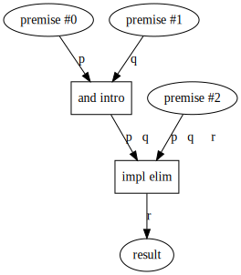
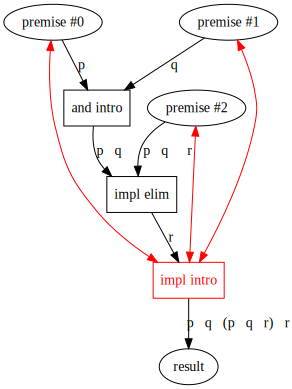

Stanford's interactive [natural deduction exercises](http://logic.stanford.edu/intrologic/exercises/exercise_04_01.html) using the [Fitch system](https://en.wikipedia.org/wiki/Fitch_notation) are fantastic. But I've long been confused on the difference between proving some goal given assumptions and proving something outright.

Consider exercise 4.1:

> Given *p* and *q* and (*p* ∧ *q* ⇒ *r*), use the Fitch system to prove *r*.

What I thought was a proof tree:

So did we prove r? We couldn't have, because r isn't a **tautology**, it relies on the premises being true. So while the deduction of r is **valid**, it isn't necessarily **sound**. And only sound things can be proven, right?

I think some clarity comes from these [UPENN CIS160 slides](https://www.seas.upenn.edu/~jean/cis160/cis260slides1.pdf) which distinguish between a **deduction tree** and a **proof tree**. A proof tree must discharge all assumptions. I think that applies to starting assumptions (premises) and temporary assumptions used to introduce an implication. This still has the assumptions around, so it is just a deduction tree.

Then was anything proven? Yes, `r` was deduced, but `p ∧ q ∧ (p∧q ⇒ r) ⇒ r` was proven. Inserting implication introduction and its discharging effect in red yields:

With all assumptions discharged, this is a real proof tree.

So I think Stanford's instructions might better be stated:

> Given *p* and *q* and (*p* ∧ *q* ⇒ *r*), use the Fitch system to **deduce** *r*.

Or:

> Given *p* and *q* and (*p* ∧ *q* ⇒ *r*), use the Fitch system to **prove** *p* ∧ *q* ∧ (*p* ∧ *q* ⇒ *r*) ⇒ *r*.

2021/06/03
