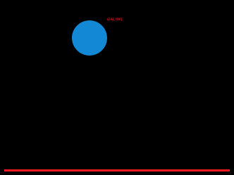
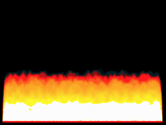
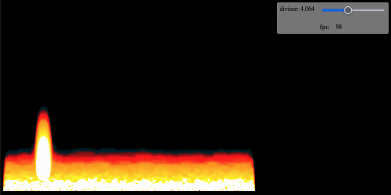
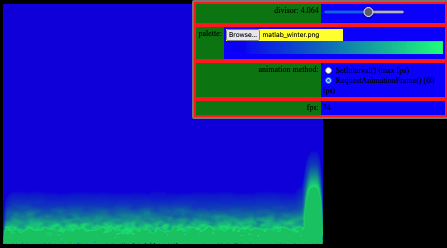
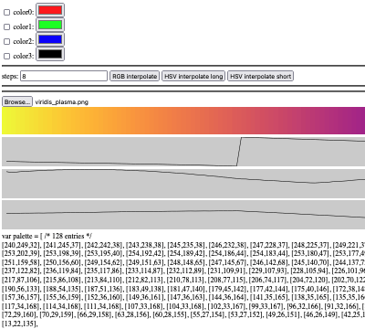
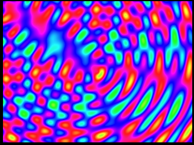
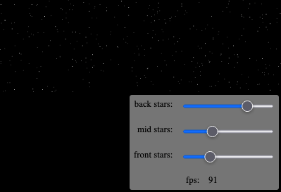
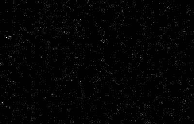

These are some experiments drawing on the HTML5 canvas with javascript circa 2018-07-15.

[./bouncing_ball](./bouncing_ball/index.html)

[./fire](./fire/index.html)

[./fire_controls](./fire_controls/index.html)

A slider allows you to adjust the fire effect divisor and your mouse cursor can inflame the flames.

[./fire_controls2](./fire_controls2/index.html)

You can load a custom palette and choose between animation methods.

[./palette](./palette/index.html)

Load images as palettes and display an array of RGB values.

[./plasma](./plasma/index.html)

[./stars_circular](./stars_circular/index.html)

[./stars_linear](./stars_linear/index.html)

