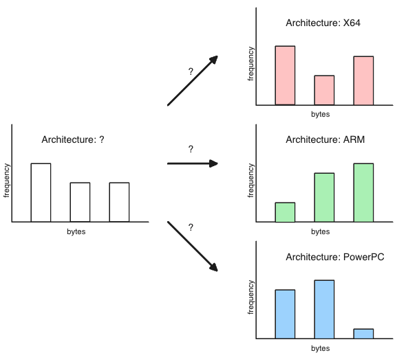
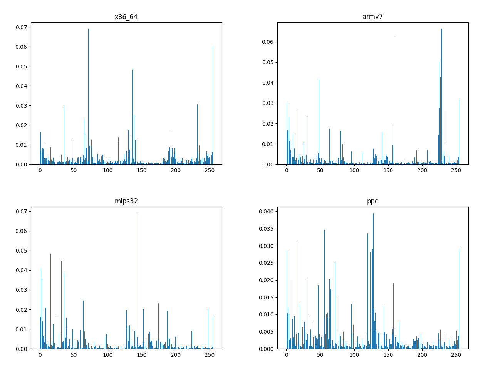

Can we detect the architecture within a blob by comparing its byte distribution to reference distributions?

Much like English prose has a certain ratio of 'e' to 'z', we hope x64 has a certain ratio of `mov` to `fsqrt`, or the bytes that encode those mnemonics.

The plan is to count the bytes in areas of the blob likely to contain code and make a histogram. Then compare that histogram to reference histograms using a statistical [goodness of fit](https://en.wikipedia.org/wiki/Goodness_of_fit) test:



It is difficult to find a good reference program from which to sample because the distribution of instructions depends on the purpose of the program. For example, a binary with a lot of symmetric cryptography has a higher rate of bit manipulation operations (shift, rotate, xor, etc.) than normal. I chose [busybox](https://www.busybox.net/) binaries because they pack a lot of diverse functionality into a single binary.

Use [generate-reference.py](./generate-reference.py) to construct the data in [references.py](./references.py). Here four of them graphed:



This is after discarding the high occurrence of null bytes, for which I don't have a quick explanation why they're so prevalent.

The goodness of fit test I use is [Pearson's chi squared test](https://en.wikipedia.org/wiki/Pearson%27s_chi-squared_test) because it's simple to understand. Between all corresponding values in the two distributions, you calculate the ratio of the squared error to the reference value. Then add that all up. The result is called a **test statistic** among mathematicians.

```python
result = sum([(sampled[i] - reference[i])**2 / reference[i] for i in range(256)])
```

I think this test statistic is then looked up in a table, where if it exceeds some threshold or critical value, you can conclude the sampled data is not from the reference distribution (data is special), otherwise it is (null hypothesis, data is not special).

We're not interested in a simple "yes/no" but which reference distribution it's closest to. So we'll simply compute the four scores and choose the reference implementation scoring the lowest (is the most similar).

We want to disregard bytes in the input blob that are definitely not code. Two techniques I can think of off the top of my head are:

* disregard low entropy regions, as this indicates filler and repeating bytes
* Disregard regions with high frequency in ascii range, indicating strings

Both of these are implemented prior to sampling.

See [guess-arch.py](./guess_arch.py) for the implementation. Here's it's performance on a small corpus of binaries I have compared to the ID produced by the [file](https://man7.org/linux/man-pages/man1/file.1.html) identification tool.

```
path                           us         file       result
MGENVXD.VXD                    x86        x86        MATCH!
PDIPX.COM                      x86_64     x86
QtGuiApp1.exe                  x86_64     x86_64     MATCH!
bookworm_elf_thumb             aarch64    armv7
busybox-arm64                  aarch64    aarch64    MATCH!
busybox-armv4l                 armv7      armv7      MATCH!
busybox-armv4tl                armv7      armv7      MATCH!
busybox-armv5l                 armv7      armv7      MATCH!
busybox-armv6l                 armv7      armv7      MATCH!
busybox-armv7l                 armv7      armv7      MATCH!
busybox-i486                   x86        x86        MATCH!
busybox-i586                   x86        x86        MATCH!
busybox-i686                   x86        x86        MATCH!
busybox-mips                   mips32     mips32     MATCH!
busybox-mips64                 mips64     mips64     MATCH!
busybox-mipsel                 mips32     mips32     MATCH!
busybox-powerpc                ppc        ppc        MATCH!
busybox-powerpc-440fp          ppc        ppc        MATCH!
busybox-x86_64                 x86_64     x86_64     MATCH!
ceph-dencoder-arm32-elf        x86        armv7
ctf_macho_ppc_be.bin           ppc        ppc        MATCH!
curl-mips32                    aarch64    mips32
dyld_apple_arm64e              aarch64    aarch64    MATCH!
echoback                       x86        x86        MATCH!
elf-Linux-ARMv7-ls             armv7      armv7      MATCH!
elf64_ppc64_be                 x86        ppc
elf_mips32_be                  x86        mips32
elf_thumb2_be                  aarch64    armv7
elf_x64_wrapped_exit           x86        x86_64
elf_x86                        x86_64     x86
foo-linux-x64-DWARF.so         aarch64    x86_64
hello-android-aarch64.elf      aarch64    aarch64    MATCH!
hello-android-thumb.elf        aarch64    armv7
hello-linux-ppc32.elf          ppc        ppc        MATCH!
hello-linux-ppc64              ppc        ppc        MATCH!
hello-linux-x64.elf            aarch64    x86_64
hello-macos-x64.macho          aarch64    x86_64
hello-windows-x86.pe32.exe     x86        x86        MATCH!
hello.exe                      x86_64     x86_64     MATCH!
hello_windows_x64.exe          x86_64     x86_64     MATCH!
libc-2.32-aarch64-2.so         aarch64    aarch64    MATCH!
libc-2.32-aarch64.so           aarch64    aarch64    MATCH!
libc.so.6                      aarch64    armv7
libhdk-mips-elf                mips32     mips32     MATCH!
libpthread_aarch64.so.0        aarch64    aarch64    MATCH!
libpthread_armv7.so.0          aarch64    armv7
libpthread_armv7eb.so.0        aarch64    armv7
libpthread_i386.so.0           aarch64    x86
libpthread_mips.so.0           aarch64    mips32
libpthread_mipsel.so.0         aarch64    mips32
libpthread_ppc32.so.0          aarch64    ppc
libpthread_thumb2.so.0         aarch64    armv7
libpthread_thumb2eb.so.0       aarch64    armv7
libpthread_x86_64.so.0         aarch64    x86_64
macho_mte_at_10000679c         aarch64    aarch64    MATCH!
magic_division_armv7.so        armv7      armv7      MATCH!
md5_armv7-android              armv7      armv7      MATCH!
md5_x64-macos                  x86_64     x86_64     MATCH!
mfcr-linux-ppc32.elf           ppc        ppc        MATCH!
mips_helloworld_condition_elf  mips32     mips32     MATCH!
nmbd-mipsel.elf                mips32     mips32     MATCH!
ntdll-aarch64.dll              aarch64    aarch64    MATCH!
ntoskrnl.exe                   x86_64     x86_64     MATCH!
pic_with_call_dest_relocations x86        x86        MATCH!
pwnd_x64.dll                   x86_64     x86_64     MATCH!
pwnd_x86.dll                   x86        x86        MATCH!
quake-dos-x86.exe              x86        x86        MATCH!
shellcode_loader_win.exe       x86_64     x86_64     MATCH!
sstic_aarch64.ko               aarch64    aarch64    MATCH!
switch_linux_ppc_le_32         ppc        ppc        MATCH!
test2.macho                    aarch64    x86_64
test_mbox.dll                  x86_64     x86_64     MATCH!
test_mbox.exe                  x86_64     x86_64     MATCH!
testfilewrite.dll              x86_64     x86_64     MATCH!
tests                          x86        x86_64
tests-macos-x64-macho          x86        x86_64
true_or_false-macos-x64        aarch64    x86_64
wpa_cli-mips64.elf             mips64     mips64     MATCH!
```

Without surprise, it identifies all the busybox binaries correctly. Overall it performs well. I should look into why the libpthread files are all misidentified.

<!-- Originally made: 2019-08-09 -->
