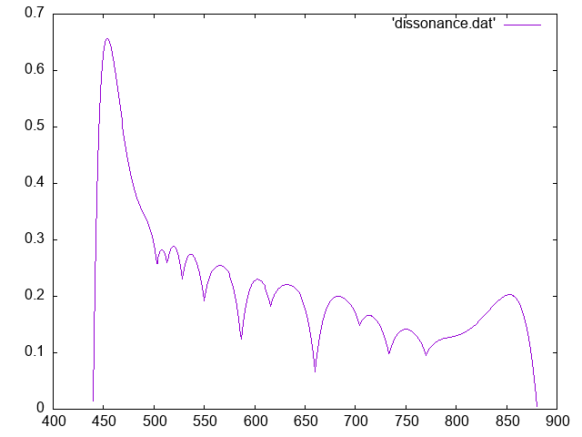

"Roughness" measure reveals major scale:

* https://music.stackexchange.com/questions/4439/is-there-a-way-to-measure-the-consonance-or-dissonance-of-a-chord
* http://www.acousticslab.org/learnmoresra/moremodel.html
