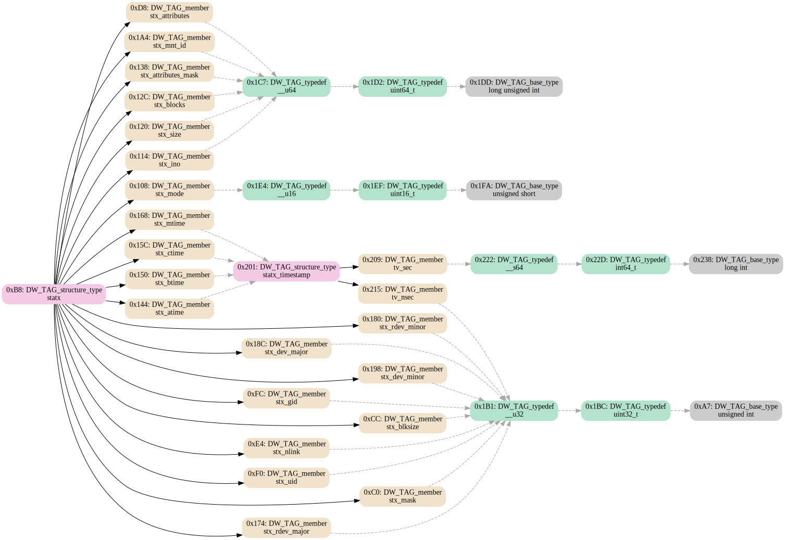

Pipe from `dwarfdump` to get DWARF information in the form of a graph.

`./helpers.py` calls dwarfdump, parses its output into graph of DNode.

`./graph.py` extends DNode to GraphNode and produces [DOT](https://en.wikipedia.org/wiki/DOT_(graph_description_language)).

`./tojson.py` extends DNode to JNode and produces [JSON](https://en.wikipedia.org/wiki/JSON) intended to be consumed to generate type libraries for reverse engineering tools.

### Preview:



### Example:

```
./graph.py ~/fdumps/filesamples/foo-linux-x64-DWARF.so --function=statx
./graph.py ~/fdumps/filesamples/foo-linux-x64-DWARF.so --structure=statx
./tojson.py ~/fdumps/filesamples/foo-linux-x64-DWARF.so --function=statx
./tojson.py ~/fdumps/filesamples/foo-linux-x64-DWARF.so --structure=statx
```

