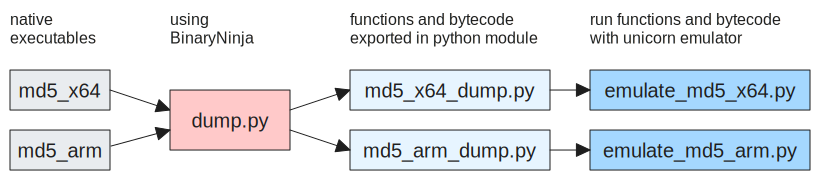

Use BinaryNinja to dump a binary's functions. Then execute those functions using unicorn.

File [dump.py](./dump.py) does the dumping. Included example outputs from this tool are md5 compiled for x64 ([md5_x64_dump.py](./md5_x64_dump.py)) and md5 compiled for armv7 ([emulate_md5_armv7.py](./emulate_md5_armv7.py)).



Those dumps are runnable by [emulate_md5_x64.py](./emulate_md5_x64.py) and [emulate_md5_armv7.py](./emulate_md5_armv7.py) respectively. Here's a run that computes the md5 of "The quick brown fox jumps over the lazy dog":

```
$ ./emulate_md5_x64.py
...
writing 0xA bytes of sub_100003dec to 0x100003DEC
creating stack segment [0xF0000000, 0xF0010000)
MD5_CTX allocated to 0xF000FE80
calling MD5Init(&context)
calling MD5Update(&context, "The quick brown fox jumps over the lazy dog", 43)
calling MD5Final(digest, &context)
p_context: 0xF000FE80
p_digest: 0xF000FE70
result: (expect: 9e107d9d372bb6826bd81d3542a419d6)
f000fe70: 9e 10 7d 9d 37 2b b6 82 6b d8 1d 35 42 a4 19 d6  ..}.7+..k..5B...
```

## Tracing and plotting reads/writes

With memory hooks (see [./, we can draw reads (green) and writes (red):

I think this shows the 

**dependencies**: capstone, unicorn.


