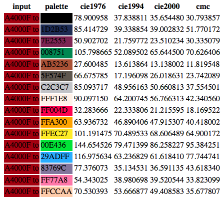

I was trying to convert an image into a format that could be displayed in pico-8. My method is naive and  straightforward: visit every pixel in the source image, and ask which of pico-8's 16 [colors are closest](https://en.wikipedia.org/wiki/Color_difference). Color difference ends up being complex, so I deferred to [colormath](https://python-colormath.readthedocs.io/en/latest/). For reasons I can't figure out, this produces terrible results:


Shouldn't her hood earn the reddish colors? Why just her bottom lip? And sonic's forehead should get the light-blue entry 13 in pico-8's palette. I converted the RGB's to colormath's "labcolor" and back. I looked at ALL of the algorithms in colormath, with a sanity check on the hood color:



Yep they all award palette index 4 (the brown) instead of index 8 (the red). I gave up at this point and went to another method. [Imagemagick](http://www.imagemagick.org) can do it by supplying another image as the palette. I did not want to get into a paint program, so [Portable Pixmap (ppm)](https://en.wikipedia.org/wiki/Netpbm_format) comes to the rescue because we can carefully specify the image in text. Here's pico8_palette.ppm adapted right from the Wikipedia example:

```
P3
4 4
255
0 0 0		29 43 83		126 37 83		0 135 81
171 82 54	95 87 79		194 195 199		255 241 232
255 0 77	255 163 0		255 236 39		0 228 54
41 173 255	131 118 156		255 119 168		255 204 170
```
And the 8 pixels so minimally specified:


Now `convert input.png -remap pico8_palette.ppm output.png`:


Though [dithering](https://en.wikipedia.org/wiki/Dither) is at work here, Dua's hood gets the red palette entry and Sonic's forehead gets the light blue. Here it is without dithering (`convert input.png -dither None -remap pico8_palette.ppm output.png`):


Not quite as pretty, but still better than the naive approach. So the workflow now will be to pipe out to imagemagick and grab its work. Actually storing the image in pico8 code is another task entirely, with issues like compression and token limits creeping in.

Here's the failing code, for reference:

```python
#!/usr/bin/env python

import re, os, sys
from PIL import Image
from colormath.color_objects import sRGBColor, XYZColor, LabColor
# https://en.wikipedia.org/wiki/Color_difference
from colormath.color_diff import delta_e_cie1976, delta_e_cie1994, delta_e_cie2000, delta_e_cmc
from colormath.color_conversions import convert_color

def rgb2lab(r,g,b):
	return convert_color(convert_color(sRGBColor(r,g,b,True), XYZColor), LabColor)	

p8_rgb = [
	(0,0,0),		# 000000
	(29,43,83),		# 1D2B53
	(126,37,83),	# 7E2553
	(0,135,81),		# 008751
	(171,82,54),	# AB5236
	(95,87,79),		# 5F574F
	(194,195,199),	# C2C3C7
	(255,241,232),	# FFF1E8
	(255,0,77),		# FF004D
	(255,163,0),	# FFA300
	(255,236,39),	# FFEC27
	(0,228,54),		# 00E436
	(41,173,255),	# 29ADFF
	(131,118,156),	# 83769C
	(255,119,168),	# FF77A8
	(255,204,170)	# FFCCAA
]

p8_lab = map(lambda rgb: rgb2lab(*rgb), p8_rgb)

#p8_srgb = map(lambda rgb: sRGBColor(rgb[0],rgb[1],rgb[2], True), p8_rgb)
#for (idx,c) in enumerate(p8_srgb):
#	print 'color %d: %s' % (idx, c.get_rgb_hex())
#sys.exit(-1)

p8_descrs = ['black', 'dblue', 'purple', 'dgreen', 'brown', 'dgray', 'lgray',
	'white', 'red', 'orange', 'yellow', 'lgreen', 'lblue', 'lpurple', 'pink',
	'tan']

def get_p8(r,g,b):
	c0 = rgb2lab(r,g,b)

	best_idx = -1
	best_delta = 100 # colors are exact opposite
	for (idx,c1) in enumerate(p8_lab):
		tmp = delta_e_cie2000(c0,c1)
		if tmp < best_delta:
			best_delta = tmp
			best_idx = idx

	return best_idx

if os.path.isfile(sys.argv[1]):
	im = Image.open(sys.argv[1])
	#assert (im.width,im.height)==(128,128)
	im = im.convert('RGB')

	im2 = Image.new('RGB', (im.width, im.height))
	im2px = im2.load()

	for x in range(im.width):
		for y in range(im.height):
			r,g,b = im.getpixel((x,y))
			#print im.getpixel((x,y))
			#sys.exit(0)
			idx = get_p8(r,g,b)
			print '(%d,%d) is %02X%02X%02X and closest to %d %s' % (x,y,r,g,b,idx,repr(p8_rgb[idx]))
	
			im2px[x,y] = p8_rgb[idx]
			#im2px[x,y] = (r,g,b)

	im2.save("/tmp/tmp.png")
else:
	m = re.match(r'(..)(..)(..)', sys.argv[1])
	assert m
	(r,g,b) = map(lambda x: int(x,16), m.group(1,2,3))
	c0str = '%02X%02X%02X to ' % (r,g,b)
	c0 = rgb2lab(r,g,b)

	fp = open('/tmp/tmp.html', 'w')
	fp.write('<html>\n')
	fp.write('<table>\n')
	fp.write('<tr><th>input</th><th>palette</th><th>cie1976</th><th>cie1994</th><th>cie2000</th><th>cmc</th></tr>\n')
	for (idx,c1) in enumerate(p8_lab):
		c1str = '%02X%02X%02X' % p8_rgb[idx]
		delta0 = delta_e_cie1976(c0,c1)
		delta1 = delta_e_cie1994(c0,c1)
		delta2 = delta_e_cie2000(c0,c1)
		delta3 = delta_e_cmc(c0,c1)
		fp.write(' <tr>\n')
		fp.write('  <td bgcolor=#%s>%s</td>\n' % (c0str,c0str))
		fp.write('  <td bgcolor=#%s>%s</td>\n' % (c1str,c1str))
		fp.write('  <td>%f</td><td>%f</td><td>%f</td><td>%f</td>\n' % (delta0,delta1,delta2,delta3))
		fp.write(' </tr>\n')
	fp.write('</table>\n')
	fp.write('</html>\n')
```
