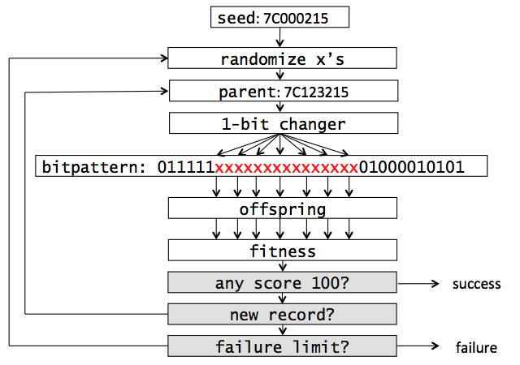
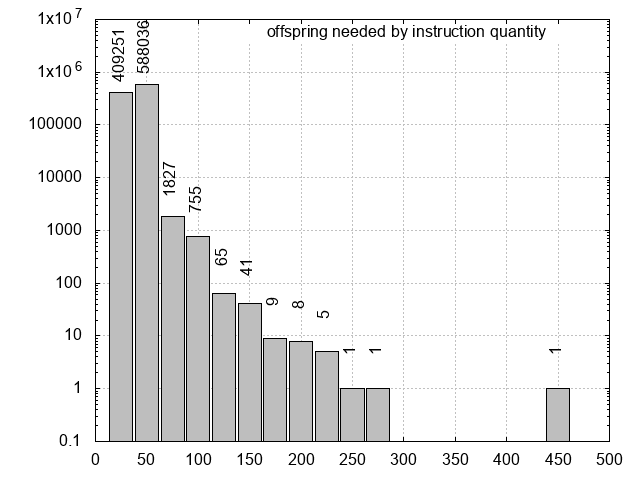
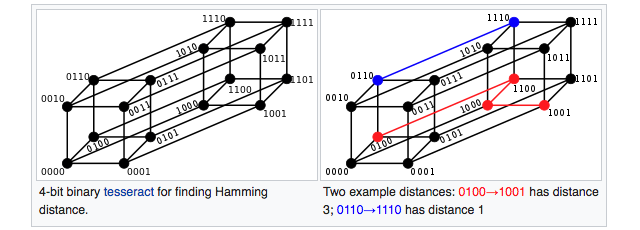

OFFICIAL RELEASE: <https://binary.ninja/2018/06/19/fast-track-to-assembler-writing.html>

This post describes how we wrote assemblers in an atypical manner: using genetic algorithms. Instead of containing logic as to how every opcode and operand is encoded, we guess. To score each guess, and guide the next guess toward the correct encoding, we invoke a disassembler and analyze its output string. The result is a surprisingly fast process that can assemble any string output by the disassembler. In effect, we construct an assembler by inverting a disassembler. It worked for PPC, then for MIPS, and it nears completion for ARM. I believe it's presentable as a general approach, at least for fixed-width instruction encodings.

# Adressing A Need In Binary Ninja

One of our aims in the user experience of Binary Ninja is to make patching as quick and painless as possible. You can enter raw bytes, invert branches and nop instructions with a click, or enter raw assembly if you choose, both on a single-line basis and in a multi-line dialogue. But there are some shortcomings.

First, the format in which you enter assembly isn't exactly the same as the format you see in disassembly. For example, in PPC, the disassembly might show `mr r26, r1` but to assemble this, you need to enter `mr 26, 1`.  When the result of disassembing an instruction word can be consumed by an assembler to produce the same instruction word, we dub it "round-tripping." The multiple authorship between binja's disassemblers and assemblers within Binja makes this difficult. We wrote all the disassemblers except PPC, and wrote none of the assemblers. For x86 we pipe out to a separate yasm process, and for others we call to a binary linked LLVM.

Second, for location-sensitive instructions, we need to locate the assembly at certain addresses. "The .org directive!" you may say. But we are surprised to find that LLVM and other assemblers strongly insist on padding out the bytes up until the .org address. This becomes problematic when you're trying to assemble, say, a jump at `0xF0000000`. Once upon a time, you'd start your COM assembler files with `.org 100h`, anticipating DOS placing your code after the[ PSP](https://en.wikipedia.org/wiki/Program_Segment_Prefix). It did not mean that your code would be at offset 256 bytes in the resulting COM file.

Amid the debate of what to do, I knew having our own assembler would be the ultimate solution. We could specify the syntax, and specify how .org is handled. But would writing assemblers be a good use of our time? We needed a shortcut.

We already had disassemblers for every architecture. I pictured them as large table whose rows were numbered by the value of every instruction word, and contained the string representation of that instruction. For example, row `0x60000000` in the PPC table contained `nop`. What prevents us from inverting this table, from finding `nop` and seeing that its encoding is `0x60000000`? Why can't a disassembler be used as an assembler?

# Framed As A Genetic Algorithm

Using terminology that often accompanies genetic algorithms, the *parents* are instruction encodings. The *offspring* are variations of that parent. The *fitness function* measures how "close" the current offspring are to the string that the user supplied for assembly by invoking the disassembler on the offspring and comparing its disassembly.

Why doesn't this work immediately? Because there are some critical questions without answers:

1. how do you choose an initial parent?
2. how do you implement a fitness function?
3. how do you move towards the correct encoding given feedback from the fitness function?

We found that primitive pre-computation using brute-forcing and imposing a syntax structure on incoming strings can answer these challenges.

# Choosing an Initial Parent

To appreciate the problem, suppose the user requested that you assemble the PPC instruction `nop`, `eieio`, or `isync`. They each have exactly one encoding. In the 32-bit instruction space, that's a haystack with 4.3 billion straws. We start by finding "seeds" for every possible opcode. The pseudocode is what you might guess:

```python
seen = {}
for insword in range(2**32):
	opc = disassemble(insword)
	if not (opc in seen):
		seen[opc] = insword
```

It takes about 45 minutes on a single core of my laptop. The results are in [ppc_seeds.txt](./ppc_seeds.txt) and [mips_seeds.txt](./mips_seeds.txt). There's a bit of debate in what you might call an opcode, like whether or not to include suffix characters. For simplicity, we accept the string in the `op_str` member of capstone's `struct cs_insn`.

Already, the problem of isolated opcodes like `nop` are solved, and if we rest on the assumption that all encodings of an opcode are in some way proximate within the instruction space, the initial instruction word we saved when first encountering an opcode will serve as a fine initial parent.

Counting the opcodes instead of just remembering the first one seen is a fun diversion. Here are [ppc_counts.txt](./ppc_counts.txt) and [mips_counts.txt](./mips_counts.txt). Here are those values for PPC sent to a tree graph drawing algorithm:


The big block to the west is undef and appears to comprise a good quarter of the whole instruction space. Note that the treemap is meant to convey relative *size*. The *proximity* illustrated here is false. The undef's, for instance, are not actually a large area of unutilized space, but the sum of small areas of undef'd encodings and undef'd special cases of legal instructions. The `nop` and friends are subpixel sized way in the southeast.

# A Fitness Function Part 1

We must grade every guess at the encoding, every offspring, against how close its disassembly is to the user's input. Some ideas that spring to mind are string similarity (of which there are a few measures) and edit distance. But what we've found is that staying in a "strings world" is a losing approach. Imagine the user requests assembly of a fictionalized `push #100000` instruction and one of our offspring is `push #116384`. The immediate string disagrees in five of the six positions, or is similar by only around 16%. But in a "binary world," this offspring should be graded very highly because it disagrees in only one of the 17 bits, or is similar by 94%.

| decimal      | binary encoding        |
| ------------ | ---------------------- |
| push #100000 | push 11000011010100000 |
| push #116384 | push 11100011010100000 |

For numeric types, it makes much more sense to compare [Hamming distance](https://en.wikipedia.org/wiki/Hamming_distance). For the opcodes themselves and punctuation characters, string comparison is still useful. What we must do, then, **is impose a light type system on the components of an input string, and then do a comparison that makes sense for that type**, compiling all results into a final score for the instruction.

# Tokens and Syntaxes

The process is no more complicated than string **tokenization**. We split on whitespace, and consider the first token to have type OPCODE. Things that look like a register, we'll call them REG. Things that look like numbers, we'll call them NUM, and so on. An example tokenization of `tdi 0, r3, 0xa` follows. Notice that the string token "r3" resulted in a REG type with a numeric value 3. It will have its hamming distance compared because the register's name here is tied to a value (eg: 3) encoded as a number, just as an immediate value might be.

### tdi 0, r3, 0xa

| string | token type | token value |
| ------ | ---------- | ----------- |
| tdi    | OPC        | "tdi"       |
| 0      | NUM        | 0           |
| ,      | PUNC       | ","         |
| r3     | REG        | 3           |
| ,      | PUNC       | ","         |
| 0xa    | NUM        | 10          |

By simply concatenating the token types, we develop a **syntax** for the tdi instruction: `tdi NUM,REG,NUM`. Tokenizing and dealing with syntaxes has the additional benefit that we increase the number of seed points within the instruction space. One seed for a general add instruction is less valuable than several seeds for each of its addressing modes. The `CACHE` instruction in MIPS is a good example:

| before (opcodes) | after (syntax)                                               |
| ---------------- | ------------------------------------------------------------ |
| 7C000025: cache  | 7C000025: cache , ( )<br />7C0000A5: cache , ( NUM )<br />7C010025: cache , NUM ( )<br />7C0100A5: cache , NUM ( NUM ) |

The first syntax for cache seems erroneous, that it is missing some operands. But capstone indeed will return `cache , ()` for 7C000025. We are in the business of matching strings from the disassembler, of inverting the encoding to disassembly mapping. This entire endeavor aims to avoid descending into the details of an ISA's encoding. I want to spend as little time in the PDF as possible.

Collecting all possible syntaxes can be done by brute force over the entire instruction set, but with significant time penalty. A faster, but possibly less complete, method I used is to fuzz all of the seed values for opcodes. I tried every possible 5-bit change over each 32-bit seed. See the results in [ppc_syn_seeds.txt](./ppc_syn_seeds.txt) and [mips_syn_seeds.txt](./mips_syn_seeds.txt).

# A Fitness Function Part 2

Recall that our offspring are 32-bit guesses at the encoding, we disassemble each of them, tokenize to a syntax, and then compare against the user's input:

```
user input                    +--------+     +--------+
 (string) ------------------->|tokenize|---->|        |
                              +--------+     |fitness |
                                             |function|----> score [0,100]
               +--------+     +--------+     |        |
offspring ---->| disasm |---->|tokenize|---->|        |
(uint32_t)     +--------+     +--------+     +--------+
```

Armed with the the syntax view of input strings and seed values for every possible syntax, the fitness function is straightforward. 

* each of n operands is worth 100/n points maximum
* return 0 if the opcode doesn't match
* return 0 if the type or quantity of operands doesn't match (different addressing mode)
* numeric operands score whatever percentage of their bits match
* string operands score 100% if they match, 0% otherwise

Here is an example request to assemble the mips instruction: `swc1 $f23, -0x7a46($t9)` which has encoding `0xE7377A46` and the current best offspring is `0xE41585BA` that disassembles to `swc1 $f21, -0x7a46($zero)`.

```
                    +-------------+-----------------+----------+---- strcmp()
                    |             |                 |          |
                    V             V                 V          V
                +--------+------+---+-------------+---+------+---+
   user input   |  OPC   | FREG |   |     NUM     |   | REG  |   |
                | "swc1" | 0x17 | , | 0xFFFF85BA  | ( | 0x19 | ) |
                +--------+------+---+-------------+---+------+---+
                +--------+------+---+-------------+---+------+---+
   offspring    |  OPC   | FREG |   |     NUM     |   | REG  |   |
   0xE7377A46   | "swc1" | 0x15 | , | 0xFFFF85BA  | ( | 0x00 | ) |
                +--------+------+---+-------------+---+------+---+
                            ^              ^             ^
                            |              |             |
                            +--------------+-------------+----------- hamming()

```

With seven tokens, each token is worth a maximum of [that cool cyclic number](https://en.wikipedia.org/wiki/142,857) 14.2857. If each of these seven tokens is a respective match, as judged by strcmp() and the hamming() functions, then it totals to 100 and assembling is complete. Otherwise, seven values will sum and be returned by the fitness function.

# Converging Toward the Solution Part 1

Quick review:

1. user's input is converted to a syntax, eg: `swc1 $f23, -0x7a46($t9)` converts to `swc1 FREG, NUM(REG)`
2. syntax is looked up in a table of precomputed seeds, eg: `swc1 FREG, NUM(REG)` finds seed value `0xE4000001`
3. the seed becomes the first parent, and is used to produce the first generation of offspring
4. the most fit offspring becomes the new parent, goto 3

But how to vary the parent? Many flips will not only move "away" from the goal instruction, they'll often jump to another opcode entirely.

# Bit Patterns

A huge optimization arises now by precomputing which bits can be changed without deviating from the current syntax. The result is a **bit pattern**, a binary level template of what an instruction looks like. Here are examples from some fancy "v" instructions in PPC:

| syntax                          | bit pattern                      | example              |
| ------------------------------- | -------------------------------- | -------------------- |
| "vcmpgtuh . VREG , VREG , VREG" | 000100xxxxxxxxxxxxxxx11001000110 | vcmpgtuh. v0, v0, v0 |
| "vsum4shs VREG , VREG , VREG"   | 000100xxxxxxxxxxxxxxx11001001000 | vsum4shs v0, v0, v0  |
| "vsubuws VREG , VREG , VREG"    | 000100xxxxxxxxxxxxxxx11010000000 | vsubuws v0, v0, v0   |
| "vcmpgtuw . VREG , VREG , VREG" | 000100xxxxxxxxxxxxxxx11010000110 | vcmpgtuw. v0, v0, v0 |

The way we compute these is not elegant: we fuzz bits, tokenize, and see if the syntax remains the same. When it does, we record which bits are always set, which bits are are always cleared, and which bits can vary:

```python
seed = lookup(syn)
always1 = seed
always0 = ~seed

for flipper in All5BitSubsetsOf32Bits:
    seed2 = seed ^ flipper
	if syntax(seed2) == syn:
        always1 &= seed2
		always0 &= ~seed2

pattern = seed & (always1 & always0)
wildcard = (~always1) & (~always0)
```

The resulting bit patterns present to use an easy logic mistake we must avoid. Suppose this computes that syn has pattern pat. The encoding of every instruction having syntax syn will match the pattern. But it is not true that every encoding matching the pat is an encoding for an instruction that matches syn.

As a real example, the bit pattern for PPC's `twi NUM, REG, NUM` instruction is a lenient `000011xxxxxxxxxxxxxxxxxxxxxxxxxx`. Every `twi` you can find with this syntax will have an encoding that matches this pattern. But if b25..21 are of some special values, like 00001 or 00010 or 00100 then you get `twlgti`, `twllti`, and `twegi` respectively. Therefore, **bit patterns cannot be used to generate all instructions of a certain syntax**. What they can be used for, as we do here, **is varying bits that have the highest probability of changing only operands**. See [ppc_bitpats.txt](./ppc_bitpats.txt) and [mips_bitpats.txt](./mips_bitpats.txt).

# Converging Toward the Solution Part 2

The algorithm can now make toggle bits that are likely to vary only operands using the bit pattern.

A naive genetic algorithm would now assign random values to the x's to generate an offspring. This would be repeated N times, where N is the generation size. N fitness evaluations would follow, determining the most fit offspring to replace the parent.

Instead of randomly assigning all x bits, we systematically toggle one bit at a time. A random assignment does reliably converge in testing, but we found that in nearly all cases, an improvement on the parent could be made with a 1-bit flip. So what? Well, suppose our current parent is hamming distance 10 from the solution. Is it faster to compute 10 generations of 1-bit flips or an unknown number of generations of random flips? We found that it's the former.

There are instructions, of course, where the encoding has complexity such that single bit flips are not helpful. Perhaps two fields are required to have the same value, so the one-bit-at-a-time approach is unable to change bits in both fields, keeping them synchronized. When the 1-bit changer fails, we simply fall back to the randomizer, generating a new parent by randomizing the x's in the seed.

Here's a flowchart with some actual values substituted in for demonstration purposes. The user has requested assembly of the PPC instruction `add. r1, r2, r3` which fits syntax `add . GPR , GPR, GPR` and indexes seed 0x7C000215. See again [ppc_bitpats.txt](ppc_bitpats.txt).



Notice the end condition. How can one know if assembly has failed or if the algorithm just hasn't found the solution yet? Initially, I thought that some timer would be needed, but this has to run on machines of varying speed. A better solution is to assign a number of failed attempts that would be a threshold of failure. How? We let the algorithm run all night on random inputs, tracking the worst case. For both PPC and mips it was less than 1,000. We set the failure limit to a safe 20,000.

We ran long randomized tests and recorded the instructions that took the longest time (in terms of algorithm cycles) to converge. Certain instructions have inter-field dependencies or mathematical relationships that do not yield well to the one-bit change approach. We special case them as needed. For PPC we currently special case seven common looking instructions and four exotic ones, and for mips seven common instructions. The special handling is not a manual assembly (though it could be), but "help" during the 1-bit changer. For example, when two fields are required to match, the 1-bit changer will have whatever change it made in one sensitive field reflected in the mirrored field.

For PPC, which currently ships with Binary Ninja, optimization has gotten assembly speed to 5,000 per second on a single core of my 2015 Macbook with 2.9GHz i5. Here's a bar graph ([gnuplot script](./graph.gnuplot)) of a randomized test of one million instructions:



Nearly 90% of randomized instructions require less than 50 offspring. And 99.99% need less than 100! For the curious, the outlier was mtocrf 0x20, r31 which needed 474 offspring. An improvement in this type of test would be to use instructions that users are likely to type. Often what I assemble is some modification of what I see in disassembly. Perhaps scraping instructions from compiled programs would be a good start. If mtocrf were found to be much more represented in this way than it was here by randomly sampling the instruction space, then it could become a candidate for special case handling.

# Conclusion and Daydreams

This approach to assembling is practical, and sufficiently efficient for the use cases in Binary Ninja. It's faster and more interesting to write than a classic disassembler, but that's subjective. If something goes wrong, we can blame the disassembler, after having exhaustively tested that `assemble(disassemble(x)) == x` for every value of `x`. On the other hand, this approach is much slower, more difficult to maintain (though we hope assembly and disassembly changes infrequently), and provides less feedback to the user in the event she makes an incorrect entry. 

Though I hand-waved them away with the phrase "special case," a few problematic instructions proved tricky. Consider that the target address in any relative jump has a mathematical relationship with the current address and the value in the displacement field. Sometimes the value is even shifted before adding, and sometimes an extra four or eight can be added, depending on the pipeline.

What exactly is happening when we flip bits at those x positions? It's fun to imagine that every encoding is a node in some giant graph and an edge exists between nodes when they're one hamming distance apart. Here's an image from [wikipedia](https://en.wikipedia.org/wiki/Hamming_distance) for the four bit case:



Every bit added doubles the size, and it quckly becomes impossible to visualize, eventually growing to a [32-hypercube](https://en.wikipedia.org/wiki/Hypercube). Immediately replacing the parent when a one-bit change improves fitness means that we're performing a sort of depth-first search. Our algorithm is a traveller on this giant spiderweb of encodings, which is difficult to picture but not without clues. We can reason, for example, that there are about 4.3 billion nodes, that the longest distance separating any two nodes is 32, and that no triangle path can exist. The number of edges is a combinatorics problem, and my best estimate is 68,719,476,736 edges. We can picture encodings for a chosen opcode localized within the graph, like a concentrated volume of red balls within a giant McDonald's ball pit.

This mental model is useful, I believe, when wondering what properties an ISA must possess for the genetic algorithm approach to work. Opcodes cannot be diffused among the whole graph, they must be in proximity, preferably connected with one another. Otherwise, our bit changer is unable to find and travel a path to the goal. I think that inter-field relationships, and in general the degree to which an ISA's encodings exhibit the [avalance effect](https://en.wikipedia.org/wiki/Avalanche_effect) (for us: small bit changes in the encoding having drastic changes in the resulting disassembly string) are the causes of an opcode being unfavorably spread in the graph.

Another viewpoint that's fun to consider is one of a simple lookup table (LUT). A disassembler is ultimately a giant LUT with 2^32 rows. When you ask to disassemble 0x7C221A15, just go to row 2082609685 and read the string `add. r1, r2, r3`. So why aren't disassemblers like capstone at least a gigabyte? Because the [Kolmogorov complexity](https://en.wikipedia.org/wiki/Kolmogorov_complexity) of the LUT is quite a bit smaller. The LUT is compressed and the capstone program is essentially acting as a decompressor. If the table were uncompressed, disassembly would be instant; just constant time array indexing. Assembly would be nearly instant since we could sort the table on strings and do logarithmic lookup. Or better, create a hash table of the strings. But we can't because the compressed nature of the disassembler allows us to see only a small area of the table at a time. It's both frustrating and fascinating that the sheer size of the table is what shields it against inversion. I suppose that's no different from a block cipher, whose plaintext-to-ciphertext pairs for a fixed key could also be considered a giant LUT.

This approach also presents many opportunities for experimentation. With a five-minute block I can brainstorm something that might be fun to try. Perhaps we could cache which bits are often toggled versus not, and some weights could be assigned. Kind of like branch prediction but for encoding bits. Maybe the likelihood of certain bit positions flipping could be precomputed. Maybe there's a way to upgrade the bit patterns. One thing I'm certain of is that I've gotten nowhere near the maximum optimization, having stopped when performance was sufficient. But maybe it's a[ Choco Mountain](https://www.youtube.com/watch?v=Y99Wj-NStok) with insane speedups waiting to be discovered, by you!

If I knew anything about machine learning, I'd love to investigate if an algorithm could observe many disassemblies, even constructing its own probe cases, and essentially learn which bits are responsible for which operands.

Some of the techniques here could be useful for goals other than assembly. For example, we were able to generate nice test cases for Binary Ninja by varying every bit pattern until four different examples of an instruction syntax are found. Limit to some threshold of tries. See [ppc_test_cases.txt](./ppc_test_cases.txt).

Thank you for reading. See [https://github.com/lwerdna/generate_assembler](https://github.com/lwerdna/generate_assembler) for code, my Jailbreak 2018 slides [jailbreak2018.pdf](./jailbreak2018.pdf) or [jailbreak2018.pptx](./jailbreak2018.pptx) and check [http://www.jailbreaksecuritysummit.com/](http://www.jailbreaksecuritysummit.com/) to see if they post video. We're interested to hear your feedback in the blog comments section.

