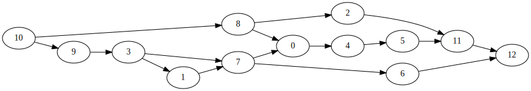
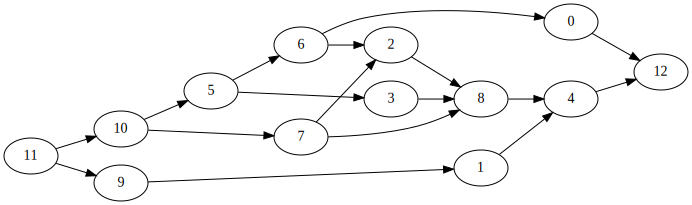

Calculate where all paths from a CFG node converge.

https://stackoverflow.com/questions/59656961/in-a-dag-how-to-find-vertices-where-paths-converge

It's equivalent to asking "What's the most immediate post dominator?".

### Example 0



The path from `3` converges at `7`. The path from `8` converges at `11`. All other splits wait until node `12` to converge.

```
$ ./test.py ./generated0.graph
paths from 7 converge at 12
paths from 10 converge at 12
paths from 8 converge at 11
paths from 3 converge at 7
```

### Example 1



```
$ ./test.py ./generated1.graph
paths from 6 converge at 12
paths from 5 converge at 12
paths from 10 converge at 12
paths from 11 converge at 12
paths from 7 converge at 8
```

