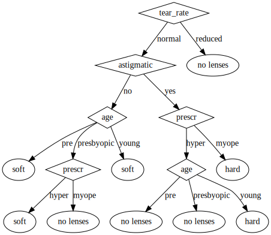
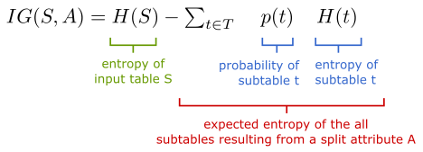
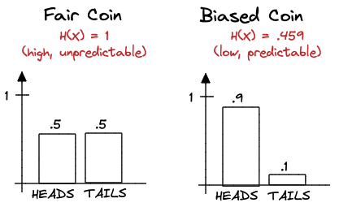
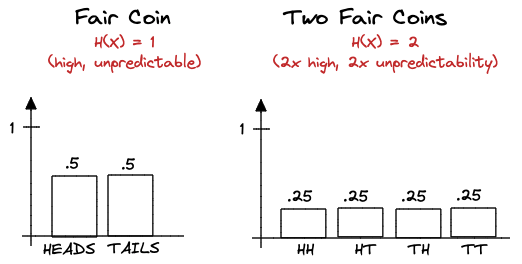
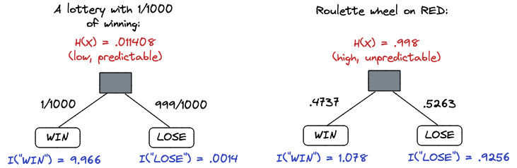
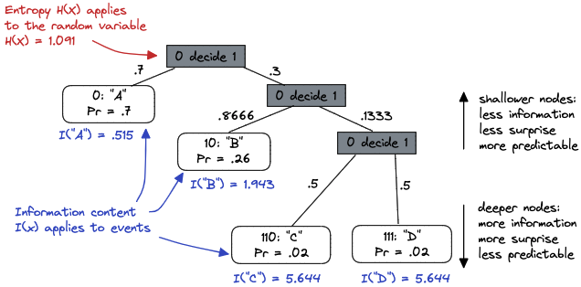

This is an algorithm for generating decision trees called ID3: https://en.wikipedia.org/wiki/ID3_algorithm

Here's the generated decision tree generated from [./gen-decision-tree.py](./gen-decision-tree.py). The dataset is from the book <u>Machine Learning in Action</u>. A manually worked example of at least the first step is given in [./worked-example.md](./worked-example.md).

While the algorithm is pretty straightforward, actually understanding what is meant by "reducing entropy" and "information gain" isn't easy to wrap one's head around.

But, high level, you're choosing the attribute/feature which is **most likely** to reduce entropy / increase predictability / maximize information gain in the resulting subtrees:

## Entropy Notes

One difficulty is that entropy measure seems to be applicable to anything: random variables, betting games, tables of data, bytes of a file, even attributes in a classification table. In reality, it's all random variables. The outcomes of betting games are the random variable's values/events. For tables of data, the classification column is counted up and, thought of as a histogram, acts as the probability mass. Same with the file, the bytes are just counted up and a probability is assigned that one of 256 events will be returned when sampling the random variable.

My current favorite way of thinking about entropy is a measure of difficulty in predicting. Or, high entropy means low predictability. What is harder to predict, a fair coin? Or a biased coin? The fair coin, so it has higher entropy:

Here the number of values/events was held at 2, but the probability distributed differently. What happens if we hold the distribution uniformly, but just increase the number of possible outcomes? In other words, what's harder to predict? The outcome of a fair coin, or the outcome of two unfair coins?

It's exactly twice as hard to predict, because you have exactly twice as many possible outcomes. How about a lottery with 1/1000 chance of winning vs. a spin on an American roulette wheel?

The lottery has lower entropy because the output is very predictable: you will probably lose. Note how high the information content of the win outcome is, especially vs. the lose.

N.B. entropy measures a random variable, while information content measures a random variable's event/value. To demonstrate, here's a machine that emits "A" 70% of the time, "B" 26% of the time, "C" 2% of the time, and "D" 2% of the time:

