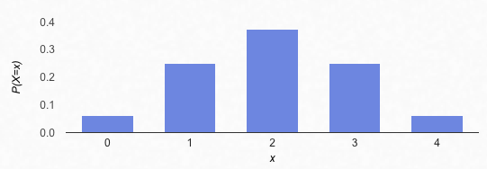
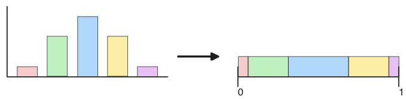
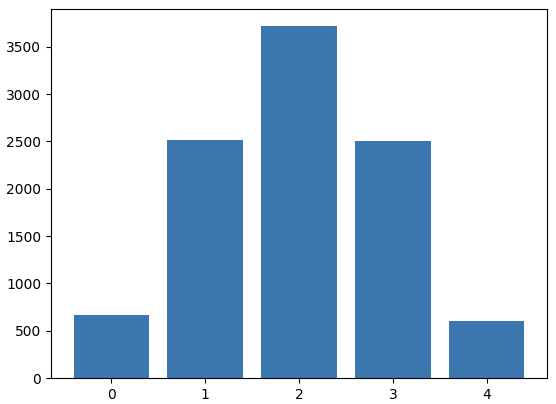
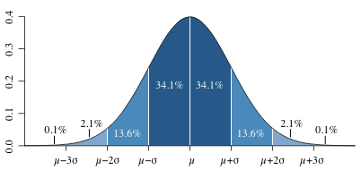
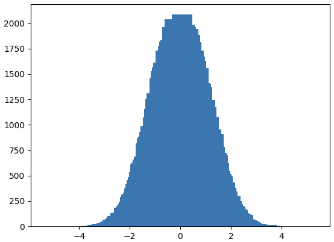

Alright, you have a probability distribution, how do you actually sample from it? Suppose the tool you have is a [PRNG](https://en.wikipedia.org/wiki/Pseudorandom_number_generator) that can sample uniformly from a fixed range, like (python):

```python
random.random() # from [0,1]
random.uniform(a,b) # from [a,b]
```

## Discrete case

For discrete distributions, we can just create a correspondence between the values in the distribution to a proportional amount of values in a range. For example, the number of heads showing in a 4-coin flip is distributed as:



Well all those values conveniently add up to 1:

```
P(0 heads) = .0625
P(1 heads) = .25
P(2 heads) = .375
P(3 heads) = .25
P(4 heads) = .0625
```

So assigning these zones to the interval [0,1] is easy. It goes like this:

* allocate .0625 to [0, .0625]
* allocate .25 to (.0625, .0625 + .25) = (.0625, .3125]
* allocate .375 to (.3125, .3125+.375] = (.3125, .6875]
* allocate .25 to (.6875, .6875 + .25] = (.6875, .9375]
* allocate .0625 to the remaining (.9375, 1.0]

It's easy to see in picture form (not to scale):



Notice that as we append one region to the previous, the new right endpoint is the same value as the cumulative distribution function (CDF). We're essentially accumulating probability as we allocate space in the [0, 1] range.

In fact we can get the right sides of each of the intervals with:

```python
pdf = [.0625, .25, .375, .25, .0625]
cdf = list(itertools.accumulate(pdf))
# [0.0625, 0.3125, 0.6875, 0.9375, 1.0]
```

And get all intervals with:

```python
intervals = list(zip([0]+cdf, cdf))
# [(0, 0.0625), (0.0625, 0.3125), (0.3125, 0.6875), (0.6875, 0.9375), (0.9375, 1.0)]
```

And now sample by finding where a generated number in [0, 1] falls:

```python
def find_interval(intervals, value):
    for i, (a,b) in enumerate(intervals):
        if a <= value < b:
            return i
```

Here's a run of 20 samples:

```
1 since random()==0.1406 is in (0.0625, 0.3125) which is the 1'th interval
1 since random()==0.3357 is in (0.0625, 0.3125) which is the 1'th interval
3 since random()==0.0472 is in (0.6875, 0.9375) which is the 3'th interval
3 since random()==0.5136 is in (0.6875, 0.9375) which is the 3'th interval
3 since random()==0.9563 is in (0.6875, 0.9375) which is the 3'th interval
1 since random()==0.2034 is in (0.0625, 0.3125) which is the 1'th interval
1 since random()==0.6740 is in (0.0625, 0.3125) which is the 1'th interval
2 since random()==0.3093 is in (0.3125, 0.6875) which is the 2'th interval
2 since random()==0.6545 is in (0.3125, 0.6875) which is the 2'th interval
3 since random()==0.6430 is in (0.6875, 0.9375) which is the 3'th interval
2 since random()==0.0007 is in (0.3125, 0.6875) which is the 2'th interval
2 since random()==0.3109 is in (0.3125, 0.6875) which is the 2'th interval
1 since random()==0.9454 is in (0.0625, 0.3125) which is the 1'th interval
0 since random()==0.0471 is in (0, 0.0625) which is the 0'th interval
2 since random()==0.0406 is in (0.3125, 0.6875) which is the 2'th interval
2 since random()==0.6365 is in (0.3125, 0.6875) which is the 2'th interval
4 since random()==0.5276 is in (0.9375, 1.0) which is the 4'th interval
1 since random()==0.5439 is in (0.0625, 0.3125) which is the 1'th interval
4 since random()==0.2527 is in (0.9375, 1.0) which is the 4'th interval
3 since random()==0.0478 is in (0.6875, 0.9375) which is the 3'th interval
```

Plotting a run of 10000 samples (see [./graph0.png](./graph0.png)) yields some evidence we did it right:



## Continuous case

So what about the continuous cases, like the normal distribution?

Well, with the idea that [ProbabilityIsDistributedStuff](./wiki/ProbabilityIsDistributedStuff), you can look at the picture and see how there's very little stuff at the thin, improbable ends or tails, and a lot of stuff at the probable center:



So if you could throw darts at this picture, and each location on the picture had an equal chance of being hit, then you could throw until you hit in the blue, and return the x value.

The x coordinate of your throw is a generated value from a range with desired tolerances, like $[\mu - 5\sigma, \mu + 5\sigma]$​. The y coordinate of your throw is a generated value from 0 to 1, or 0 to the maximum value of the PDF. These ranges are defining a box around the distribution.

It looks like this in code:

```python
def sample(a, b, mean, stddev):
    while True:
        x = a + random.random() * (b-a) # get value [a, b]
        y = random.random() # get value [0, 1]
        if y < normal_pdf(x, mean, stddev):
            return x
```

I initially thought this was a terrible idea, as you end up throwing away a lot of values. If you had a distribution with a huge vertical spike and no area elsewhere, this problem is very pronounced. So I searched for real methods and found [7.1.3 Generating Samples from Probability Distributions](https://web.mit.edu/urban_or_book/www/book/chapter7/7.1.3.html) from the book "Urban Operations Research" where it's called "The rejection method" and "a quite ingenious approach" 😂.

To test that this works, I split the interval [-5, 5] into 200 bins and sample 100,000 times (see [./graph1.py](./graph1.py)), counting samples:



The book has some more efficient methods, one of which uses the CDF (when there's an explicit formula for it) and makes much more sense after seeing how accumulation appeared above in the discrete case.
