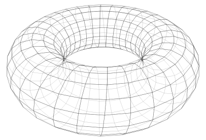
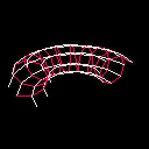
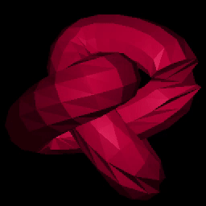
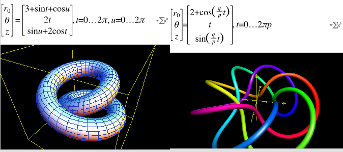
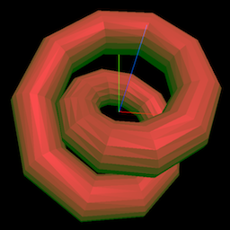
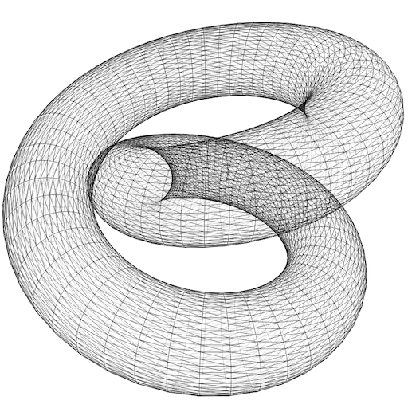
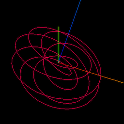

It's a bit obvious in hindsight, but I had a real "aha!" moment when I saw that [Insolit Dusts's Gourard Demo](http://insolitdust.sourceforge.net/code.html) didn't contain any coordinates for the object, and instead generated the points at runtime.

Another example I encountered is [flockaroo's code at turtletoy](https://turtletoy.net/turtle/2dc4806767) that has torus generating code:



The cool pencil shade look comes from setting a light opacity, and then redrawing lines (darkening) when the normal calculated for each "L" drawn at a vertex is forward facing. Here it is ported to Pico-8 with an illustrative animation:



Pico-8 gets you something on the screen very fast, with no layers between you and the code where problems can hide (did I call this API right? did I miss a necessary API?). But if something goes wrong, it's not the friendliest environment for finding out why. Three.js's abstractions (scene, camera, geometry, material, ...) while more complicated, can be useful in debugging shapes progressively:

* THREE.Points() geometry and PointsMaterial to see if vertices are generally in the right place
* THREE.Line() geometry with LineBasicMaterial to see if they are ordered properly
* THREE.Mesh() geometry with MeshBasicMaterial (and "wireframe: true") or MeshPhongMaterial but this requires you to supply faces and compute normals

I use [python to generate the torus](./gen_torus.py) and then within my editor (vim) for [the javascript](./torus.js), I can `r !./gen_torus.py`, switch to my browser, and `ctrl+R`. I'm sure there are ways to optimize the workflow but it suffices for now.

Here's insolit's object (a search for knots turned up the [Trefoil Knot](https://en.wikipedia.org/wiki/Trefoil_knot)) [generated by python](./gen_thing.py) and rendered [in three.js](./thing.js):



Captured from my browser using [kap](https://getkap.co) which is brew-installable. You can see that I do not properly make the triangle faces in two of the sharp turns, and the surface gets crunchy :)

These things are everywhere, I just hadn't caught on. The demo page for three.js's ["parametric geometries"](https://threejs.org/examples/webgl_geometries_parametric.html) obviates this entire article. An image search "procedural geometry" turns up a lot of related stuff. Blender has a [shape generator](https://blendermarket.com/products/shape-generator).

The grapher app contains some examples with really compact equations, parameterized around one or two variables, and outputting in polar form. I imagine this on a typical x-y graph bounced up and down on a z axis:



In the first case, the equation impressively generates the solid, that's not just the path through space, but the path spiralling around the path through space. Converted to python:

```python
ticks_toroid = 20
ticks_cross_section = 20

vertices = []
for t in [1.0*t/ticks_toroid*2*pi for t in range(ticks_toroid)]:
	for u in [1.0*u/ticks_cross_section*2*pi for u in range(ticks_cross_section)]:
		# parametric equations -> polar coords
		r0 = 3 + sin(t) + cos(u)
		theta = 2*t
		z = sin(u) + 2*cos(t)

		# polar -> cartesian
		x = r0 * cos(theta)
		y = r0 * sin(theta)

		vertices.append((x,y,z))
```

Rendered in three.js:



Rendered in [turtletoy](https://turtletoy.net/turtle/03d0636fdc), I wish I could get rid of or lighten the points and lines that fall behind others:



The second case has a really easy conversion:

```python
(q,p) = (3.0, 7.0)
ticks_knot = tt = 300

vertices = []
for t in [1.0*t/ticks_knot * 2*pi*p for t in range(ticks_knot)]:
	# parametric equations -> polar coords
	r0 = 2 + cos(q/p*t)
	theta = t
	z = sin(q/p*t)

	# polar -> cartesian
	x = r0 * cos(theta)
	y = r0 * sin(theta)

	vertices.append((x,y,z))
```

But its output is just a path through space:



I would like to make some reusable code that would generate a mesh over a path. Imagine an insect flying this route and leaving in its trail a cylindrical mesh, as if it were extruding a circle while moving forward.