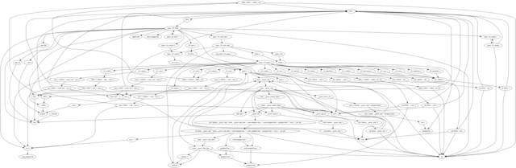

Extract type information from DWARF by gdb script.



unsorted notes:

```
(gdb) ptype <typename>
gdb -q ./linux/aarch64/libc.so -ex 'maint print symbols' -ex 'q' > /tmp/out.txt
gdb -q ./linux/aarch64/libc.so -ex 'info types' -ex 'q' > /tmp/out.txt
gdb -q ./linux/aarch64/libc.so -ex 'info functions' -ex 'q' > /tmp/out.txt
gdb -q ./linux/aarch64/libc.so -x onetype.py > foo.dot
```

Where:

* `-q` is "quiet", don't print intro screen.
* `-ex` is "evaluate single command" (can be used multiple times)
* `-x` is execute commands from file

