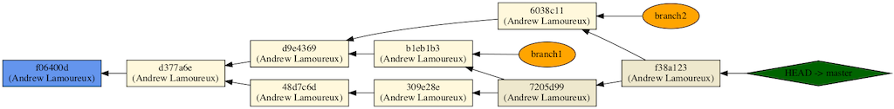

When you use `-n 5` it doesn't depth-first go after first parent or i'th parent, it kind of breadth-first traverses all parents:




Asking for 3 commits shows that it splits immediately:

```
$ git log --pretty=format:"[%ct|%cn|%s|%d] %h %p" --all -n 3
[1636139974|Andrew Lamoureux|I| (HEAD -> master)] f38a123 7205d99 6038c11
[1636139941|Andrew Lamoureux|E| (branch2)] 6038c11 d9e4369
[1636139893|Andrew Lamoureux|H|] 7205d99 309e28e b1eb1b3
```

And now all of them:

```
$ git log --pretty=format:"[%ct||%cn||%s||%d] %h %p" --all -n 9
[1636139974||Andrew Lamoureux||I|| (HEAD -> master)] f38a123 7205d99 6038c11
[1636139941||Andrew Lamoureux||E|| (branch2)] 6038c11 d9e4369
[1636139893||Andrew Lamoureux||H||] 7205d99 309e28e b1eb1b3
[1636139824||Andrew Lamoureux||G||] 309e28e 48d7c6d
[1636139799||Andrew Lamoureux||D||] 48d7c6d d377a6e
[1636139764||Andrew Lamoureux||F|| (branch1)] b1eb1b3 d9e4369
[1636139728||Andrew Lamoureux||C||] d9e4369 d377a6e
[1636139541||Andrew Lamoureux||B||] d377a6e f06400d
[1636139518||Andrew Lamoureux||A||] f06400d
```

Starting at 7205d99 it goes left twice:

```
$ git log --pretty=format:"[%ct|%cn|%s|%d] %h %p" -n 3 7205d99
[1636139893|Andrew Lamoureux|H|] 7205d99 309e28e b1eb1b3
[1636139824|Andrew Lamoureux|G|] 309e28e 48d7c6d
[1636139799|Andrew Lamoureux|D|] 48d7c6d d377a6e
```

But going 4 deep it will go back to the right:

```
$ git log --pretty=format:"[%ct|%cn|%s|%d] %h %p" -n 3 7205d99
[1636139893|Andrew Lamoureux|H|] 7205d99 309e28e b1eb1b3
[1636139824|Andrew Lamoureux|G|] 309e28e 48d7c6d
[1636139799|Andrew Lamoureux|D|] 48d7c6d d377a6e
[1636139764|Andrew Lamoureux|F| (branch1)] b1eb1b3 d9e4369
```

Position of HEAD does not matter!

```
git checkout f06400d
$ git log --pretty=format:"[%ct|%cn|%s|%d] %h %p" --all -n 5
[1636139974|Andrew Lamoureux|I| (master)] f38a123 7205d99 6038c11
[1636139941|Andrew Lamoureux|E| (branch2)] 6038c11 d9e4369
[1636139893|Andrew Lamoureux|H|] 7205d99 309e28e b1eb1b3
[1636139824|Andrew Lamoureux|G|] 309e28e 48d7c6d
[1636139799|Andrew Lamoureux|D|] 48d7c6d d377a6e
```

