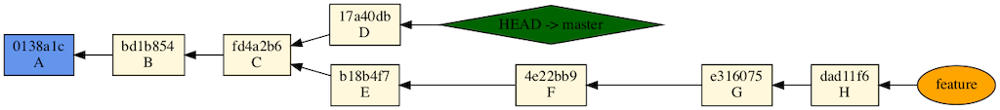
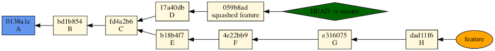

Given this schema:



### method1: merge

```
git checkout master
git merge --squash feature
git commit -m "squashed feature"
```

puts a new commit at master, and does NOT merge the two branches. Feature branch can now be abandoned:




