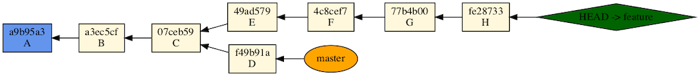
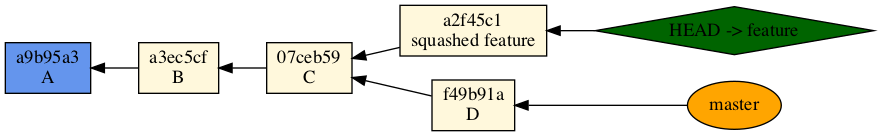
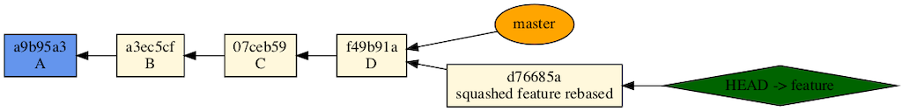
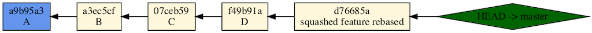

```
git rebase -i 07ceb59
```

In the editor, pick the first, squash the rest!

```
pick 49ad579 E
squash 4c8cef7 F
squash 77b4b00 G
squash fe28733 H
```

A new commit is squashed feature is left on the feature branch!



And finally...

```
git rebase master
```

Resolved conflict, `git add`, `git rebase --continue` commit message "squashed feature rebase" and...

The squashed feature commit is re-written as a new commit at "D":



And now master can be advanced and feature deleted:

```
git checkout master
git merge feature --ff
git branch -d feature
```


