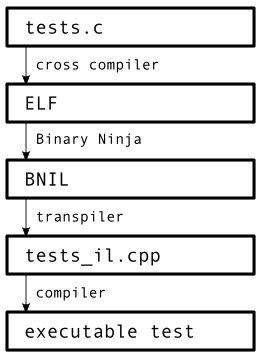
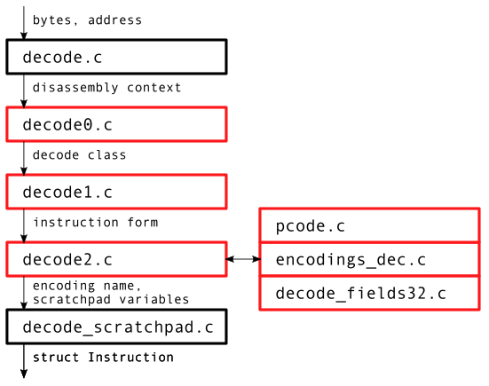
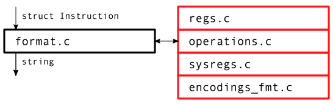
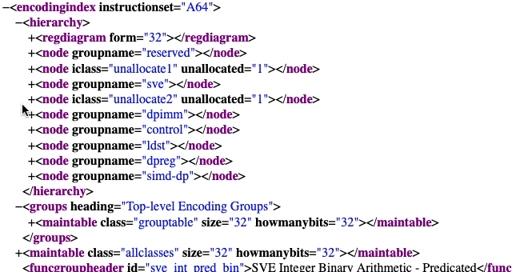
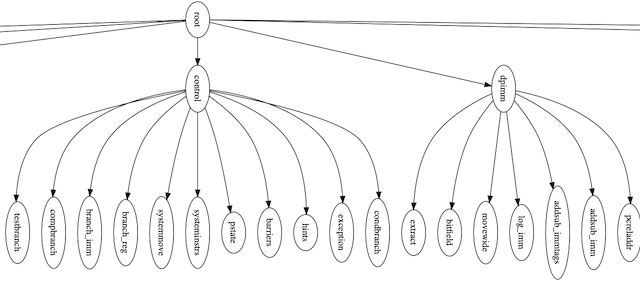
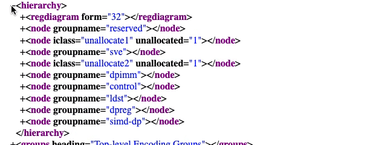
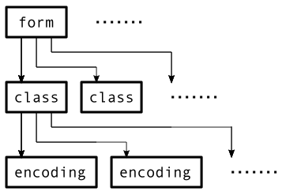
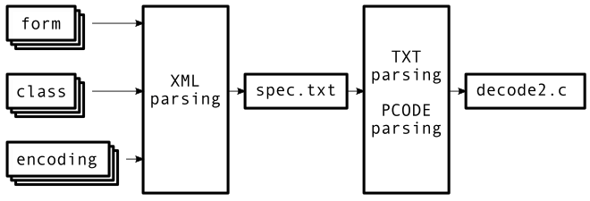

OFFICIAL VERSION: https://binary.ninja/2021/04/05/groundup-aarch64.html

What does it take to almost completely re-write a full architecture module to get the highest accuracy AArch64/ARMv8 decompilation and lifting? Follow along as we not only talk about the improvements we've made since [open sourcing it in October 2020](https://binary.ninja/2020/10/07/open-source-architectures.html), but also take a behind the scenes look at the new disassembler and how it was generated it from the [ARM specification](https://developer.arm.com/architectures/cpu-architecture/a-profile/exploration-tools).

We've really enjoyed all of the community interaction with our plugin repositories. In the first week alone, we had 13 commits from non-vector35 developers:

```
5557a4c 2020-10-13 Improve svc lift (yrp)
08cad92 2020-10-12 Add dmb/dsb lifting support (Brinly Taylor)
044b937 2020-10-12 Add SEV intrinsic lifter (Brinly Taylor)
e8fdc03 2020-10-11 Add BTI hint test (yrp)
d62db93 2020-10-11 Fix BTI lift (yrp)
7c3ee84 2020-10-11 Format readme (#10) (yrp)
a1a2c7f 2020-10-11 Lift hint (yrp)
cae7a5d 2020-10-12 readme: fix a typo :) (#9) (Brinly)
30ec531 2020-10-11 WIP: Lift msr and mrs (yrp)
3901064 2020-10-11 Lift wfi/wfe intrinsic (Brinly Taylor)
4ed3a98 2020-10-10 Lift isb (#6) (_yrp)
915516b 2020-10-09 Lift ccmp (yrp)
114bf5e 2020-10-08 Add movz IL (Josh Watson)
```

In total we've had 82 commits from 4 outside developers. That's 26.6% of the total 308 commits in the repository at the time of writing (though note that all internal commits before the repository was public were squashed so this is more representative of recent commits than total commits). Activity being concentrated at the start of architecture release is likely due to initial interest, but also that less work is needed as issues are resolved.

Contributions aren't limited to just code. Offering test binaries, creating and updating [github issues](https://github.com/Vector35/arch-arm64/issues), creating spin-off projects like yrp's [rust bindings](https://crates.io/crates/bad64), and even just hanging out and talking on the #arm-day channel in the [Binary Nina Slack](https://slack.binary.ninja/) is beneficial to us. Thank you for your support.

# Plugin Goals

## Complete and Accurate Disassembly

The disassembler was semi-automatically generated from the [ARM Machine Readable Specification](https://developer.arm.com/architectures/cpu-architecture/a-profile/exploration-tools) (MRS) version 2020-03. The specification names each encoding, giving 3385 total. But some are aliases and some are redundant names given to "bad" encoding paths, like `UNALLOCATED_3`, `UNALLOCATED_4`, etc. Filtering these, we end up with 2336 truly unique encodings.

### Verification

Verifying disassembly is not as straightforward as one might first imagine. The ISA revision or the core that implement that ISA can cause:

- the existence/nonexistence of instructions
- whether the generic hint instruction gets promoted to its own mnemonic
- whether moves to system registers get promoted to their own mnemonic
- whether system registers acquire a special name or remain in their generic numeric identifier form
- SIMD "arrangement specifiers" are equivalent in certain contexts ([example](./simd_arrspec_equiv.s))

ARM does not release an authoritative disassembler. Initially we verified disassembly by enumerating the entire 32-bit instruction space and comparing against a committee of disassemblers comprised of [libopcodes](https://www.gnu.org/software/binutils/), [capstone](http://www.capstone-engine.org/), and [llvm](https://llvm.org/). In cases where the committee agreed, fixes were straightforward. Otherwise we consulted the specification to resolve differences. Ideally we can treat the specification as an infallible oracle, but in a couple cases we followed consensus when one was apparent, choosing to follow a convention presentation of an instruction over the specification.

### Maintenance

One of the other goals of this work was to make maintenance / updates of our architecture module easier and faster. Theoretically, a machine-generated specification to architecture could allow for rapid updates with less manual effort except as required to adjust to any changes in the specification format or capaibilites.

### Before/After Comparison

The number of encodings that represent real instructions (but not bad encoding paths or other unreachable encodings) plus 157 aliases is 2493. For each of these, we [generated up to 16 examples](./test_cases.txt) and disassembled them. Some encodings like `AUTIA1716_HI_hints` have only one instruction: `autoiasp`. The [accuracy of the Binary Ninja disassembler](./old_disasm_full_test.txt) prior to this effort is visualized below:


The x axis ranges over each of the 38660 tests. Purple is colored for the 19322 passes, white for the 19338 failures. The old disassembler thus covered about 50% of the instruction space. Note the nearly 1/3 gap at the right of the graph is the previously unsupported Scalable Vector Extension (SVE) instructions.

After the results of this effort, the current disassembler has achieved full 100% coverage:


## Lift Data Processing / Memory Access Instructions

Data processing and memory access instructions represent the bulk of what a typical binary executes during execution. To ensure that we lift these both in sufficient coverage and accuracy, we compile test functions written in C and ensure that execution of their lifted IL matches expected behavior from the test functions.

Our test battery builds up functionality in a bottom up fashion, with functions that establish primitive behavior and build in complexity:

- return values
- operating on parameters
- use flags, by using all comparison operators (<, >, ==, <=, !=, etc.) on signed and unsigned values
- primitive mathematical operators on integer and floats: add, sub, mul, div
- mathematical operations build from primitives: exponentiate, exp_mod, gcd
- recursive (can a function call itself)
- floating point

The full battery is at: [tests.c](https://github.com/Vector35/llil_transpiler/blob/master/tests.c)

These functions are compiled with the Android A64 cross compiler provided with with Android [Native Development Kit (NDK)](https://developer.android.com/ndk/downloads) to an ELF executable. Binary Ninja then disassembles and lifts the compiled code to BNIL. To ensure this BNIL accurately depicts the semantics of the original instructions, the BNIL is translated into a compilable C++ program:

| IL       | translated to                        |
| --------------- | ------------------------------------------------------------ |
| LLIL_IF     | C++'s if                           |
| LLIL_GOTO    | C++'s goto (and labels are generated for every IL block)   |
| LLIL_CALL    | C++ function invocation                   |
| LLIL_JUMP_TO  | C++ switch statement                     |
| LLIL_RET    | architecture dependent, LLIL_JUMP(LLIL_REG('lr')) for A64  |
| everything else | maps to a function call eg: LLIL_REG becomes C++ REG() eg: LLIL_PUSH becomes C++ PUSH() |

[This is the full translation](./tests_il.cpp) of the test battery to C++, Interleaved with comments from the original BNIL.

By compiling this C++ version of the IL and executing it, we can be reasonably sure lifting is accurate when it executes as expected. The full process is illustrated:



All of the tests pass with the exception of `switch_doubler()`. This does not indicate a failure of lifting, but of current shortcomings of analysis. A sequence of `cmp`, `cset`, and `tbnz` currently prevents detection of a dispatch table for a switch statement. Future improvements in analysis are planned.

## Lift Scalar Floating-Point

Scalar floating point is taken to mean the 300 floating point encodings that are not Advanced SIMD (and do not operate on "V" registers) and not SVE (and do not operate on "Z" registers). Recall the default floating point register file is D0...D31 with each 64-bit Dx register addressable via 32-bit Sx, 16-bit Hx, or 8-bit Bx. Advanced SIMD (brand name NEON) extends each by 64-bits to the V0...V31 register set.

We disassemble all these instructions and lift enough to pass the floating point tests in the transpiler verification.

A user submitted issue listing unsupported floating point instruction was submitted at https://github.com/Vector35/arch-arm64/issues/24 and has since been closed.

We don't have full coverage, but cover most common cases.

## Lift System Instructions

We rely on intrinsics to lift system instructions. When there are identifiable registers that are read and written (obvious cases `MRS` and `MSR`) we name these registers in the instrinsic's input and output list and have human readable intrinsic names like `_ReadStatusReg` and `_WriteStatusReg`. Most of the intrinsics in the non-NEON enumeration `enum Arm64Intrinsic` from il.h are system instructions.

We currently support pointer authentication instructions (`AUTDA`, `AUTDB`, etc.), data/instruction memory/synchronization barriers (`DMB`, `DSB`, `ESB`, etc.), wait for exception (`WFE`), wait for interrupt (`WFE`) and a few others.

For system register numeric identifiers that have a human readable name, we attempt to translate. A full list is in `get_system_register_name()` from [sysregs.c](https://github.com/Vector35/arch-arm64/blob/dev/disassembler/sysregs.c).

## Lift Advanced SIMD / NEON

The first approach is to define registers that are the optional sub components of the full 128-bit vectors. Recall registers from the V0-V31 register file can have their full 128-bit width or their lower 64-bit width portioned as 16/8 bytes, 8/4 halves, 4/2 single-precision, or 2/1 double-precision. Our architecture plugin design allows registers be declared as sub registers within others, enabling lifting of Advanced SIMD in great detail. For example, the instruction `ushr v21.8b, v15.8b, #0x7` performs a shift right on the 8 byte components of the lower 64-bits of vector register `v15`, and can be lifted to:

```
LLIL_SET_REG.b(v21.b[0],LLIL_LSR.b(LLIL_REG.b(v15.b[0]),LLIL_CONST(7)))
LLIL_SET_REG.b(v21.b[1],LLIL_LSR.b(LLIL_REG.b(v15.b[1]),LLIL_CONST(7)))
LLIL_SET_REG.b(v21.b[2],LLIL_LSR.b(LLIL_REG.b(v15.b[2]),LLIL_CONST(7)))
LLIL_SET_REG.b(v21.b[3],LLIL_LSR.b(LLIL_REG.b(v15.b[3]),LLIL_CONST(7)))
LLIL_SET_REG.b(v21.b[4],LLIL_LSR.b(LLIL_REG.b(v15.b[4]),LLIL_CONST(7)))
LLIL_SET_REG.b(v21.b[5],LLIL_LSR.b(LLIL_REG.b(v15.b[5]),LLIL_CONST(7)))
LLIL_SET_REG.b(v21.b[6],LLIL_LSR.b(LLIL_REG.b(v15.b[6]),LLIL_CONST(7)))
LLIL_SET_REG.b(v21.b[7],LLIL_LSR.b(LLIL_REG.b(v15.b[7]),LLIL_CONST(7)))
```

The other approach used intrinsics. This term refers the feature in compilers by which code generation receives special handling for qualifying functions, often generating select instructions or canned optimizations. It also refers the feature by which architecture plugin writers can describe these instances to Binary Ninja for analysis and display. Specifically, authors give a human readable name, and a list of inputs and outputs accompanied by their types. This helps inform the dataflow system by providing information about what is tainted without fully modeling the exact data transformation.

The `ushr` instruction above can be generated by the C compiler intrinsic documented at ARM's website:

```
uint8x8_t vshr_n_u8(uint8x8_t a, const int n)
```

So the example `ushr`, lifted as an intrinsic, is a compact:

```
v21.8b = vshr_n_u8(v15.8b, 7)
```

Thus we have a choice. Lifting with the first approach rewards those valuing detail, which could be useful for emulating IL or learning the details of what instructions do. It also maximizes the size of the IL listing, supplying a larger problem for dataflow analysis.

Lifting to an intrinsic captures instructions with a human readable name and a quickly parsable function-like syntax. It minimizes the size of the IL listing, supplying a smaller problem for dataflow analysis, at the cost of specificity.

Ultimately we settled on a hybrid approach. For mov's and push/pop instructions we implemented the fine grained lifting with sub-registers, so that dataflow analysis would not miss value and parameter passing through these instructions. The remaining instructions are lifted to intrinsics for clarity when possible.

To lift to intrinsics, we collected and pruned every NEON intrinsic. Those of the form `vreinterpret_*()` are more abstract and do not map to an instruction. Some, like `vcmla_laneq_f32()` generate multiple instructions, meaning intrinsic to instruction is one to many. Since lifting is attempting the opposite (instruction to intrinsic), the lifter would be performing many to one, something not yet supported. Intrinsics of the form `vmov*()` merely copy from one register to another and are better lifted with IL SetRegister. The remaining C intrinsics are lifted to Binary Ninja intrinsics.

# Behind The Scenes: Disassembler

The hand written disassembler has been completely replaced by a disassembler generated from the ARM specification.

## High Level Overview

The disassembler is split into **decoding** and **formatting**.

Decoding figures out instruction details for incoming bytes, things like the instruction mnemonic and the list of operands. Formatting turns that decoded result into a human readable string.

The distinction is not merely conceptual, it's also by compilation unit. So a user can optionally link only to the decoding portion if they choose. Binary Ninja links to both, using some of the string lookups from the formatting side when building InstructionText tokens for display.

The following diagrams present a top-down view of the project. Some terms are not defined until later in the sections that describe how that particular file is generated.

### Decoding



All of the red source files are automatically generated.

Supplying the bytes and the address at which to disassemble, the decoding logic path travels through 6 generated files and two hand written files. The output is a `struct Instruction` which is defined in [decode.h](https://github.com/Vector35/arch-arm64/blob/dev/disassembler/decode.h) and contains the mnemonic and list of operands.

### Formatting



The output from decoding, a `struct Instruction` can be passed to the formatting logic path, which travels through 4 generated files and 1 hand written file. The output is a string.

## Generating Code

The [ARM machine readable specification](https://developer.arm.com/architectures/cpu-architecture/a-profile/exploration-tools) (MRS) comes as a zip of a few PDF's, .xml's, and generated .html's. The .html's have become my preferred method of of navigating through instruction details.

I didn't find any documentation on the structure of the files. I could see the .xml's contain tagged data and were used in generating the .html's, but otherwise you have to open the files in a text editor or .xml viewer and apply inductive reasoning to what you see.

I found what I believe to be three distinct phases of decoding described from the specification, and tried to embody those phases in three files: decode0.cpp, decode1.cpp, and decode2.cpp.

### decode0.cpp

The initial phase is high level classification of incoming bytes into what the .xml calls decoding **groups** and  **classes**. In a 2.5MB file called `encodingindex.xml`, we found the tag `<hierarchy>` contained a bunch of `<node>` tags with either an "iclass" or "groupname" attribute.



Each group can have sub-tags that are classes, or other groups, a typical tree. The `<decode>` tags contain expressions from which tests for entering this group can be generated. For the above example, knowing `hibit="28"`, `"width=4"`, `name="op0"` and expression `101x` we generate [decode0.c:969](https://github.com/Vector35/arch-arm64/blob/f8891ce1a8938c2929f931286a05e66813279f63/disassembler/decode0.c#L969).

Never one to miss a chance at drawing a [graph](./decode_graph.png) ([source](./decode_graph.dot)), the groups and classes looks like what you might expect:



Function `decode_spec()` starts conceptually at the root node. Generated if statements decide when to follow edges to other groups. Class nodes are terminal. A function called `decode_iclass_???` is assumed available at link time. For instance iclass "hints" will be a function `decode_iclass_hints()`.

See [decode0.c](https://github.com/Vector35/arch-arm64/blob/dev/disassembler/decode0.c) for full source. It's surprisingly easy to read and mirrors the `<hierarchy>` portion of the .xml.

#### Review:

* decoding logic is given in  `encodingindex.xml`
* the `<hierarchy>` contains a tree of **groups** and **classes**, like folders and files
* `decode0.c` implement the top level decoding decision logic, and calls to (not-yet-defined) functions per class

### decode1.cpp

The next phase implements each of the decoding class functions.

The details of each class come from "iclass_sect" tags that follow the `<hierarchy>` and its children. They have an "id" attribute that matches the iclass attribute from when we were generating decode0.cpp:



There are two children of `<iclass_sect>` we make use of. The `<regdiagram>` says which named bitfields exist within the 32-bit encoding. The `<instructiontable>` contains statements about the value of those named fields, and which instruction **form** ("iform") to use if that statement is true.

For example, the `<regdiagram>` of instruction class "sve_int_bin_pred_log" defines the bit bounds of fields named "size", "opc", "Pg", "Zm", "Zdn". The `<instructiontable>` then gives 5 conditions:

```
opc == 000 -> iformid is orr_z_p_zz
opc == 001 -> iformid is eor_z_p_zz
opc == 010 -> iformid is and_z_p_zz
opc == 011 -> iformid is bic_z_p_zz
opc == 1xx -> iformid is UNALLOCATED
```

From which we generated the function:

```c
int decode_iclass_sve_int_bin_pred_log(context *ctx, Instruction *dec)
{
	uint32_t opc=(INSWORD>>16)&7;
	if(!opc) return orr_z_p_zz(ctx, dec); // -> orr_z_p_zz_
	if(opc==1) return eor_z_p_zz(ctx, dec); // -> eor_z_p_zz_
	if(opc==2) return and_z_p_zz(ctx, dec); // -> and_z_p_zz_
	if(opc==3) return bic_z_p_zz(ctx, dec); // -> bic_z_p_zz_
	if((opc&4)==4) UNALLOCATED(ENC_UNALLOCATED_144);
	UNMATCHED;
}
```

Note that for each instruction form, we declare a function with that exact name. Function `orr_z_p_zz()` implements decoding for instruction form with id `orr_z_p_zz`.

You may view the full code at [decode1.c](https://github.com/Vector35/arch-arm64/blob/dev/disassembler/decode1.c). It is rather straightforward, one function per instruction class, and appearing in the exact order as the .xml.

#### Review:

* after the `<hierarchy>` tag, encodingindex.xml maps decoding classes to instruction **forms**
* decode1.cpp implements this logic, and calls to (not-yet-defined) functions per instruction form

### decode2.cpp

The final generated phase contains implementations of those instruction forms.

Each instruction form has a corresponding .xml file. For example form `ABS_advsimd` has .xml file `abs_advsimd.xml`. Within, you find `<alias_list>` tags with names and conditions under which different encodings should prevail over the current. `<classes>` which contains one or more `<iclass>` trees. Finally, you find a `<ps_section>` which contains decoding pseudocode that is common to all classes.

**NOTE:** these classes are not the same as the decoding class from earlier in the decoding logic.

Each `<iclass>` contains a `<regdiagram>` that, like before, tells us which named bit fields we can extract. Then a number of `<encoding>` tags. And finally a `<ps_section>` that contains per-class decoding pseudocode.

Now each `<encoding>` contains an `<asmtemplate>` with what disassembly should look like. When there are multiple contending encodings in one class, the encodings will contain `<box>` elements with expressions that use the named bit field variables and tell us when that encoding is matched.

#### Review:

* we have a list of instruction **forms**, each with a corresponding .xml file
* each instruction form contains one or more instruction **classes** (not the decoding classes)
* each class has one or more instruction **encodings**



#### An Intermediate Form

There are tons of this .xml, over 1200 individual files for the instruction forms. There are special cases and exceptions. We knew if all the code were going to be generated by parsing .xml, debugging could become very difficult. Pseudocode that failed to translate for a particular encoding would require finding its enclosing class, its enclosing form, and open its enclosing .xml. Complexity was winning, and the development task ahead seemed daunting.

What is needed is to split the task up, to come up with an intermediate product that captures the result of all the .xml parsing. And if that intermediate product is human readable (and thus easier to debug), then better. The result is a somewhat large text file representing the parts of the MRS essential for disassembly.

So all of the .xml files for each instruction form, over 1200 of them, get parsed and distilled into 1.1 megabytes of text. We present to you: [armspec.txt](./armspec.txt). Here's the very first entry for the very first instruction form:

```
IFORM: ABS_advsimd
	TYPE: instruction
	XML: abs_advsimd.xml
	CLASS: ABS_asisdmisc_R
		FIELDS32: 01|U=0|11110|size=xx|10000|opcode=01011|10|Rn=xxxxx|Rd=xxxxx
		ENCODING: ABS_asisdmisc_R
			OPERATION: ABS
			SYNTAX: <V><d>,<V><n>
		DECODE_PCODE:
			integer d = UInt(Rd);
			integer n = UInt(Rn);
			if size != '11' then UNDEFINED;
			integer esize = 8 << UInt(size);
			integer datasize = esize;
			integer elements = 1;
			boolean neg = (U == '1');
```

Simple tabs keep the nested structure. Forms contain classes which contain encodings. Here the form `ABS_advsimd` has two classes: `ABS_asisdmisc_R` and `ABS_asimdmisc_R`. Each class has only one encoding: `ABS_asisdmisc_R` and `ABS_asimdmisc_R`, respectively.

#### Review:

* each instruction form has an .xml file (~1200 of them)
* all .xml's are parsed into an intermediate form, a text file
* the text file is then separately parsed to make decode2.c



#### Parsing "fields32"

All of the `<regdiagram>` and `<box>` .xml get distilled down into what we call a "fields32" which is a notation for how to split apart the bits in an instruction encoding into optionally named fields, along with constraints on those bits. Example:

```
01|U=0|11110|size=xx|10000|opcode=01011|10|Rn=xxxxx|Rd=xxxxx
```

It reads like:

> After a zero, then one, the next bit is named 'U' and should have value zero, then expect one, one, one, one, zero, etc.

The pipes are section dividers. The x's are wildcards. Only a bit of translation tedium stands between a fields32 and some C. The generated code to check for this fields32 is:

```c
if((INSWORD & 0xFF3FFC00)==0x5E20B800) {
```

And the generated code to extract those named fields is:

```c
dec->U = (insword>>29)&1;
dec->size = (insword>>22)&3;
dec->opcode = (insword>>12)&0x1f;
dec->Rn = (insword>>5)&0x1f;
dec->Rd = insword&0x1f;
```

So many instructions have the same fields32 that they're factored out and appear in [decode_fields32.c](https://github.com/Vector35/arch-arm64/blob/dev/disassembler/decode_fields32.c).

#### Parsing Pcode

There are two types of pseudo code in the specification. The operational pseudo code describes what an instruction does. The decoding pseudocode describes how to decode instructions. We're interested only in the latter for the purposes of the generated disassembler.

So how do we translate it to C? At the start of every parsing task, I briefly entertain a fantasy that I'm a first principles developer to the death, and spend sometimes days trying to make a parser of my own. Then I run into problems, having to factor production rules and make all these workarounds, and I give up. This time was no different. I turned to the [Grako](https://pypi.org/project/grako/) parser generator.

Like most parser generators, you make a grammar (ours: [pcode.ebnf](./pcode.ebnf)) and it turns that grammar into parsing code. Then you fill in the code generation. There are some very obvious signs in there knobs were turned until it worked and I lack a full command of grammar writing. That higher precedence stuff comes _later_ in a series of telescoping production rules still bends my mind. Or do they come earlier? Whatever.

Using again our example form `ABS_advsimd` class `ABS_asisdmisc_R`, we have decode pcode:

| `pcode`                            | `c`                                                   |
| -------------------------------- | --------------------------------------------------- |
| integer d = UInt(Rd);            | dec->d = UINT(dec->Rd);                             |
| integer n = UInt(Rn);            | dec->n = UINT(dec->Rn);                             |
| if size != '11' then UNDEFINED;  | if(dec->size!=3) {<br/>			UNDEFINED;<br/>} |
| integer esize = 8 << UInt(size); | dec->esize = (8) << (UINT(dec->size));              |
| integer datasize = esize;        | dec->datasize = dec->esize;                         |
| integer elements = 1;            | dec->elements = 1;                                  |
| boolean neg = (U == '1');        | dec->neg = (dec->U==1);                             |

It's nearly one to one. Most pcode is like this, but some gets really nasty, with case statements and other arcana. For a complicated example, see the pcode for form `FCVTAS_float`.

What happens when the pcode calls into a function defined in the spec, like `BFXPreferred()`? We just generate a call to a same named function and implement a minimal set of these functions to get successful linking in [pcode.c](https://github.com/Vector35/arch-arm64/blob/dev/disassembler/pcode.c).

#### The "Scratchpad"

Both the named bit fields and the pcode variables must be stored somewhere until they can be interpreted into a `struct Instruction`. And those variables vary widely depending on what is decoded. In our `ABS_advsimd` example, decoding produced a "d", "n", "size", "esize", "datasize", and "neg", but other decoding paths won't have those at all.

The solution, as brutish as it seems, is to take the union of all possible variable names. Here is part of the definition of the decoding result structure `Instruction`:

```c
struct Instruction {
	uint32_t insword;
	enum ENCODING encoding;
	enum Operation operation;
	InstructionOperand operands[MAX_OPERANDS];
	
	/* specification scratchpad: ~300 possible named fields */
	uint64_t A;
	uint64_t ADD;
	...
```

Users of the disassembler thus can stay out of any spec nonsense by limiting their consumption to the `.insword`, `.encoding`, `.operation`, and `.operands` fields. If they have any interest in what the pcode produced, they may access the scratchpad.

## Enter Humans

### Making Sense: Operands

Even after the pcode executes, its motley collection of output variables isn't very user friendly. Disassembler consumers, both humans and the Binary Ninja architecture plugin, want something that makes sense, something in the world of mnemonics and operands.

This task is handled by [decode_scratchpad.c](https://github.com/Vector35/arch-arm64/blob/dev/disassembler/decode_scratchpad.c). Its 10,000 lines required mostly a human hand. There wasn't much choice: the decoding pcode just doesn't have a list of operands in mind, so this translation step is just unavoidable. It's one of those situations where you know the information is there. The pcode did _something_. But how do you take that something and turn it into something a disassembler user can work with easily? 

### Making Strings

"Eventually you do plan to have disassembly on your disassembly tour, right?" you might be asking. Yes, we eventually to produce something like `abs d2, d10` from 5EE0B942.

But the majority of the work is already done by the time operands are populated in `struct Instruction` by `decode_scratchpad.c`. All is left to do is look up strings. The mnemonic is referenced in a table, and some mild logic walks the operand list to produced text tokens separated by commas. This bit currently weighs in at a light 500 lines in [format.c](https://github.com/Vector35/arch-arm64/blob/dev/disassembler/format.c).

# Epilogue

Thanks again to the community support in improving the architecture. We hope the behind the scenes look into how we're striving to make an accurate and complete disassembler and lifter was enjoyable.

With Aarch64 becoming one of the most predominant architectures (if not _the_ most in this post-PC world!), Vector 35 is focused on continuing to maintain the best possible support. In fact, due to this original effort documented here (which was originally committed , when the 2020-09 specification was released, it took us about two days to incorporate all of the updates using this framework, and the 2020-12 [updates](https://github.com/Vector35/arch-arm64/commit/6bba0bf6a214eea4ccc193c4ff0307a7c749d0c1) took less than a day! That meant that 8.7A could be supported with very little effort. Not only does this approach then pay off in correctness, but also in maintainability which was exactly one of our original goals.

