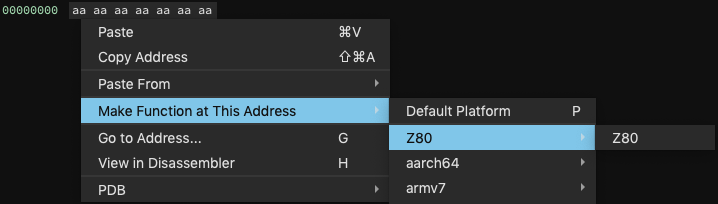
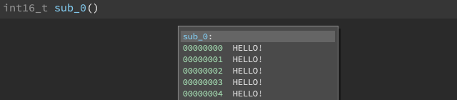
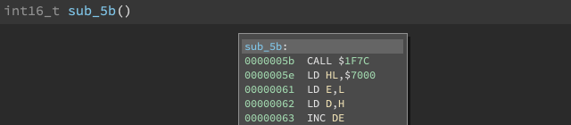
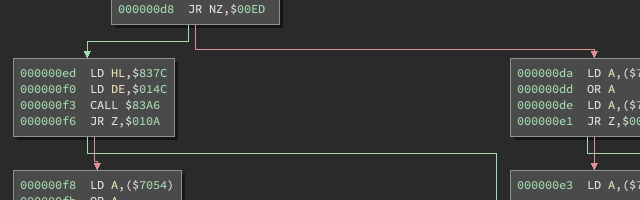

THIS IS OUTDATED! THE FINAL VERSION IS AT: https://binary.ninja/2020/01/08/guide-to-architecture-plugins-part1.html

# Rapid Development of Architecture Plugins

Drop hello.py in your [Binja plugin directory](https://docs.binary.ninja/guide/plugins/index.html):

```python
print('Hello, world!')
```

Yes, that's it. Observe "Hello, world!" in your Log window after running Binja. There are [more official](https://docs.binary.ninja/guide/plugins/index.html) guidelines, and a [sample plugin](https://github.com/Vector35/sample_plugin), but this is all that's needed.

Now establish that you can call some Binja api's:

```python
from binaryninja.log import log_info
log_info("Hello, world!")
```

From this point, your code can declare to Binja that it's a [PluginCommand](https://api.binary.ninja/binaryninja.plugin.PluginCommand.html) or a new [BinaryView](https://api.binary.ninja/binaryninja.binaryview.BinaryView.html) or even a new [Architecture](https://api.binary.ninja/binaryninja.architecture.Architecture.html) entirely.

This article tackles [Architecture](https://api.binary.ninja/binaryninja.architecture.Architecture.html), and we choose a small one fit for demonstration: [Z80](https://en.wikipedia.org/wiki/Zilog_Z80). We tell Binja that we're an architecture by extending the [Architecture](https://api.binary.ninja/binaryninja.architecture.Architecture.html) class:

```python
from binaryninja.architecture import Architecture
class Z80(Architecture):
  name = 'Z80'
Z80.register()
```

In a python session with Binja imported, try:

```bash
>>> list(binaryninja.Architecture)
[<arch: aarch64>, <arch: armv7>, <arch: thumb2>, <arch: armv7eb>, <arch: thumb2eb>, <arch: mipsel32>, <arch: mips32>, <arch: ppc>, <arch: ppc_le>, <arch: x86_16>, <arch: x86>, <arch: x86_64>, <arch: Z80>]
```

Or, in the Binja UI, create a new buffer `File -> New -> Binary Data` and a function, and you should see:



### Checkpoint #1

We have a custom architecture with the name 'Z80'. Hopefully that was quick! See [checkpoint #1](https://github.com/Vector35/Z80/commit/5716006d14e54a5355f507b0f878d661bdd1259c) for the code so far.

<hr>

Along with the architecture name, there are other facts about our architecture we can communicate to Binja by setting variables:

```python
class Z80(Architecture):
	name = 'Z80'
	address_size = 2		# 16-bit addresses
	default_int_size = 1	# 1-byte integers
	instr_alignment = 1		# no instruction alignment
	max_instr_length = 3	# maximum length
							# ...
```

Registers are a tad more involved. We define a dictionary whose keys are the register names, and whose values are [RegisterInfo](https://api.binary.ninja/binaryninja.function.RegisterInfo.html) objects.

Registers that are independent, and not a sub-register of another are called "full width" registers. Otherwise, registers are a subset of the bits in a full width register. Think `eax` within `rax` in X86_64.

The RegisterInfo constructor takes the full width register name, the size of the register, and optionally the offset within an enclosing register. For Z80's full width, 2-byte register `AF` the construction is:

```python
class Z80(Architecture):
  #...
  regs = {
    'AF': RegisterInfo('AF', 2)
  }
```

This says "Register AF is a subregister of AF and has size 2." Since the subregister relationship points to itself, Binja knows it's a full-width register. In contrast, consider the 1-byte registers `A` and `Flags` which are subregisters of `AF`:

```python
regs = {
	'AF': RegisterInfo('AF', 2),
	'A': RegisterInfo('AF', 1, 1),		# subregister of 'AF', 1-byte, offset 1
	'Flags': RegisterInfo('AF', 0),		# subregister of 'AF', 1-byte, offset 0
}
```

This says, "Register A is a subregister of AF, has size 1, and is at byte offset 1 from the lsb of AF and register Flags is a subregister of AF, has size 1, and is at byte offset 0 from the lsb of AF."

If there are any registers with the role of stack pointer or link register, we should set them. The former applies to Z80:

```python
	stack_pointer = "SP"
```
### Checkpoint #2

Our Z80 architecture reported its address size, integer size, instruction size, and available registers to Binja! See [checkpoint #2](https://github.com/Vector35/Z80/commit/b16124ba6eea057d62c91586acd19369f8d6d574) for the code so far.

<hr>

Setting variables is good for architecture information that doesn't change or has few possible values, but once we want to disassemble, we need to implement callback functions.

Though many callback functions are available for your architecture to service, only three are essential:

* `get_instruction_info()` - to help Binja draw the control-flow graph
* `get_instruction_text()` - to disassemble bytes for Binja
* `get_instruction_low_level_il()` - to lift, but we'll return NOP for now

The first, [get_instruction_info()](https://api.binary.ninja/binaryninja.architecture-module.html#binaryninja.architecture.Architecture.get_instruction_info), describes instructions' length and branch behavior by returning an [InstructionInfo](https://api.binary.ninja/binaryninja.function.InstructionInfo.html):

```python
	def get_instruction_info(self, data, addr):
	result = InstructionInfo()
		result.length = 1
	return result
```

The second, [get_instruction_text()](https://api.binary.ninja/binaryninja.architecture-module.html#binaryninja.architecture.Architecture.get_instruction_text), describes the actual text presented to the user per instruction, by returning a list of [InstructionTextToken](https://api.binary.ninja/binaryninja.function.InstructionTextToken.html) and the instruciton size:

```python
	def get_instruction_text(self, data, addr):
		tokens = [InstructionTextToken(InstructionTextTokenType.TextToken, "HELLO!")]
		return tokens, 1
```

We've told Binja that all bytes disassemble to "HELLO!" and have length 1. Test it on the command line:

```bash
>>> binaryninja.Architecture['Z80'].get_instruction_text(b'\xAA', 0)
>>> (['HELLO!'], 1)
```

Or in the GUI by creating a buffer and a function with architecture Z80:



### Checkpoint #3

Our Z80 architecture can now disassemble, though it returns a placeholder for everything. See [checkpoint #3](https://github.com/Vector35/Z80/commit/832b7a3d869401f2a49d940eb1c3f811a13cb4dd) for the code so far.

<hr>

But how do we get real disassembly in there? We'll find an existing disassembler and piggyback on its results! After `pip install skoolkit`, I learned it expected memory snapshots of a ZX spectrum game. No problem: our requests can be wrapped to look like that. In [skwrapper.py](./skywrapper.md) (skoolkit wrapper) there is exposed the very simple `disasm(data, addr)` function for our architecture to use.

First, we need [get_instruction_info()](https://api.binary.ninja/binaryninja.architecture-module.html#binaryninja.architecture.Architecture.get_instruction_info) to return the correct size:

```python
	def get_instruction_info(self, data, addr):
		(instrTxt, instrLen) = skwrapper.disasm(data, addr)
		if instrLen == 0:
			return None
		result = InstructionInfo()
		result.length = instrLen
		return result 
```

Next, we need [get_instruction_text()](https://api.binary.ninja/binaryninja.architecture-module.html#binaryninja.architecture.Architecture.get_instruction_text) to return the correct string:

```python
	def perform_get_instruction_text(self, data, addr):
		(instrTxt, instrLen) = skwrapper.disasm(data, addr)
		tokens = [InstructionTextToken(InstructionTextTokenType.TextToken, instrTxt)]
		return tokens, instrLen
```

And we can test it with:

```bash
>>> binaryninja.Architecture['Z80'].get_instruction_text(b'\x2a\x34\xbc\x1a', 0)
(['LD HL,($C234)'], 3)
```

### Checkpoint #4

We got a disassembler for free from PIP. Now actual Z80 assembly is being returned. See [checkpoint #4](https://github.com/Vector35/Z80/commit/8e3914e67890978a77baf5a55ee90203b8cec6be) for the architecture code, and drop in [skwrapper.py](./skwrapper.py) alongside in the plugins directory so it can disassemble.

<hr>

If the disassembly text were broken into types, Binja could do some cool tricks. All registers could be highlighted when clicked. Addresses could be followed when double clicked. Here's how we would split the `LD HL,($C234)`:

| token |  type |
| --- | ---|
| "LD" | InstructionToken: The instruction mnemonic |
| "HL" | RegisterToken: Registers |
| "," | OperandSeparatorToken: The comma or whatever else separates tokens |
| "(" | BeginMemoryOperandToken |
| "$" | TextToken: Text that doesn’t fit into the other tokens |
| "C234" | PossibleAddressToken: Integers that are likely addresses |
| ")" | EndMemoryOperandToken: The end of a memory operand |

What we'll do is parse the string into one of several classes of formats. By looking at premade [opcode lists](./z80list.txt) or [disassembling every instruction](./disasm65536.txt) ourselves, we can see that there aren't that [many patterns](./disasm65536.txt). We can do a decent job splitting on just a few symbols:

```python
atoms = [t for t in re.split(r'([, ()\+])', instrTxt) if t]
```

The first atom is an `InstructionToken` type and we add a space if there are operands:

```python
result.append(InstructionTextToken(InstructionTextTokenType.InstructionToken, atoms[0]))
if atoms[1:]:
  result.append(InstructionTextToken(InstructionTextTokenType.TextToken, ' '))
```

The remaining atoms are operands and are handled on a case-by-case basis. Don't let the long class and enumeration names intimidate you, this is very manageable at just over 10 cases!

```python
for atom in atoms[1:]:
	if not atom or atom == ' ':
		continue
	elif atom == 'C' and atoms[0] in ['CALL','RET']:
		result.append(InstructionTextToken(InstructionTextTokenType.TextToken, atom))
	elif atom in self.reg16_strs or atom in self.reg8_strs:
		result.append(InstructionTextToken(InstructionTextTokenType.RegisterToken, atom))
	elif atom in self.cond_strs:
		result.append(InstructionTextToken(InstructionTextTokenType.TextToken, atom))
	elif atom.startswith == '#':
		result.append(InstructionTextToken(InstructionTextTokenType.IntegerToken, atom))
	elif atom.startswith('$'):
		result.append(InstructionTextToken(InstructionTextTokenType.PossibleAddressToken, atom))
	elif atom.isdigit():
		result.append(InstructionTextToken(InstructionTextTokenType.IntegerToken, atom))
	elif atom == '(':
		result.append(InstructionTextToken(InstructionTextTokenType.BeginMemoryOperandToken, atom))
	elif atom == ')':
		result.append(InstructionTextToken(InstructionTextTokenType.EndMemoryOperandToken, atom))
	elif atom == '+':
		result.append(InstructionTextToken(InstructionTextTokenType.TextToken, atom))
	elif atom == ',':
		result.append(InstructionTextToken(InstructionTextTokenType.OperandSeparatorToken, atom))
	else:
		raise Exception('unfamiliar token: %s from instruction %s' % (tok, instrTxt))
```

Our command-line test now shows all the tokens we returned:

```bash
>>> binaryninja.Architecture['Z80'].get_instruction_text('\x2a\x34\xbc\x1a', 0)
(['LD', ' ', 'HL', ',', '(', '$C234', ')'], 3)
```

And in the UI, we have:



### Checkpoint #5

Our Z80 architecture can now disassemble instructions for real. Parsing strings is inefficient, but we're ok sacrificing runtime speed for development speed at this moment. Write now, learn now, optimize later. See [checkpoint #5](https://github.com/Vector35/Z80/commit/337c359e14b1ffdac04360927e6771777edd1631).

<hr>

In Binja, you'll see that all instructions are disassembled and presented sequentually. It's all in one block.

To make Binja split blocks properly and find new code to disassemble, we must augment [get_instruction_info()](https://api.binary.ninja/binaryninja.architecture-module.html#binaryninja.architecture.Architecture.get_instruction_info) with the ability to attach branch information to the returned [InstructionInfo](https://api.binary.ninja/binaryninja.function.InstructionInfo.html):

| what                    | purpose                                                      |
| ----------------------- | ------------------------------------------------------------ |
| UnconditionalBranch     | terminates a basic block                                     |
| FunctionReturn          | terminates a function                                        |
| TrueBranch, FalseBranch | splits the control flow graph into two                       |
| CallDestination         | informs Binja of where to recursively look to disassemble more code |

We are simply helping Binja draw the CFG and locate more code to disassemble. We are not telling Binja the meaning of the instructions; that's saved for lifting.

After some quick searches on Z80 branching, these are the cases I found, as regular expressions:

```python
		rccs = r'(?:C|NC|Z|NZ|M|P|PE|PO)'
		regexes = [ \
			r'^(?:JP|JR) '+rccs+r',\$(.*)$',	# 0: conditional jump		eg: JP PE,#DEAD
			r'^(?:JP|JR) \$(.*)$',				# 1: unconditional jump		eg: JP #DEAD
			r'^(?:JP|JR) \((?:HL|IX|IY)\)$',	# 2: unconditional indirect	eg: JP (IX)
			r'^DJNZ \$(.*)$',					# 3: dec, jump if not zero	eg: DJNZ #DEAD
			r'^CALL '+rccs+r',\$(.*)$',			# 4: conditional call		eg: CALL PE,#DEAD
			r'^CALL \$(.*)$',					# 5: unconditional call		eg: CALL #DEAD
			r'^RET '+rccs+'$',					# 6: conditional return
			r'^(?:RET|RETN|RETI)$',				# 7: return, return (nmi), return (interrupt)
		]
```

All regexes are tested against the string returned from disassembly. Depending on which one applies, we [add_branch()](https://api.binary.ninja/binaryninja.function-module.html#binaryninja.function.InstructionInfo.add_branch) the appropriate [BranchType](https://api.binary.ninja/binaryninja.enums.BranchType.html):

```python
			if i==0 or i==3:
				dest = int(m.group(1), 16)
				result.add_branch(BranchType.TrueBranch, dest)
				result.add_branch(BranchType.FalseBranch, addr + instrLen)
				pass
			elif i==1:
				dest = int(m.group(1), 16)
				result.add_branch(BranchType.UnconditionalBranch, dest)
				pass
			elif i==2:
				dest = int(m.group(1), 16)
				result.add_branch(BranchType.IndirectBranch)
				pass
			elif i==4 or i==5:
				dest = int(m.group(1), 16)
				result.add_branch(BranchType.CallDestination, dest)
				pass
			elif i==6:
				pass # conditional returns don't end block
			elif i==7:
				result.add_branch(BranchType.FunctionReturn)
```

In the Binja UI you should see:



### Checkpoint #6

We now have beautiful control flow graphs from Binja because of the help we returned from the newly enhanced `get_instruction_info()`. See [checkpoint #6](https://github.com/Vector35/Z80/commit/ffd2286b685c8aaebb7ea7e8ba8bb6dbd0da530e).

<hr>

How do we get Binja to use our architecture when a Z80 file is opened? By implementing a [BinaryView](https://api.binary.ninja/binaryninja.binaryview.BinaryView.html) for each filetype. As an example, we'll do a [ColecoVision](https://en.wikipedia.org/wiki/ColecoVision) ROM:

```python
from binaryninja.binaryview import BinaryView;
class ColView(BinaryView):
	name = 'Coleco'
	long_name = 'ColecoVision ROM'
ColView.register()
```

When opening a new binary, Binja visits all registered views and asks if that view applies by calling its [is_valid_for_data()](https://api.binary.ninja/binaryninja.binaryview-module.html#binaryninja.binaryview.BinaryViewType.is_valid_for_data) function. Check my [ColecoVision notes](ColecoNotes.md) to see that they start with "\xAA\x55" or "\x55\xAA":

```python
	@classmethod
	def is_valid_for_data(self, data):
    header = data.read(0,0x24)
		return header[0:2] in [b"\xAA\x55", b"\x55\xAA"];
```

Two other functions: `perform_is_executable()` and `perform_get_entry_point()` do the roles indicated by their names:

```python
	def perform_is_executable(self):
		return True

	def perform_get_entry_point(self):
		return unpack('<H', self.data[0xA:0xA+2])[0]
```

The [BinaryView](https://api.binary.ninja/binaryninja.binaryview.BinaryView.html) can also place parts of the file in memory. From the [ColecoVision notes](ColecoNotes.md), we know ROMs are mapped to 0x8000. Using [add_auto_segment()](https://api.binary.ninja/binaryninja.binaryview-module.html#binaryninja.binaryview.BinaryView.add_auto_segment) we place it in one call:

```python
self.add_auto_segment(0x8000, 0x4000, 0, 0x4000, SegmentFlag.SegmentReadable|SegmentFlag.SegmentExecutable)
```

### Checkpoint #7

Now we can open up ColecoVision ROMS and in Binja and our Z80 architecture is loaded and used automatically. Test it out on this [BurgerTime ROM](./burgertime.col).

We're up to three separate files now. It's time to graduate to a python module directory structure in the plugins folder:

* Z80/[Z80Arch.py](./Z80Arch.py)
* Z80/[ColecoView.py](./ColecoView.py)
* Z80/[skwrapper.py](./skwrapper.py)
* Z80/[\_\_init\_\_.py](./__init__.py)

See [checkpoint #7](https://github.com/Vector35/Z80/commit/6d770863e0d5efda318af863b4bdd631bdec922b).

<hr>

## Recap

The article's goal was to get you running as fast as possible, but at the cost of much explanation.

Writing architectures will feel more natural if you understand Binja is trying to do. It's trying to have a concise interface by which any new architecture can be described, allowing Binja to present disassembly and perform analysis:

| objects to be described              | described by                               |
| ------------------------------------ | ------------------------------------------ |
| registers, flags, address size, etc. | member variables in the architecture class |
| instruction size, branch behavior    | `get_instruction_info()` method            |
| instruction string                   | `get_instruction_text()` method            |
| instruction semantics                | `get_instruction_low_level_il()` method    |

When Binja is faced with a buffer of bytes and an associated architecture, it's first use of its senses is to call `get_instruction_info()` and see instruction size and whether branching is present. It caches the results, and divides the buffer into basic blocks. Now the instruction sized bytes within each block can be sent to  `get_instruction_text()` to display text per instruction within a block.

It's very important to understand the distinction between the "realms" `get_instruction_info()` and `get_instruction_text()` live in versus what `get_instruction_low_level_il()` lives in. The former just help guide Binja through finding the _presenting_ instructions to users. The latter enables Binja to analyze code by translating the meaning and behavior of the instructions into Binja's tongue: low-level intermediate language. 

Architectures can be invoked via the command line, or explicitly selected when creating a function. But they're very convenient when attached to binary file types. That's when BinaryView came in. We implemented a BinaryView for ColecoVision ROMs, but we might also want a BinaryView for TI-calculator ROMs or Gameboy ROMs.

## Conclusion

I hope this article convinced you that architecture writing doesn't have to be a slog. Part 2 will cover lifting, which will enable Binja to perform its various analyses on code from your architecture.

Don't be afraid to use any of the checkpoint codes as starting points for your own work. There's a [PowerPC architecture](https://github.com/Vector35/ppc-capstone) that outsources disassembly to capstone. And an [NES](https://github.com/Vector35/binaryninja-api/blob/dev/python/examples/nes.py) architecture that's self contained.
