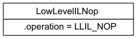

### Introduction, Recap

In the [first installment](https://binary.ninja/2020/01/08/guide-to-architecture-plugins-part1.html), we got a Z80 architecture up and running with disassembly and control graphs. In this second installment, we'll cover Binary Ninja's intermediate languages and the concept of lifting.

Recall an architecture plugin's job: to inform Binary Ninja (binja) about an unknown architecture so binja can open new binaries, perform analysis, etc. This is done by populating Architecture class fields like`.address_size`, `.max_instr_length`, and `.regs` and implementing class methods like `get_instruction_text()`, `get_instruction_info()`, and `get_instruction_low_level_il()` from [architecture.py](https://github.com/Vector35/binaryninja-api/blob/dev/python/architecture.py).

| architecture component                     | purpose                                        |
| ------------------------------------------ | ---------------------------------------------- |
| member variables in the architecture class | describe registers, flags, address size, etc.  |
| `get_instruction_info()` method            | describe instruction size, branch behavior     |
| `get_instruction_text()` method            | provide an instruction's string representation |
| `get_instruction_low_level_il()` method    | provide instruction semantics                  |

Like the first blog post, you're invited to [install](https://docs.binary.ninja/guide/plugins.html) and follow along developing in git:

```
$ git clone https://github.com/Vector35/Z80
$ cd Z80 && git checkout tutorial2_start
```

Our inchoate `get_instruction_low_level_il()` in Z80Arch.py is awaiting our code:

```python
    def get_instruction_low_level_il(self, data, addr, il):
        return None
```

The [example binary](./assets/dacman.col) will be the homebrew Pac-Man clone called [DacMan](https://www.collectorvision.com/games/dacman.php). Opening it and selecting LLIL code with `get_instruction_low_level_il()` in its current state should show a bunch of undefined:


### What is Lifting?

It's translating from a lower level language to a higher level intermediate language. Since it starts "lower" and ascends "higher", it called called "lifting". I wonder if other terms like "raising" were considered. Anyway, the lower level language will be the machine instructions of the architecture we're targetting (Z80) and the higher level intermediate language is called binja's low level intermediate language (LLIL).

Why do this? The main reason is so binja can have a common, generalized analysis target rather than a collection of analyzers per architecture. Imagine how inflexible it would be to maintain a special analyzer for every architecture, and having to construct a new one for each plugin!

So BNIL acts a common tongue, and it's our job as the plugin author to write a translater from the target architecture to this common language binja expects:


### LLIL: The Callback

Alright, so Binja's going to be asking us for LLIL by invoking our definition of  `get_instruction_low_level_il()`. Let's first look at what we're supplied to do the job:

```
data: <class 'bytes'>
addr: <class 'int'>
  il: <class 'binaryninja.lowlevelil.LowLevelILFunction'>
```

The `data` and corresponding `length` hold bytes from the instruction. The `il` is an initially empty container which will accumulate the current function's LLIL that we produce on a per-instruction basis with invocations of this callback.

The `il` parameter actually serves two roles. In addition to being the container for produced LLIL, but it's also a reference to a class with many LLIL producing helper functions. See [lowlevelil.py](https://github.com/Vector35/binaryninja-api/blob/dev/python/lowlevelil.py).

As the container, we will be calling `il.append(...)` to append LLIL instructions to it.

As the helper, we will be calling `il.store()` to produce `LLIL_STORE`, `il.set_reg(...)` to produce `LLIL_SET_REG`, etc.

#### Exercise #1: unimplemented

Well, we can't lift Z80 bytes without first disassembling, so let's start our `get_instruction_low_level_il()` with a call to the disassembler. Note that since the first tutorial, Z80 has migrated away from [skoolkit](https://pypi.org/project/skoolkit/) disassembler to [z80dis](https://pypi.org/project/z80dis/).

```python
    def get_instruction_low_level_il(self, data, addr, il): 
        decoded = decode(data, addr)
        if decoded.status != DECODE_STATUS.OK or decoded.len == 0:
            return None
```

Remember the roles of the `il` parameter? Let's try them both. When an instruction disassembly succeeds, we'll use the helper `il.Unimplemented()` to construct a simple single-instruction expression that marks that the instruction isn't yet implemented by the lifter. Then, as the container, we'll `il.append()` it to the progressively built function:

```python
        expr = il.unimplemented()
        il.append(expr)

        return decoded.len
```

See [checkpoint #1](https://github.com/Vector35/Z80/commit/236de467ad19e4691416d485051b644d43f1ae8d). Now reload the binary and observe the disassembly:


Check out those red [no](https://en.wikipedia.org/wiki/No_symbol) symbols. Binja has received our `LLIL_UNIMPLEMENTED` and by default tags each line that's lifted to unimplemented, a built-in todo list! Check the LLIL view and confirm that everything is lifted to Unimplemented.

### LLIL: Assembly DSL Nature

Obviously to be a translator from Z80 to LLIL, we're going to need to know something about LLIL.

I think it mostly resembles an assembly language, because there is a finite set of available instructions (about 135 total), and execution flows "fall through" style with the exception of label-based branching.

The instructions are the LLIL_XXX values from the `LowLevelIlOperation` enumeration in generated `api/python/enums.py` file:

```python
class LowLevelILOperation(enum.IntEnum):
	LLIL_NOP = 0
	LLIL_SET_REG = 1
  # ...
	LLIL_LOAD = 6
	LLIL_STORE = 7
	LLIL_PUSH = 8
	LLIL_POP = 9
  # ...
```

Hopefully these LLIL instructions have names you can already imagine mapping to some machine instructions you're familiar with. It was designed with ease of lifting in mind.

BNIL is a domain specific language (DSL), but you never write it down as text. Like we never produce the string "LLIL_LOAD" or "LLIL_STORE" and ask binja to compile or otherwise process it. Instead, it's an [internal or embedded DSL](https://en.wikipedia.org/wiki/Domain-specific_language#External_and_Embedded_Domain_Specific_Languages), being expressed in and hosted by the language Python.

Here's an abridged table showing the correspondence between raw LLIL instructions and the constructs in python:

| instruction | LowLevelILFunction helper | LowLevelILInstruction |
| ----------- | ------------------------- | --------------------- |
| LLIL_NOP    | `.nop()`                  | LowLevelILNop         |
| LLIL_LOAD   | `.load(...)`              | LowLevelILLoad        |
| LLIL_STORE  | `.store(...)`             | LowLevelILStore       |
| LLIL_PUSH   | `.push(...)`              | LowLevelILPush        |
| LLIL_POP    | `.pop(...)`               | LowLevelILPop         |


#### Exercise #2: Lifting NOP

Let's lift our first instruction to LLIL that has no operands: LLIL_NOP. We simply detect when the Z80 disassembler found a Z80 nop and return an LLIL nop expression:

```python
        expr = None

        if decoded.op == OP.NOP:
            expr = il.nop()
        else:
            expr = il.unimplemented()

        il.append(expr)
```

The python encapsulation of our produced LLIL looks like:



Reload the binary, and since there's no naturally occurring NOP in this land, patch in four zero bytes and behold:


See [checkpoint #2](https://github.com/Vector35/Z80/commit/664368c14b4fcf8c08a07d305efef3a527d6ef6d).

### LLIL: Tree Nature

Unlike assembly's rigid instructions, LLIL is flexible because many of its instructions accept subexpressions in their operands. And those operands might contain subexpressions, and so on.

This nearly cries for a tree-like mental picture. Every LowLevelILInstruction can be thought of as internal nodes of a tree. Each of their operands that isn't another LowLevelILInstruction is a leaf node. So we can revisit our lift of NOP to:


Trail of Bit's [Breaking Down Binary Ninja's Low Level IL](https://blog.trailofbits.com/2017/01/31/breaking-down-binary-ninjas-low-level-il/) is approaching four years old, but I doubt its exposition of this concept can be topped and I recommend it as prerequisite reading. You'll see some elements and examples in this post inspired from TOB's article. It also includes some code for printing existing lifted IL in a text outline format which reinforces the tree idea when examining the result of already written lifters.

If LLIL is to be thought of as a tree-like language, then learning to translating to LLIL could benefit from  cultivating an ability to think of assembly instructions in a tree-like manner. For me, it's helpful to think first of a composition of functions, then translate to the LLIL tree. For example, the x86 instruction `mov eax, 2` might first become the composition `mov(reg("eax"), 2))` and after surveying [lowlevelil.py](https://github.com/Vector35/binaryninja-api/blob/dev/python/lowlevelil.py) I find my `mov()` maps to `LLIL_SET_REG` whose arguments tell me the 2 can't be supplied naked, but wrapped in an `LLIL_CONST`, resulting in:

```
LLIL_SET_REG
├─── eax
└─── LLIL_CONST
     └─── 2
```

The x86 instruction `lea eax, [edx+ecx*4]` might decompose to `lea(add(reg("edx"),mul(reg("ecx"), 4)))` before mapping to `LLIL_SET_REG`, `LLIL_REG`,  `LLIL_ADD`, `LLIL_MUL`, before mapping to LLIL tree:

```
LLIL_SET_REG
├─── eax
└─── LLIL_ADD
     ├─── LLIL_REG
     │    └─── edx
     └─── LLIL_MUL
          ├─── LLIL_REG
          │    └─── ecx     
          └─── LLIL_CONST
               └─── 2 
```

#### Exercise #3: Lifting PUSH

Let's hop into lifting PUSH, which requires _something_ to be pushed. But binja doesn't have separate instructions for pushing registers or constants or flags. It instead pushes a general expression:

```python
        elif decoded.op == OP.PUSH:
            if decoded.operands:
                (oper_type, oper_val) = decoded.operands[0]
                if oper_type == OPER_TYPE.REG:
                    subexpr = il.reg(REG_TO_SIZE[oper_val], reg2str(oper_val))
                    expr = il.push(REG_TO_SIZE[oper_val], subexpr)
```

Note that both the helper function `il.reg()` and `il.push()` need the size of the register access and push, respectively, which necessitates the `REG_TO_SIZE` lookup. And even if you don't know anything about program analysis, doesn't it make sense that in order to analyze a push, you'd need to know how many bytes are going on the stack? And to analyze a register access, you'd need to know how large the register is? Returning to our imagined tree, LLIL_PUSH sits at the root, and its one operand is a branch to a subexpression node LLIL_REG:


Let's confirm this works when pushing registers in the disassembly view:


And LLIL view:


See [checkpoint #3](https://github.com/Vector35/Z80/commit/e3a167c509437a31ce01c60072dcccec96d9291d).

### LLIL: Thinking in LLIL

As you lift more instructions, your mental library of LLIL instructions will increase, and your need to consult [lowlevelil.py](https://github.com/Vector35/binaryninja-api/blob/dev/python/lowlevelil.py) will decrease.

#### Eexercise #4: LD immediate to register

Consider the instruction `LD DE, 0x7000` which loads the value 0x7000 into register DE. A function view might be `ld(reg("de"), 0x7000)`.  Since it writes to a register, we find a fit with `LLIL_SET_REG` and look to the prototype of LowLevelILFunction's helper function in [lowlevelil.py](https://github.com/Vector35/binaryninja-api/blob/dev/python/lowlevelil.py):

```python
def set_reg(self, size:int, reg:'architecture.RegisterType', value:ExpressionIndex,
		flags:Optional['architecture.FlagType']=None) -> ExpressionIndex:
```

It only takes one expression argument. This helper function will automatically form the register operand for us using the register we supply. We'll also make an educated guess concerning whether the immediate is an address or not by testing whether it's a nonzero 2-byte value. Non-address values map to `LLIL_CONST` while address values map to `LLIL_CONST_PTR`:

```python
        elif decoded.op == OP.LD:
            (oper_type, oper_val) = decoded.operands[0]
            (operb_type, operb_val) = decoded.operands[1]

            if oper_type == OPER_TYPE.REG:
                size = REG_TO_SIZE[oper_val]
                subexpr = None

                if oper_type == OPER_TYPE.REG and operb_type == OPER_TYPE.IMM:
                    if size == 2 and operb_val != 0:
                        subexpr = il.const_pointer(2, operb_val)
                    else:
                        subexpr = il.const(size, operb_val)

                    expr = il.set_reg(size, reg2str(oper_val), subexpr)
```

The resulting tree is:


See [checkpoint #4](https://github.com/Vector35/Z80/commit/f8da9dc7243c7b909ccf28c9075ff5f7aced691f).

#### Exercise #5: LD register to memory

Consider the instruction `LD (0x7002),A` which writes the value in register A to address 0x7002. Functionally, we could write it `LD(0x7002,reg("A"))`. Writing a value to memory matches `LLIL_STORE` and its corresponding helper function prototype is:

```python
def store(self, size:int, addr:ExpressionIndex, value:ExpressionIndex, flags=None) -> ExpressionIndex:
```

Notice we have to supply two subexpressions here. None will be built automatically from the helper. 

```python
        elif decoded.op == OP.LD:
            #...
            elif oper_type == OPER_TYPE.ADDR_DEREF:
                if operb_type == OPER_TYPE.REG:
                    size = REG_TO_SIZE[operb_val]
                    subexpr_a = il.const_pointer(size, oper_val)
                    subexpr_b = il.reg(size, reg2str(operb_val))
                    expr = il.store(size, subexpr_a, subexpr_b)
```

The resulting tree is very straightforward:


See [checkpoint #5](https://github.com/Vector35/Z80/commit/9e140ae0c2ee18d6edae3e20e02e75abf00f5f7b).

### Factoring out operand lifting

It's extremely common when lifting an instruction that we must generate LLIL for operands. Rather than replicate this for each instruction, we should have some common utility. Indeed this is done in almost all of Vector35's architectures:

| architecture                                                 | operand lifting utilities:                  |
| ------------------------------------------------------------ | ------------------------------------------- |
| [arch-x86](https://github.com/Vector35/arch-x86/blob/master/il.cpp) | ReadILOperand(), WriteILOperand() functions |
| [arch-armv7](https://github.com/Vector35/arch-armv7/blob/staging/il.cpp) | ReadILOperand() functions                   |
| [arch-arm64](https://github.com/Vector35/arch-arm64/blob/staging/il.cpp) | ReadILOperand() functions                   |
| [arch-ppc](https://github.com/Vector35/arch-ppc)             | operToIL() functions                        |
| [6502 / NES](https://github.com/Vector35/binaryninja-api/blob/dev/python/examples/nes.py) | OperandIL[] lookup table                    |

The upfront cost of implementing such a function will pay dividends as it's used when lifting future instructions. It's also not a bad time to fully familiarize ourselves with the target architecture and the operand types reported by the disassembler. Let's survey the types of operands Z80 can have.

**Register** operands map easily to LLIL_REG:

```python
    if oper_type == OPER_TYPE.REG:
        return il.reg(REG_TO_SIZE[oper_val], reg2str(oper_val))
```

**Dereferenced register** operands map to `LLIL_LOAD` of `LLIL_REG`. It's also sometimes convenient to opt out of the actual load, which we'll signal using the `ignore_load` parameter.

```python
    elif oper_type == OPER_TYPE.REG_DEREF:
        tmp = il.reg(REG_TO_SIZE[oper_val], reg2str(oper_val))
        return il.load(size_hint, tmp)
```

**Address** operands map to `LLIL_CONST_PTR`:

```python
    elif oper_type == OPER_TYPE.ADDR:
        return il.const_pointer(2, oper_val)
```

**Dereferenced address** operands map to `LLIL_LOAD` of `LLIL_CONST_PTR`:

```python
    elif oper_type == OPER_TYPE.ADDR_DEREF:
        tmp = il.const_pointer(2, oper_val)
        return il.load(size_hint, tmp)
```

**Dereferened indexed memory** operands map to `LLIL_LOAD` of an address formed by the addition `LLIL_ADD` of a register `LLIL_REG` and an offset `LLIL_CONST`:

```python
    elif oper_type in [OPER_TYPE.MEM_DISPL_IX, OPER_TYPE.MEM_DISPL_IY]:
        reg_name = 'IX' if oper_type == OPER_TYPE.MEM_DISPL_IX else 'IY'
        tmp = il.add(2, il.reg(2, reg_name), il.const(1, oper_val))
        return il.load(size_hint, tmp)
```

**Immediates** map easily to `LLIL_CONST`:

```python
    elif oper_type == OPER_TYPE.IMM:
        return il.const(size_hint, oper_val)
```

#### Exercise #6: generalized operand lifter

Try to implement the utility function `operand_to_il()`. It must be given the operand type (as returned from the disassembler), operand value, the LowLevelILFunction, and the size of the parameters:

```python
def operand_to_il(self, oper_type, oper_val, il, size_hint=0):
```

It's also happens to be convenient for Z80 lifting to be able to ignore the load of the dereferenced operands. For instance, when `(0x7002)` is the left hand side (destination) of an `LD` instruction, we don't want to actually load from there, just access its address. But when it's the right hand side (source) of an `LD`, we do want to lift as an `LLIL_LOAD`. So we introduce a helpful `ignore_load` flag to our utility function's prototype.

```python
def operand_to_il(self, oper_type, oper_val, il, size_hint=0, ignore_load=False):
```

See the new function `operand_to_il()` and our current lifting implementation adapted to use it in [checkpoint #6](https://github.com/Vector35/Z80/commit/c17013299c069757943bc209761a9ae1af02a1cc).

### LLIL: Exact fits and getting inventive

Every example lift so far has had an easy mapping to LLIL. A natural question to ask is "Can _any_ assembly instruction be described by LLIL?". Definitely not directly, as the number of instructions in modern ISA's vastly exceeds the number of instructions in LLIL.

This section is a lesson that LLIL won't always have an exact fit for the assembly instruction. Sometimes you need to cobble something together.

#### Exercise #7: lifting push AF

We currently lift `PUSH AF` as an `LLIL_PUSH` of `LLIL_REG` AF. And while AF is a register pair in that it can be the object of register reads and pushes and what not, access to it is special in Z80 in that the low 8 bits (the "F" part) map to the flags. 

Push can only target AF, BC, DE, HL, IX, IY, so let's test when AF is the object:

```python
        # when pushing AF, actually push the flags
        if oper_val == REG.AF:
```

We need to form the 2-byte value that goes on the stack. The high 8 bits will be register `A` but the low 8 bits must contain the flags:

| 7    | 6    | 5    | 4    | 3    | 2    | 1    | 0    |
| ---- | ---- | ---- | ---- | ---- | ---- | ---- | ---- |
| s    | z    |      | h    |      | pv   | n    | c    |

But there's no LLIL_HANDLE_THESE_Z80_FLAGS. So what do we do? Imagine how you might do it in C: shifts and ors. We'll synthesize it with `LLIL_LSL` and `LLIL_OR`.

```python
     expr = il.push(2,
                il.or_expr(2,
                    il.or_expr(1,
                        il.or_expr(1,
                            il.shift_left(1, il.flag('s'), il.const(1, 7)),
                            il.shift_left(1, il.flag('z'), il.const(1, 6))
                        ),
                        il.or_expr(1,
                            il.or_expr(1,
                                il.shift_left(1, il.flag('h'), il.const(1, 4)),
                                il.shift_left(1, il.flag('pv'), il.const(1, 2))
                            ),
                            il.or_expr(1,
                                il.shift_left(1, il.flag('n'), il.const(1, 1)),
                                il.flag('c')
                            )
                        )
                    ),
                    il.shift_left(2, il.reg(1, 'A'), il.const(1, 8)
     )))
```

I think it's cool how the tree structure can been seen in the the code that constructs the expression. Test it out by flipping to the LLIL view to confirm:


See [checkpoint #7](https://github.com/Vector35/Z80/commit/4df97935fbfddfb38e3254ab03659505288b964c).

### LLIL: Lifting branches

Unconditional branches that have a computed target present no new challenges. Call to an address operand maps to `LLIL_CALL` easily:

``` python
    elif decoded.op == OP.CALL:
        if oper_type == OPER_TYPE.ADDR:
            expr = il.call(il.const_pointer(2, oper_val))
```

Returns (`RET` in Z80) take as input how much the stack is adjusted:

```python
    elif decoded.op == OP.RET:
        if oper_type == None:
            expr = il.ret(il.pop(2))
```

Jumps to an absolute address (`JP` in Z80) or relative address (`JR` in Z80) map to `LLIL_JUMP`. In the relative case, the disassembler z80dis returns to use an already calculated effective address as the operand value. When the address is close and in the same function, `LLIL_GOTO` is preferred, and we can test this by using the `il.get_label_for_address()` function:

```python
    elif decoded.op in [OP.JP, OP.JR]:
        if oper_type == OPER_TYPE.ADDR:
            tmp = il.get_label_for_address(Architecture['Z80'], oper_val)
            if tmp:
                expr = il.goto(tmp)
            else:   
                expr = il.jump(il.const_pointer(2, oper_val)) 
```

#### Exercise #8: Lift CALL, RET, JP, JR

See if you can get these implementations emplaced and working. Scroll through the binary and make sure calls, returns, and jumps make sense. Well, the unconditional ones, anyways.

See [checkpoint #8](https://github.com/Vector35/Z80/commit/6e24f53ef5ccc078af1776322ab70ccdd8d5c2ab).

### LLIL: Lifting conditional instructions

The previous lesson about branches ignored the possibility of an operand that would make `RET` or `JR` or `JP` conditional. So how do we do those? The answer is LLIL provides an assembly-language like test and goto instruction called `LLIL_IF` which can point at labels we can insert in code. The general form is something like:

```
LLIL_IF <condition, label_true, label_false>

label_true:
    (lifted instruction)

label_false:
```

The steps to construct something like this are:

1. create an expression for the condition test
2. allocate label(s) using `LowLevelILLabel()` call from [lowlevelil.py](https://github.com/Vector35/binaryninja-api/blob/dev/python/lowlevelil.py)
3. create an LLIL_IF with `il.if(...)` supplying the condition test and two labels and append it to `il`
4. mark the current spot with the "true" label using `il.mark_label(...)`
5. append code that should be executed for this label
6. mark the current spot with the "false" label using `il.mark_label(...)`

What makes this convenient is that the labels you allocate aren't committed to any address. You can provide them immediately to `il.if()` and only later commit with `il.mark_label()`.

#### Exercise #9: Lifting conditional RET

The only operand RET can take is one of the conditional flags, so the presence of an operand means it's conditional.

```python
    elif decoded.op == OP.RET:
        if oper_type == None:
            expr = il.ret(il.pop(2))
        else:
            antecedent = self.jcc_to_flag_cond(oper_val, il) # step 1
            t = LowLevelILLabel()                            # step 2
            f = LowLevelILLabel()
            il.append(il.if_expr(antecedent, t, f))          # step 3
            il.mark_label(t)                                 # step 4
            il.append(instr)                                 # step 5
            il.mark_label(f)                                 # step 6
```

How was that antecedent formed though? Just as we had a helper function `operand_to_il()` for normal operands, we need a helper function `jcc_to_flag_cond()` for condition codes. HINT: use `il.flag()` and `il.not_expr()` to invert them.

See [checkpoint #9](https://github.com/Vector35/Z80/commit/2a9d6ba3bc87a9524c95d8caea85aa0a5e2de8af) for the solution. In `sub_882f()` we have a conditional RET on the zero flag:


And the lift has it executing the RET when `z` is true, and jumping to the `DEC (IX)` otherwise:


### Verification

How can you know if your lifting is accurate? I wish I had more formal advice to offer, but the effective techniques so far are:

**Manual inspection:** make sure the resulting analysis looks sensical. After you lift an instruction, inspect the LLIL, then the MLIL, then the HLIL.

**Test driven development:** start with what you believe _should_ be the lifted output of several assembly instructions, then develop until the test is met. This is the approach taken for over 2000 cases in the [arch-arm64 lifting test](https://github.com/Vector35/arch-arm64/blob/staging/arm64test.py).

**Transpiler**: run a test program vs. a compiled version of a lifted test program. If the outputs match, your lift is likely very accurate. The [llil_transpiler project](https://github.com/vector35/llil_transpiler) has a target for Z80 using the [small device C compiler (SDCC)](http://sdcc.sourceforge.net/) and the [implementation of emulated of LLIL instructions](https://github.com/Vector35/llil_transpiler/blob/master/runtime.cpp) stands independently as a nice reference of what the LLIL instructions are intended to do.

None of these truly "verify" an accurate lift, they just increase the confidence.

### Q & A

**What is the difference between LLIL and Lifted LLIL?** Lifted LLIL is the raw product of an architecture plugin's call to `get_instruction_low_level_il()`. Everything we produced in this post is is Lifted LLIL. It's the crude oil straight from the ground. After some refinement you get LLIL. A series of `LLIL_NOP` is collapsed into a single NOP, for example.

**What is the difference between LLIL and BNIL?** BNIL is an umbrella term for all the levels of IL binja uses, and Lifted LLIL is at the bottom level.

**What is the difference between an expression and an actual LLIL instruction?** An expression is an internal numeric identifier for a portion of an LLIL instruction's full tree and is returned by most of the helper functions. Recall the tree for the x86 instruction `lea eax, [edx+ecx*4]`:

```
LLIL_SET_REG
├─── eax
└─── LLIL_ADD
     ├─── LLIL_REG
     │    └─── edx
     └─── LLIL_MUL
          ├─── LLIL_REG
          │    └─── ecx     
          └─── LLIL_CONST
               └─── 2 
```

This might be stored internally as:

| Expression ID | Instruction  | Operand 0 | Operand 1 |
| ------------- | ------------ | --------- | --------- |
| 0             | LLIL_SET_REG | eax       | 1         |
| 1             | LLIL_ADD     | 2         | 3         |
| 2             | LLIL_REG     | edx       |           |
| 3             | LLIL_MUL     | 4         | 5         |
| 4             | LLIL_REG     | ecx       |           |
| 5             | LLIL_CONST   | 2         |           |

Since the internal storage is inconsequential when constructing LLIL, "expression" and "instruction" can be used interchangeably without harm.

### Conclusion

I hope this post has been helpful in getting you started lifting! If you're looking for more exercises, I recommend you extend the conditional RET to conditional JP and JR too. You can always restart the tutorial by checking out branch [tutorial2_start](https://github.com/Vector35/Z80/commits/tutorial2_start) from the [Z80 git repo](https://github.com/Vector35/Z80) or simply re-clicking the checkpoints. Spoilers can be had by checking out branch [master](https://github.com/Vector35/Z80/tree/master).

We welcome feedback. Is there something you wish were covered in more detail? Less? Do you have a question that belongs in the Q&A?

Hop on the `#api-help` channel in our community [slack](https://slack.binary.ninja/). 


