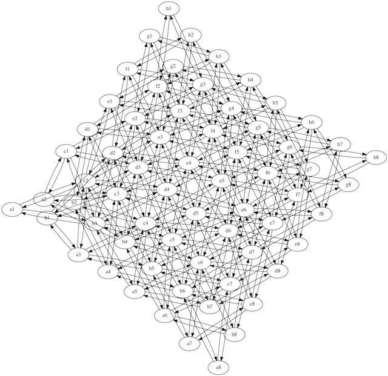

Draw the knight's tour input graph.

```
./go.py > out.dot
dot ./out.dot -Tpng -o out_dot.png
neato ./out.dot -Tpng -o out_neato.png
fdp ./out.dot -Tpng -o out_fdp.png
sfdp ./out.dot -Tpng -o out_sfdp.png
twopi ./out.dot -Tpng -o out_twopi.png
circo ./out.dot -Tpng -o out_circo.png
```

fdp can even infer the structure of the chess board:

