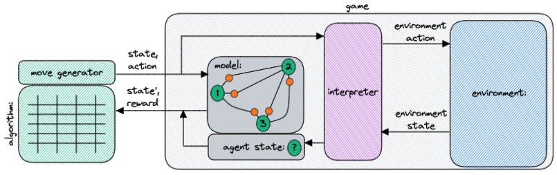
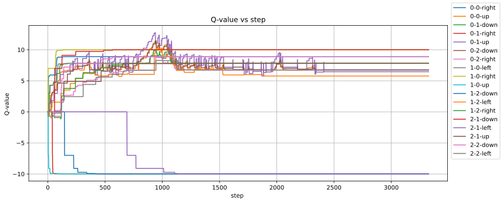

A stab at Q-Learning, inspired by deeplizard video without external dependencies.

Diagram of implementation:

And the contents of this directory can be understood in the context of the diagram:

* [./qlearn.py](./qlearn.py) is the algorithm
* [./ManualActions.py](./ManualActions.py) is a move generator that uses user input (so you can manually play the game)
* [./DecayedEpsilonGreedyActions.py](./DecayedEpsilonGreedyActions.py) is a move generator that uses decayed epsilon greedy method
* [./LizardGame](./LizardGame.py) is a game that implements the environment, agent state space, and reward for the game in the deeplizard video.

This is what the Q-values look like as they converge for q-learning with decayed epsilon greedy:

## Resources

* [Exploration vs. Exploitation - Learning the Optimal Reinforcement Learning Policy](https://www.youtube.com/watch?v=mo96Nqlo1L8)
* https://en.wikipedia.org/wiki/Q-learning
