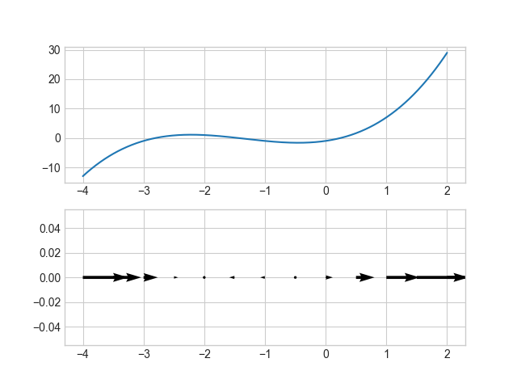
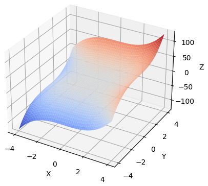
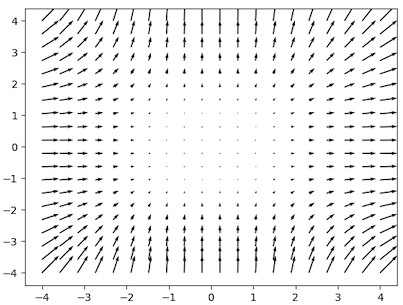

For some scalar-valued function of n variable, the gradient is a new function that returns a vector pointing in the direction of greatest value increase for the original function.

## 1-dimensional example

A normal graph from high school $y = f(x)$ has scalar output and thus qualifies for a gradient when it's differentiable. For example:
$$
f(x) = x^3 + 4x^2 + 3x - 1
$$

According to https://en.wikipedia.org/wiki/Gradient the gradient is just:
$$
\nabla f(p) = \begin{bmatrix}\frac{\partial f}{\partial x}(p)\end{bmatrix}
$$
Since we're taking the partial derivative with respect to the only input variable $x$, we're really just taking the familiar derivative and treating it as the length of the arrow that points in the direction of biggest increase:

$$
\nabla f(p) = \begin{bmatrix}3x^2 + 8x + 3\end{bmatrix}
$$

And plotting such arrows aligned with the graph shows that they really do point in the direction of the function's peaks, and their magnitude is proportional to the rate of increase:

## 2-dimension example

Let's examine this guy:
$$
f(x,y) = x^3 - \frac{x}{4} + y^3 + \frac{y}{7}
$$

Our gradient becomes:
$$
\nabla f(p) = \begin{bmatrix}\frac{\partial f}{\partial x}(p) \\ \frac{\partial f}{\partial y}(p)\end{bmatrix} = \begin{bmatrix}3x^2 - \frac{1}{4} \\ 3y^2 + \frac{1}{7}\end{bmatrix}
$$

And it's visually checkable that the arrows point in the direction of greatest increase.

## Resources

Thank you to this site which provided a bare, stripped example of quiver that I could easily adapt:

https://problemsolvingwithpython.com/06-Plotting-with-Matplotlib/06.15-Quiver-and-Stream-Plots/