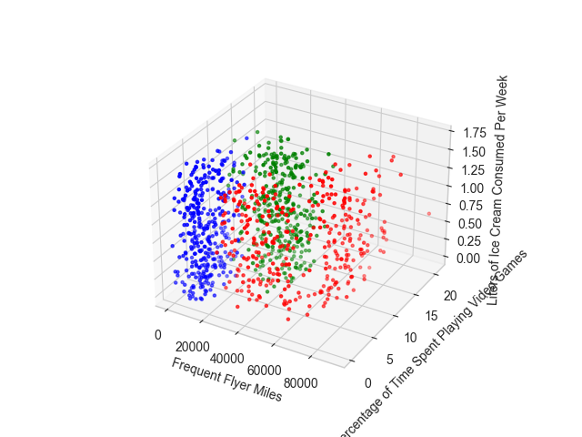
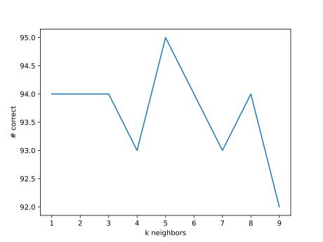

This is an exercise from Chapter 2 of the book Machine Learning in Action.

https://en.wikipedia.org/wiki/K-nearest_neighbors_algorithm

The algorithm is pretty simple: Just find the k closest points in the space and look for a [plurality](https://en.wikipedia.org/wiki/Plurality_(voting)).

Be careful to normalize, otherwise sets with different ranges of values get an undue amount of influence.

Here's video game time vs. liters of ice cream consumed (see [./plot.py](./plot.py)):



And the results of using 90% of the sample points for "training" and 10% as test subjects for classification accuracy (see [./knn.py](./knn.py)):

```
k=1 performance 94/100 or 94%
k=2 performance 94/100 or 94%
k=3 performance 94/100 or 94%
k=4 performance 93/100 or 93%
k=5 performance 95/100 or 95%
k=6 performance 94/100 or 94%
k=7 performance 93/100 or 93%
k=8 performance 94/100 or 94%
k=9 performance 92/100 or 92%
```

