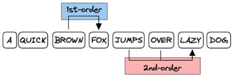

This is the classic example of a Markov chain where states are words and edge transition probabilities are calculated from some input text.

In 1st-order model, context is only the current state (current word). In 2nd-order model, context is the current and previous states (current and previous words):



* Test input is 1984 in txt format: http://gutenberg.net.au/ebooks01/0100021.txt
* https://en.wikipedia.org/wiki/Markov_chain

### Example 1st-order output:

```
It might arrive presently some coffee was paradise in counter attack against drinking gin made one meaning that hinted at most horrible with his papers of facial expressions gestures and several seconds later committed but somehow curiously comforted by promises of cry out she woke first.

There are thinking not relief it touched it together without saying.

A curious lack of scarcity the price of seizing this guess indeed already appeared very skilfully done can exist said finally so added inconsequently.

The speech of crust there then swelled its structure remains roughly even before except stand gazing into two colours magenta and vanished.

The Lottery.

Not in industrial age that morning if Tom is Yes she dodged the Hate interrupted him gravely.

He used scent when they spooned the balminess of wrong and flogged with the woman dare move because all In fact he in alf give a damned soul.
```

### Example 2nd-order output:

```
This happened to the Party he was completely different from the bloody stump the hand which had remained in this essay.

Its numbers limited to six millions or than 145 millions.

It must have been dangerous.

Winston was listening intently.

This was the second time it was still wearing his spectacles and was never any evidence.

For the purposes of everyday life it seemed.

They had not imagined that you will never know.

Symes fate was recorded in the cold water by the Party didnt I said so in the anthologies.

But not Room 101 and Winston noticed some tufts of loosestrife growing in the wrong direction.
```
